# Continuum-Ops — Autonomous Integration Reliability Agent

**Author:** Mayank Gupta

---

## What problem are we solving?

When enterprise systems (ERP, CRM, WMS, eCommerce) exchange business documents (orders, invoices, shipments), failures often happen **silently**. The system may be “up,” but the **business process stops**.

Common examples:
- Orders get stuck in integration queues (dead-letter / retry loops)
- A missing customer/product record blocks processing
- One bad message (“poison”) blocks many good ones
- Duplicate transactions occur during retries

The result: delayed revenue, fulfillment delays, manual firefighting, and poor customer experience.

---

## What is Continuum-Ops?

**Continuum-Ops** is an **autonomous reliability agent** for enterprise integrations. Think of it as a digital **L2/L3 integration support engineer** that runs in the background.

It:
1. Detects when a business process is failing
2. Diagnoses the likely cause
3. Suggest the fix to human to execute and wait for its completion
4. Verifies that the process is flowing again
5. Produces a short incident summary (RCA)

Future Enhancements:

6. Fixes the issue automatically when it’s safe and confidence level is high (as per learning)

---

## Simple workflow (how it works)

```mermaid
flowchart LR
  A[Business process eventOrder/Invoice/Shipment] --> B[Failure detectedQueue/DLQ/Logs]
  B --> C[AutoHeal diagnoses probable cause]
  C --> D{Safe + high confidence?}
  D -- No --> E[Ask human in Teams or create ADO ticket]
  E --> F[Human executes fixor approves fix]
  D -- Yes in future --> G[AutoHeal executes approved runbook]
  F --> H[AutoHeal verifies flow restored]
  G --> H
  H --> I[Notify in Teams + short RCA summary]

  %% Simple styling (most Mermaid renderers support this)
  classDef signal fill:#E8F0FE,stroke:#1A73E8,color:#0B1F3A;
  classDef problem fill:#FCE8E6,stroke:#D93025,color:#3A0B0B;
  classDef ai fill:#E6F4EA,stroke:#188038,color:#0B3A14;
  classDef decision fill:#FFF7E0,stroke:#F29900,color:#3A2A00;
  classDef human fill:#F3E8FD,stroke:#7E57C2,color:#1F0B3A;
  classDef verify fill:#E0F7FA,stroke:#00838F,color:#06343A;
  classDef outcome fill:#E8EAED,stroke:#5F6368,color:#202124;

  class A signal;
  class B problem;
  class C ai;
  class D decision;
  class E,F human;
  class G ai;
  class H verify;
  class I outcome;
```

---

## What makes it different from monitoring?

Traditional monitoring answers: **“Is the system healthy?”**  
AutoHeal answers: **“Are orders/invoices/shipments successfully flowing end-to-end?”**

This is about **business continuity**, not charts and dashboards.

---

## Simple use case (example)

**Scenario: Order processing stops**
- An order message fails and lands in a dead-letter queue
- The root cause is a **missing customer record** in ERP

**AutoHeal response**
- Detects the stuck order
- Diagnoses the missing customer
- Asks Human for action on teams / ADO tickets
- Checks the order message
- Confirms the order is processed successfully
- Sends a Microsoft Teams notification with a short summary

---

## Business value

- **Reduce downtime of business processes** (orders ship on time)
- **Lower operational load** (less manual queue/log investigation)
- **Faster incident resolution** (minutes vs hours)
- **Consistent, auditable actions** (approvals + logs)
- **Continuous learning** (recurring failures get easier to fix)

---