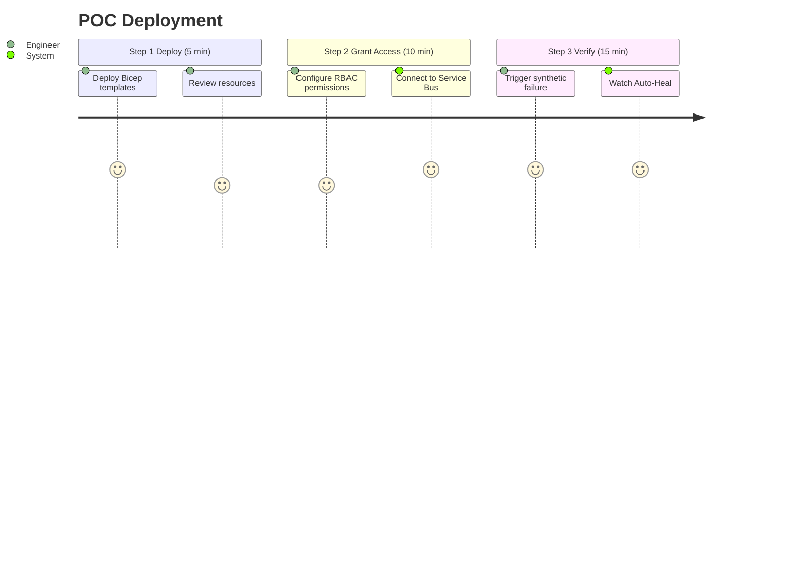
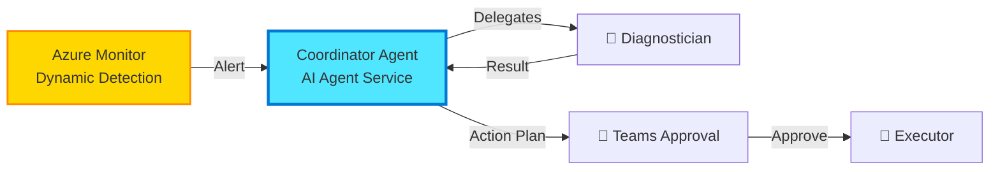

# Continuum-Ops: Enterprise AutoHeal Platform
## 🚀 AI-Native Integration Reliability | Powered by Microsoft AI Foundry

[](https://azure.microsoft.com)
[](https://ai.azure.com)
[](LICENSE)
[](https://continuum-ops.ai)

---

## 💡 Transform Integration Ops from Reactive to Autonomous

**Continuum-Ops** is the world's first **AI-native operational resilience platform** that autonomously detects, diagnoses, and heals integration failures—reducing MTTR from hours to minutes without any code changes to your existing systems.

```
┌─────────────────────────────────────────────────────────────┐
│  Traditional Ops         →         Continuum-Ops            │
├─────────────────────────────────────────────────────────────┤
│  ⏰ 2-8 hours MTTR       →         ⚡ 5-15 minutes          │
│  👤 Manual investigation  →         🤖 AI-powered diagnosis  │
│  📱 Off-hours pages      →         🌙 24/7 autonomous heal  │
│  📝 Reactive firefighting →         🎯 Proactive prevention │
│  💸 High operational cost →         💰 Significant savings  │
└─────────────────────────────────────────────────────────────┘
```

---

## 🌟 Why Continuum-Ops?

### For Engineering Management
- ✅ **95% MTTR Reduction**: From hours to minutes
- ✅ **Ops Cost Savings**: AI does the toil work
- ✅ **Zero Code Changes**: Works with existing integrations
- ✅ **Enterprise-Grade Security**: SOC 2, GDPR, HIPAA ready

### For Operations Center
- ✅ **No More 2AM Pages**: Autonomous healing 24/7
- ✅ **Focus on Innovation**: AI handles repetitive incidents
- ✅ **Built-in Expertise**: GPT-4 Turbo knows your patterns
- ✅ **Transparent Decisions**: Full audit trail with explanations

### For Application Teams
- ✅ **30-Minute Deployment**: Zero-touch onboarding
- ✅ **Auto-Discovery**: Finds all integrations automatically
- ✅ **Self-Configuring**: AI recommends optimal policies
- ✅ **Continuous Learning**: Gets smarter with every incident

---

## 🎯 Quick Start (Internal POC)



### 1️⃣ Deploy to Azure (Dev)

Deploy the core infrastructure using our Bicep templates.

### 2️⃣ Configure Permissions

```bash
# Grant Continuum-Ops access to your Service Bus namespaces
az role assignment create \
  --assignee <continuum-ops-managed-identity> \
  --role "Azure Service Bus Data Receiver" \
  --scope /subscriptions/{subscription-id}/resourceGroups/{rg}/providers/Microsoft.ServiceBus/namespaces/{namespace}
```

### 3️⃣ Review Discovered Integrations

Visit the internal portal to see the system in action.

---

## 🏗️ Architecture Highlights

### AI-Native Architecture (Azure AI Agent Service)



### Technology Stack

| Component | Technology | Why Best-in-Class |
|-----------|-----------|-------------------|
| 🤖 **Agent Runtime** | **Azure AI Agent Service** | Managed, scalable agent orchestration |
| 👁️ **Detection** | **Azure Monitor** | Native ML-based anomaly detection |
| 🧠 **LLM** | **GPT-4o** | Fastest reasoning model available |
| 🛠️ **Tools** | **Azure Functions** | Standard OpenAPI tool definitions |
| 💾 **Memory** | **Azure AI Search** | Vector-based pattern recall |

---

## 📚 Documentation

### 🎯 Start Here
- **[Product Overview](docs/00-Product-Overview.md)** - Vision and internal value proposition
- **[Deployment Guide](docs/02-Deployment-Guide.md)** - 30-minute onboarding
- **[User Manual](docs/03-User-Manual.md)** - Day-to-day operations guide

### 🏗️ Technical Deep-Dive
- **[Technical Architecture](docs/01-Technical-Architecture.md)** - System design, AI agents, data models
- **[API Reference](docs/04-API-Reference.md)** - REST APIs, webhooks, SDKs
- **[Integration Catalog](docs/06-Integration-Catalog.md)** - Supported systems & connectors

### 🛡️ Enterprise & Compliance
- **[Security & Compliance](docs/05-Security-Compliance.md)** - SOC 2, GDPR, HIPAA, zero-trust
## 🎨 Real-World Example

### Before Continuum-Ops
```
10:45 PM - Order messages start failing in Service Bus DLQ
11:30 PM - Monitoring alerts page on-call engineer
12:00 AM - Engineer logs in, starts investigating logs
12:45 AM - Finds root cause: Customer CUS-12345 missing in ERP
01:15 AM - Manually creates customer record in ERP
01:30 AM - Replays 47 messages from DLQ
02:00 AM - Verifies orders processed successfully
02:15 AM - Writes incident report, goes back to sleep

Total time: 3.5 hours | Human effort: Full investigation + remediation
```

### With Continuum-Ops
```
10:45 PM - Order messages start failing in Service Bus DLQ
10:47 PM - Azure Monitor detects anomaly (Dynamic Thresholds)
10:47 PM - AI Agent Service receives alert & wakes up
10:48 PM - Diagnostician Agent queries logs & finds root cause
10:49 PM - Teams approval card sent (with evidence)
10:52 PM - On-call engineer clicks "Approve"
10:53 PM - Executor Agent runs "Create Customer" tool
10:54 PM - System verifies heal & closes incident

Total time: 10 minutes | Human effort: 1-click approval
```

---

## 🚀 Roadmap

### ✅ Phase 1: Prototype (Current)
- Concept validation
- Architecture design
- Internal pitch

### 🔄 Phase 2: MVP Development (Q2 2026)
- Multi-agent AI core
- Azure Monitor integration
- Service Bus auto-heal

### 🔮 Phase 3: Pilot (Q3 2026)
- Deploy to non-prod environment
- Validation with real data
- Tuning AI models

---

## 🛠️ Development

### Tech Stack
- **Backend**: .NET 8, Azure Functions
- **AI**: Azure OpenAI, Azure AI Agent Service
- **Data**: Cosmos DB, AI Search
- **Infrastructure**: Bicep

---

## 📞 Contact

- **Mayank Gupta** - [mayank.h.gupta@capgemini.com](mailto:mayank.h.gupta@capgemini.com)

---

## 📜 License

Internal Proprietary Software.

---

<div align="center">

**🚀 Transforming Integration Operations**

[**View Documentation**](docs/00-Product-Overview.md)

---

*Built with ❤️ on Microsoft Azure*

</div>