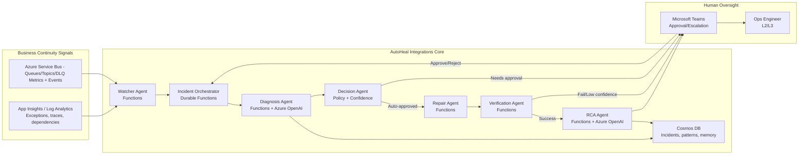
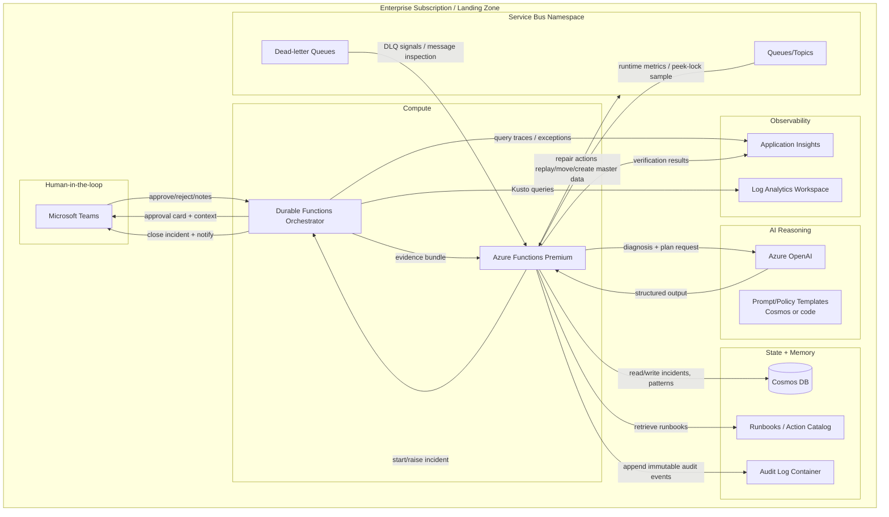
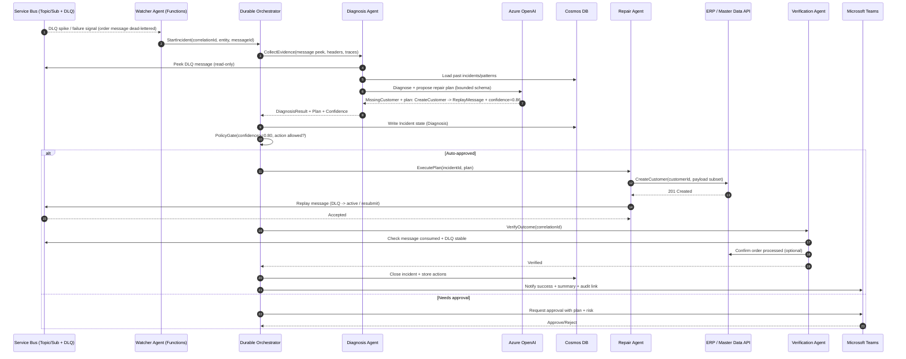

# Continuum-Ops — AutoHeal Integrations (Autonomous Integration Reliability Agent)

## 0. What this is / isn’t

**AutoHeal Integrations** is an **autonomous operational backend service** that acts like a digital **L2/L3 integration support engineer**.

- **Not** a monitoring dashboard
- **Not** a chatbot

It focuses on **business continuity**: detecting and repairing enterprise integration failures that silently break business processes (orders, invoices, shipments).

Closed loop:

**Observe → Diagnose → Decide → Act → Verify → Learn**

---

## 1. Purpose & real-world problem

In enterprises running ERP (e.g., Dynamics 365), integrations commonly fail in ways that do not immediately surface as “system down,” but stop business flow:

- messages go to **Azure Service Bus DLQ**
- **missing master data** blocks orders/invoices
- **duplicate transactions** occur during retries
- **poison messages** block an entire queue/subscription
- **downstream consumers stop** (no active receiver / lock renewal issues / throttling)

Today, operations teams manually:

- monitor queues and subscriptions
- read logs and correlate by IDs
- replay messages
- fix payload or master data
- contact owning teams
- write post-incident RCA

AutoHeal automates this operational loop with guardrails.

---

## 2. Target Azure stack (required)

- **Azure Service Bus** (queues, topics, DLQ)
- **Azure Functions** (workers)
- **Durable Functions** (incident orchestration)
- **Azure OpenAI** (LLM reasoning)
- **Azure Cosmos DB** (memory/learning)
- **Application Insights / Log Analytics** (telemetry)
- **Microsoft Teams** (human approval / escalation)
- Optional: **Power App** (summary/dashboard)

---

## 3. High-level architecture (logical)

### 3.1 Flow overview

1. **Watcher Agent** detects business-impacting failures from Service Bus + telemetry signals.
2. **Incident Orchestrator** (Durable Functions) runs an end-to-end incident workflow.
3. **Diagnosis Agent** collects evidence and uses Azure OpenAI to propose likely cause(s).
4. **Decision Agent** applies policy + confidence scoring to choose auto-fix vs approval.
5. **Repair Agent** executes safe corrective actions.
6. **Verification Agent** validates business outcome.
7. **RCA Agent** produces a structured RCA artifact and updates memory.
8. **Communication Agent** notifies Teams and records audit events.

### 3.2 Mermaid diagram — event-driven + agents + approval loop

---

## 4. Detailed component architecture (Azure resources)

### 4.1 Resources and communication paths

---

## 5. Sequence diagram (example)

Scenario: **Order message fails → agent diagnoses missing customer → creates customer → replays message → order succeeds → Teams notification**

---

## 6. Agent design (logical roles)

### 6.1 Watcher Agent
**Responsibility:** Detect business-impacting anomalies and raise incidents.

**Signals/tools:**
- Service Bus DLQ depth spikes, increasing active count, no active receivers
- Sample-peek message headers for correlation patterns
- App Insights exceptions/dependency failures

**Output:** Normalized `IncidentTrigger` events.

### 6.2 Diagnosis Agent
**Responsibility:** Build evidence bundle and identify likely cause.

**Tools:**
- Log Analytics queries (Kusto) by correlationId/messageId
- App Insights traces/exceptions
- DLQ message body + headers (read-only)
- Cosmos DB pattern memory
- Azure OpenAI to produce **structured** diagnosis (schema) with citations.

### 6.3 Decision Agent
**Responsibility:** Determine whether to auto-repair, request approval, or escalate.

**Inputs:** diagnosis confidence, policy, blast radius, action risk classification, tenant/environment.

**Controls:**
- Confidence thresholds
- “Allowed actions” policy per integration
- Rate limits / concurrency limits
- Mandatory approval for high-risk actions

### 6.4 Repair Agent
**Responsibility:** Execute the approved runbook safely.

**Typical actions:**
- replay DLQ message / resubmit
- isolate poison message(s) to quarantine queue
- patch payload fields (only if deterministic and policy-approved)
- create missing master data via ERP API
- manage Service Bus subscription rules (careful; approval required)

**Controls:** idempotency keys, retries, circuit breakers.

### 6.5 Verification Agent
**Responsibility:** Validate business outcome after repair.

**Checks:**
- message consumed from active queue
- DLQ stops growing for the signature
- downstream state changed (ERP record exists / status updated)
- no duplicate side effects (dedupe keys)

### 6.6 RCA Agent
**Responsibility:** Produce a structured RCA record and learning updates.

**Tools:**
- Azure OpenAI for narrative + structured RCA
- Cosmos DB writeback of patterns, suggested prevention steps

### 6.7 Communication Agent
**Responsibility:** Operational comms and approvals.

**Tools:**
- Teams: adaptive cards for approvals; incident summaries; handoff packets
- Links to logs, incident timeline, audit trail

---

## 7. Data & memory model (Cosmos DB)

Cosmos DB is the long-lived memory for incident operations and learning. Recommended containers (partitioning shown conceptually):

### 7.1 Containers
1. **Incidents** (`/tenantId`, `/integrationId`)
   - incidentId, timestamps, status
   - entity (order/invoice/shipment)
   - correlation IDs, message IDs
   - current step, orchestrator instance ID
   - diagnosis summary, confidence, evidence pointers

2. **EvidenceIndex** (`/tenantId`, `/incidentId`)
   - links to App Insights query results, Log Analytics query hashes, sample payload references
   - message headers snapshot (sanitize PII)

3. **ActionHistory / AuditEvents** (`/tenantId`, `/incidentId`)
   - immutable append-only event stream
   - who/what invoked (managed identity), action parameters, outcome
   - approvals (approver identity, time, decision)

4. **Runbooks (Action Catalog)** (`/tenantId` or global)
   - runbook id, version, preconditions, required permissions
   - risk level, approval required, max executions/hour
   - verification criteria

5. **FailurePatterns** (`/tenantId`, `/integrationId`)
   - error signature (hash of exception + key fields)
   - most likely root causes
   - recommended actions and historical success rates
   - mean time to repair, recurrence rate

6. **ReliabilityScores** (`/tenantId`, `/integrationId`)
   - success/failure rates per process
   - DLQ rate, replay success rate
   - confidence calibration metrics (did AI predictions match?)

### 7.2 Learning approach (practical)
- Store structured outcomes: “action X resolved signature Y with success rate Z.”
- Use retrieval by signature + integration context.
- Optionally store embeddings for unstructured evidence (with strict data handling and PII controls).

---

## 8. Deployment & scaling plan

### 8.1 Azure Functions scaling
- Prefer **Functions Premium** for predictable scaling, VNET/private endpoints, and avoiding cold starts.
- Scale drivers:
  - Service Bus trigger functions scale based on message backlog.
  - Watchers that poll metrics/logs should be timer-triggered with adaptive frequency.
- Concurrency controls:
  - Use host.json + function-level concurrency settings.
  - Implement per-integration rate limits in Decision/Repair agents.

### 8.2 Handling multiple queues/topics/subscriptions
- Use a **configuration-driven registry** of monitored entities, stored in Cosmos DB (and optionally seeded from discovery).
- Each monitored entity has:
  - entity path, type (queue/topic/sub), DLQ path
  - owning team / escalation mapping
  - allowed runbooks and approval requirements

### 8.3 Auto-discovery of Service Bus entities
- Use management-plane discovery on a schedule:
  - enumerate namespaces and entities
  - tag-based inclusion/exclusion (e.g., resource tags: `AutoHeal=Enabled`)
  - ingest discovered entities into the registry with “pending onboarding” status
- Do **not** auto-enable remediation on newly discovered entities by default—require explicit onboarding approval.

### 8.4 Multi-tenant / many integrations
Two common enterprise models:

1. **Single enterprise tenant, many integrations** (most internal scenarios)
   - Partition by `integrationId` and `environment`.
   - Enforce per-integration policies, throttles, and approval routing.

2. **Multiple lines of business / tenants**
   - Partition Cosmos DB by `tenantId`.
   - Per-tenant managed identity scopes (or per-tenant function app deployment if isolation required).
   - Separate AOAI deployments or content filters per policy.

Durable Functions instance ID should include `tenantId-integrationId-incidentId` for deterministic traceability.

---

## 9. Security & Responsible AI

### 9.1 Managed identity & least privilege
- Use **Managed Identity** for Functions.
- Scope RBAC to minimum:
  - Service Bus Data Receiver/Sender (per namespace/entity as needed)
  - Log Analytics Reader (workspace scope)
  - Application Insights API access (if required)
  - Cosmos DB RBAC (data-plane)
  - ERP API access via AAD app registration / MI federation pattern

### 9.2 Approval workflow & safety gates
- Define a **risk classification** per runbook:
  - Low risk: replay message, move to quarantine, notify only
  - Medium risk: payload patch with deterministic mapping
  - High risk: master data creation, rule changes, subscription disablement
- Apply **confidence thresholds**:
  - Auto-run only if confidence ≥ threshold AND runbook risk ≤ allowed risk
  - Otherwise require Teams approval
- Implement “blast radius” protections:
  - max actions per hour per integration
  - circuit breaker if repeated failures after repair

### 9.3 Audit logging (non-negotiable)
- Append-only audit events in Cosmos DB (or immutable storage if required).
- Log:
  - evidence references, prompts (sanitized), model version
  - decision inputs/outputs, policy evaluated
  - execution parameters, results, retries
  - approval identity and timestamps

### 9.4 Responsible AI controls
- Constrain Azure OpenAI responses to a **strict JSON schema** (diagnosis, evidence citations, proposed actions, confidence, risks).
- Never let the model directly execute actions; it only proposes.
- PII handling:
  - redact sensitive fields from payload before sending to the model
  - store minimal necessary payload fragments
- Model governance:
  - pin model versions for production
  - track outcome-based calibration (confidence vs actual success)

---

## 10. Optional: Power App (summary only)

If a UI is needed, keep it narrow:
- incident list, status, timeline
- actions taken and approvals
- reliability trend per integration

The UI is not the product; the orchestrated backend is.
