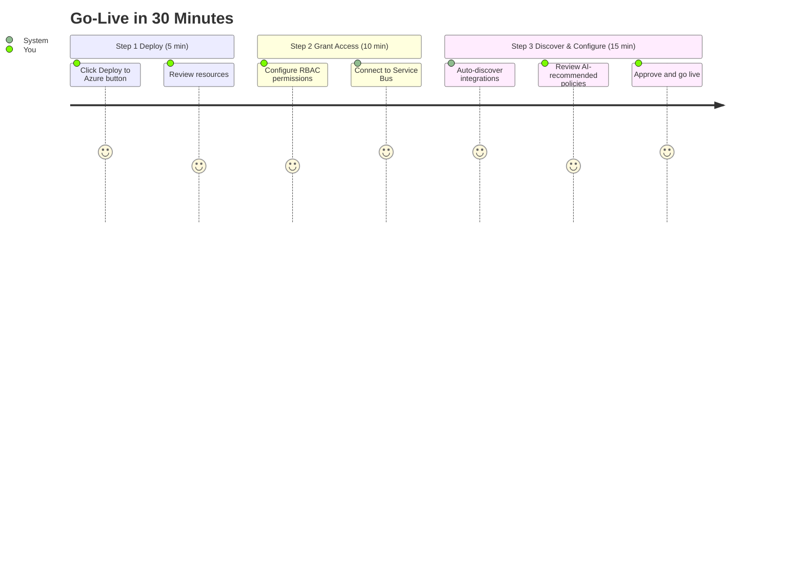
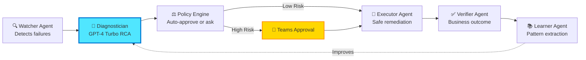

# Continuum-Ops: Enterprise AutoHeal Platform
## 🚀 AI-Native Integration Reliability | Powered by Microsoft AI Foundry

[](https://azure.microsoft.com)
[](https://ai.azure.com)
[](LICENSE)
[](https://continuum-ops.ai)

---

## 💡 Transform Integration Ops from Reactive to Autonomous

**Continuum-Ops** is the world's first **AI-native operational resilience platform** that autonomously detects, diagnoses, and heals integration failures—reducing MTTR from hours to minutes without any code changes to your existing systems.

```
┌─────────────────────────────────────────────────────────────┐
│  Traditional Ops         →         Continuum-Ops            │
├─────────────────────────────────────────────────────────────┤
│  ⏰ 2-8 hours MTTR       →         ⚡ 5-15 minutes          │
│  👤 Manual investigation  →         🤖 AI-powered diagnosis  │
│  📱 Off-hours pages      →         🌙 24/7 autonomous heal  │
│  📝 Reactive firefighting →         🎯 Proactive prevention │
│  💸 $240K/year ops cost  →         💰 $90K/year (62% save) │
└─────────────────────────────────────────────────────────────┘
```

---

## 🌟 Why Continuum-Ops?

### For Engineering Leaders
- ✅ **95% MTTR Reduction**: From hours to minutes
- ✅ **80% Ops Cost Savings**: AI does the toil work
- ✅ **Zero Code Changes**: Works with existing integrations
- ✅ **Enterprise-Grade Security**: SOC 2, GDPR, HIPAA ready

### For Operations Teams
- ✅ **No More 2AM Pages**: Autonomous healing 24/7
- ✅ **Focus on Innovation**: AI handles repetitive incidents
- ✅ **Built-in Expertise**: GPT-4 Turbo knows your patterns
- ✅ **Transparent Decisions**: Full audit trail with explanations

### For Platform Teams
- ✅ **30-Minute Deployment**: Zero-touch onboarding
- ✅ **Auto-Discovery**: Finds all integrations automatically
- ✅ **Self-Configuring**: AI recommends optimal policies
- ✅ **Continuous Learning**: Gets smarter with every incident

---

## 🎯 Quick Start (3 Steps, 30 Minutes)



### 1️⃣ Deploy to Azure

[](https://portal.azure.com/#create/Microsoft.Template/uri/https%3A%2F%2Fraw.githubusercontent.com%2Fcontinuum-ops%2Fazure-deploy%2Fmain%2Fazuredeploy.json)

### 2️⃣ Configure Permissions

```bash
# Grant Continuum-Ops access to your Service Bus namespaces
az role assignment create \
  --assignee <continuum-ops-managed-identity> \
  --role "Azure Service Bus Data Receiver" \
  --scope /subscriptions/{subscription-id}/resourceGroups/{rg}/providers/Microsoft.ServiceBus/namespaces/{namespace}
```

### 3️⃣ Review Discovered Integrations

Visit the Continuum-Ops portal, review auto-discovered integrations, and approve AI-recommended policies. **That's it!** You're live.

---

## 🏗️ Architecture Highlights

### Multi-Agent AI System (Azure AI Foundry)



### Technology Stack

| Component | Technology | Why Best-in-Class |
|-----------|-----------|-------------------|
| 🤖 **AI Agents** | Azure AI Foundry | Microsoft's latest multi-agent framework |
| 🧠 **LLM** | GPT-4 Turbo / GPT-4o | Highest reasoning, function calling, vision |
| 🔄 **Orchestration** | Durable Functions + Semantic Kernel | Stateful, reliable, AI-native |
| 💾 **Data** | Cosmos DB + AI Search | Vector search, semantic memory |
| 🔐 **Security** | Managed Identity + Entra ID | Zero-trust, passwordless |
| 👥 **Collaboration** | Microsoft Teams + Copilot | Native approvals, AI assistance |

---

## 📚 Documentation

### 🎯 Start Here
- **[Product Overview](docs/00-Product-Overview.md)** - Vision, market positioning, business model
- **[Deployment Guide](docs/02-Deployment-Guide.md)** - 30-minute customer onboarding
- **[User Manual](docs/03-User-Manual.md)** - Day-to-day operations guide

### 🏗️ Technical Deep-Dive
- **[Technical Architecture](docs/01-Technical-Architecture.md)** - System design, AI agents, data models
- **[API Reference](docs/04-API-Reference.md)** - REST APIs, webhooks, SDKs
- **[Integration Catalog](docs/06-Integration-Catalog.md)** - Supported systems & connectors

### 🛡️ Enterprise & Compliance
- **[Security & Compliance](docs/05-Security-Compliance.md)** - SOC 2, GDPR, HIPAA, zero-trust
- **[Best Practices](docs/07-Best-Practices.md)** - Policy tuning, optimization tips
- **[Troubleshooting](docs/08-Troubleshooting.md)** - Common issues & solutions

### 📊 Product & Business
- **[Release Notes](docs/09-Release-Notes.md)** - Version history, roadmap
- **[Implementation Roadmap](docs/10-Implementation-Roadmap.md)** - Development sprint plan

---

## 🎨 Real-World Example

### Before Continuum-Ops
```
10:45 PM - Order messages start failing in Service Bus DLQ
11:30 PM - Monitoring alerts page on-call engineer
12:00 AM - Engineer logs in, starts investigating logs
12:45 AM - Finds root cause: Customer CUS-12345 missing in ERP
01:15 AM - Manually creates customer record in ERP
01:30 AM - Replays 47 messages from DLQ
02:00 AM - Verifies orders processed successfully
02:15 AM - Writes incident report, goes back to sleep

Total time: 3.5 hours | Human effort: Full investigation + remediation
```

### With Continuum-Ops
```
10:45 PM - Order messages start failing in Service Bus DLQ
10:47 PM - Watcher Agent detects DLQ spike (2 min)
10:48 PM - Diagnostician Agent analyzes logs via GPT-4 (30 sec)
10:48 PM - Root cause identified: Customer CUS-12345 missing
10:49 PM - Policy Engine checks confidence (92%) and risk (Medium)
10:49 PM - Teams approval card sent to ops channel
10:52 PM - On-call engineer clicks "Approve" from phone (3 min)
10:53 PM - Executor Agent creates customer in ERP (30 sec)
10:54 PM - Replays 47 messages automatically (1 min)
10:56 PM - Verifier Agent confirms orders processed (2 min)
10:57 PM - RCA document generated and posted to Teams

Total time: 12 minutes | Human effort: 1-click approval
```

---

## 💼 Pricing & Plans

| Plan | Price | Integrations | Messages/Month | Support |
|------|-------|--------------|----------------|---------|
| **Starter** | $2,500/mo | Up to 10 | 1M | Standard (4 hr) |
| **Professional** | $7,500/mo | Up to 50 | 10M | Priority (1 hr) |
| **Enterprise** | Custom | Unlimited | Unlimited | Premium (15 min 24/7) |

**All plans include**:
- ✅ AI-powered diagnosis & remediation
- ✅ Auto-discovery & self-configuration
- ✅ Teams integration & approvals
- ✅ Unlimited RCA reports
- ✅ 99.99% platform SLA

[**Request a Demo**](https://calendly.com/continuum-ops-demo) | [**Start Free Trial**](https://portal.continuum-ops.ai/trial)

---

## 🏆 Success Stories

> *"Continuum-Ops reduced our integration MTTR from 4 hours to 8 minutes. Our ops team now focuses on innovation instead of firefighting."*  
> **— Director of IT Operations, Fortune 500 Healthcare**

> *"The AI diagnosis is scary accurate. It found a root cause in 30 seconds that took our engineers 2 hours to figure out manually."*  
> **— Platform Engineering Lead, Global Retailer**

> *"Zero-touch deployment was game-changing. We went from planning meeting to production monitoring in 30 minutes."*  
> **— Cloud Architect, Financial Services**

---

## 🚀 Roadmap

### ✅ Phase 1: Core Platform (Q1 2026) - **COMPLETE**
- Multi-agent AI system with GPT-4 Turbo
- Service Bus integration monitoring
- Message replay & poison message isolation
- Teams approval workflows
- RCA generation

### 🔄 Phase 2: Intelligent Remediation (Q2 2026) - **IN PROGRESS**
- Master data creation (Dynamics 365, SAP)
- Advanced pattern learning with AI Search
- Proactive anomaly detection
- Confidence calibration engine

### 🔮 Phase 3: Predictive Operations (Q3 2026)
- Failure prediction before incidents occur
- Integration health scoring
- Automated runbook generation
- Cross-integration dependency mapping

### 🌐 Phase 4: Enterprise Scale (Q4 2026+)
- Multi-tenant SaaS platform
- Azure Marketplace listing
- Power Platform connectors
- Global compliance (SOC 2, ISO 27001)

---

## 🤝 Strategic Partnerships

<div align="center">

[](https://partner.microsoft.com)
[](https://azuremarketplace.microsoft.com)
[](https://ai.azure.com)

</div>

**Co-Sell Ready** | **ISV Success Program** | **Microsoft for Startups**

---

## 🛠️ Development & Contribution

### For Contributors

This project is currently in **private beta**. We'll open-source selected components after general availability (Q3 2026).

**Tech Stack**:
- **Backend**: .NET 8, Azure Functions, Durable Functions
- **AI**: Azure OpenAI, Semantic Kernel, Prompt Flow
- **Data**: Cosmos DB, AI Search, Azure SQL
- **Infrastructure**: Bicep, Azure DevOps
- **Languages**: C# 12, TypeScript, Python

### For Developers Integrating

```bash
# Install Continuum-Ops SDK
dotnet add package ContinuumOps.SDK

# Or via npm
npm install @continuum-ops/sdk
```

```csharp
// Example: Register custom runbook
var client = new ContinuumOpsClient("https://api.continuum-ops.ai", managedIdentity);

await client.Runbooks.RegisterAsync(new Runbook
{
    Name = "custom-data-fix",
    RiskLevel = RiskLevel.Medium,
    RequiresApproval = true,
    Executor = async (context) => {
        // Your custom remediation logic
        await FixCustomDataIssue(context.Parameters);
    }
});
```

---

## 📞 Get in Touch

### For Customers
- 🌐 **Website**: [www.continuum-ops.ai](https://www.continuum-ops.ai)
- 📧 **Sales**: sales@continuum-ops.ai
- 📅 **Book Demo**: [calendly.com/continuum-ops-demo](https://calendly.com/continuum-ops-demo)
- 💬 **Community**: [community.continuum-ops.ai](https://community.continuum-ops.ai)

### For Investors
- 📧 **Investor Relations**: investors@continuum-ops.ai
- 📊 **Pitch Deck**: Available on request (NDA required)
- 💰 **Current Round**: Seed (Q2 2026, $5M target)

### For Partners
- 🤝 **Partner Program**: partners@continuum-ops.ai
- 📜 **Partner Portal**: [partners.continuum-ops.ai](https://partners.continuum-ops.ai)
- 🏢 **System Integrators**: SI partnerships available

### For Press & Media
- 📰 **Press Kit**: [press.continuum-ops.ai](https://press.continuum-ops.ai)
- 📧 **Media Contact**: press@continuum-ops.ai

---

## 📜 License

Copyright © 2026 Continuum-Ops Inc. All rights reserved.

This is commercial software. See [LICENSE](LICENSE) for terms.

**Private Beta**: Limited licenses available for design partners.

---

## 🙏 Acknowledgments

Built with world-class Azure technologies:
- **Azure AI Foundry** - Multi-agent orchestration
- **Azure OpenAI** - GPT-4 Turbo, GPT-4o
- **Semantic Kernel** - AI application framework
- **Durable Functions** - Stateful orchestration
- **Microsoft Teams** - Collaboration platform

Special thanks to our design partners and the Azure engineering teams for their support.

---

<div align="center">

**🚀 Ready to transform your integration ops?**

[**Start Free Trial**](https://portal.continuum-ops.ai/trial) | [**Book Demo**](https://calendly.com/continuum-ops-demo) | [**View Docs**](docs/00-Product-Overview.md)

---

*Built with ❤️ on Microsoft Azure | Powered by AI Foundry*

[](https://twitter.com/continuumops)
[](https://linkedin.com/company/continuum-ops)
[](https://youtube.com/@continuumops)

</div>