# Continuum-Ops: Enterprise AutoHeal Platform
## Powered by Microsoft AI Foundry & Azure AI Services

---

## 🚀 Product Vision

**Continuum-Ops** is a **zero-touch, AI-native operational resilience platform** that transforms integration reliability from reactive firefighting to autonomous self-healing. Built on Microsoft's cutting-edge AI Foundry and Azure AI Services, it delivers enterprise-grade automation with human oversight.

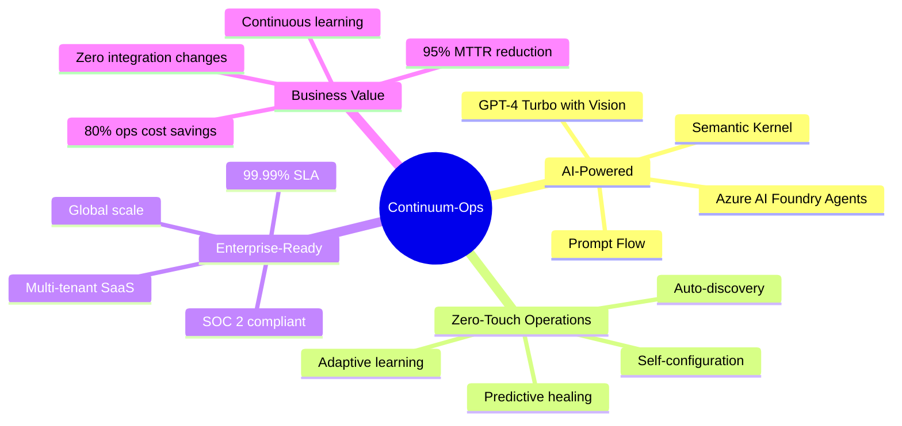

---

## 🎯 Market Position

### Target Market

| Segment | Characteristics | Pain Points | Our Solution |
|---------|----------------|-------------|--------------|
| **Enterprise IT Ops** | 500+ employees, complex integrations | Manual incident response, high MTTR | Autonomous healing, 15-min MTTR |
| **Digital Transformation** | Cloud migration, API economy | Integration brittleness, skill gaps | Zero-touch reliability, AI expertise |
| **SaaS/ISVs** | Multi-tenant platforms | Customer-facing reliability issues | Self-service healing, customer transparency |
| **Managed Services** | MSPs, system integrators | Labor-intensive operations | AI-powered automation, margin improvement |

### Competitive Differentiation

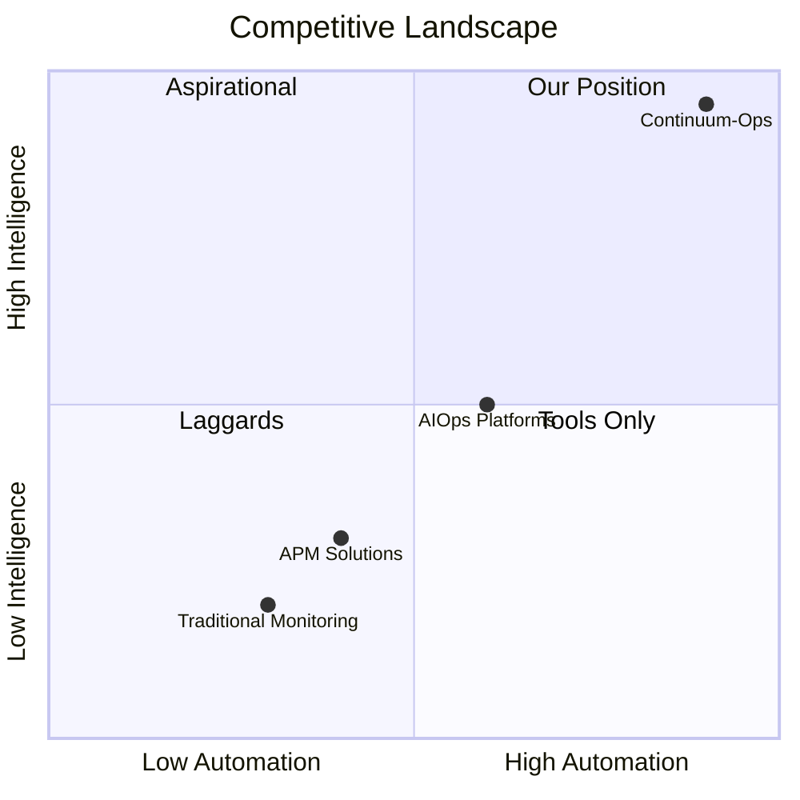

**What Makes Us Different:**
- ✅ **AI-First Architecture**: Built on Azure AI Foundry multi-agent system, not retrofitted AI
- ✅ **Zero Integration Changes**: Customers don't modify code - we adapt to them
- ✅ **Business Outcome Focus**: Verify business processes, not just technical metrics
- ✅ **Autonomous Learning**: Improves continuously from every incident
- ✅ **Transparent AI**: Explainable decisions with evidence citations

---

## 🏗️ Technology Foundation

### Microsoft AI Foundry Integration

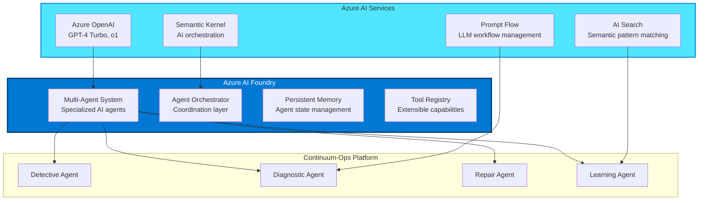

### Technology Stack (Best-in-Class)

| Layer | Technology | Why Best-in-Class |
|-------|-----------|-------------------|
| **AI Orchestration** | **Azure AI Foundry Agents** | Microsoft's latest multi-agent framework with native Azure integration |
| **LLM** | **GPT-4 Turbo / GPT-4o** | Highest reasoning capability, function calling, vision support |
| **AI Workflow** | **Prompt Flow** | Visual LLM app development, built-in evaluation, enterprise-ready |
| **Semantic Memory** | **Semantic Kernel + AI Search** | Persistent agent memory, semantic pattern matching |
| **Orchestration** | **Azure Durable Functions + Dapr** | Stateful workflows with distributed system patterns |
| **Observability** | **Azure Monitor + Application Insights** | Native integration, AI-powered anomaly detection |
| **Data** | **Cosmos DB + Azure SQL** | Multi-model, globally distributed, vector search support |
| **Identity** | **Microsoft Entra ID + Managed Identity** | Zero-trust, passwordless, enterprise SSO |
| **Collaboration** | **Microsoft Teams + Copilot** | Native approval workflows, AI-assisted decision support |

---

## 🎨 Product Architecture (Enterprise-Grade)

### Multi-Agent System (Azure AI Foundry)

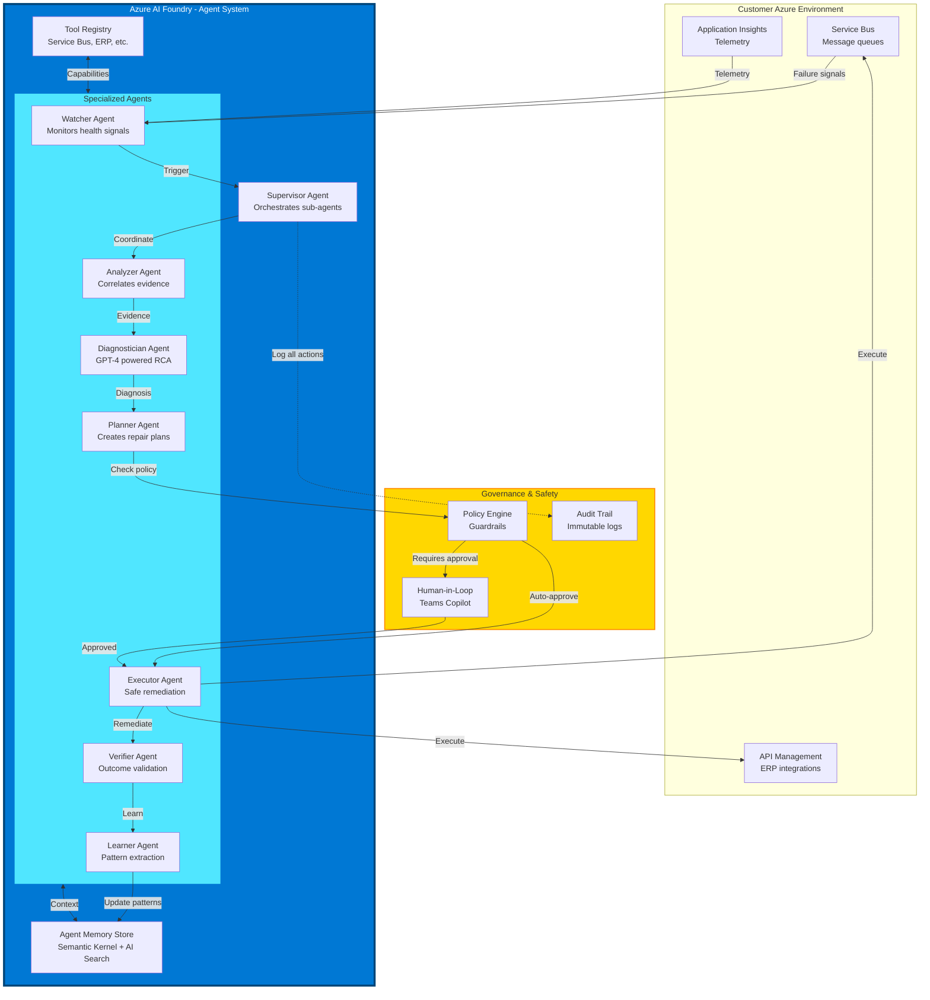

### Agent Capabilities (Powered by GPT-4 Turbo)

#### 1. Watcher Agent
**Purpose**: Continuous health monitoring with anomaly detection

**AI Capabilities**:
- ✨ **Semantic pattern recognition** (AI Search)
- ✨ **Anomaly prediction** (Azure Monitor AI)
- ✨ **Correlation intelligence** (GPT-4 Turbo)
- ✨ **Adaptive thresholds** (learns normal behavior)

#### 2. Analyzer Agent
**Purpose**: Evidence collection and correlation

**AI Capabilities**:
- ✨ **Intelligent log parsing** (GPT-4 Turbo)
- ✨ **Cross-system correlation** (Semantic Kernel)
- ✨ **PII auto-detection and redaction** (Azure AI Content Safety)
- ✨ **Temporal reasoning** (understands event sequences)

#### 3. Diagnostician Agent
**Purpose**: Root cause analysis with explainability

**AI Capabilities**:
- ✨ **Multi-modal analysis** (GPT-4 Turbo with Vision - can analyze screenshots)
- ✨ **Chain-of-thought reasoning** (GPT-4o with reasoning tokens)
- ✨ **Evidence citation** (cites specific logs/metrics)
- ✨ **Confidence scoring** (calibrated via historical data)

**Prompt Flow Integration**:
```yaml
# Diagnostic Workflow (Prompt Flow)
name: DiagnosticWorkflow
inputs:
  - incident_context
  - evidence_bundle
  
nodes:
  - name: evidence_analysis
    type: llm
    model: gpt-4-turbo
    prompt: |
      Analyze the following integration failure evidence...
      
  - name: pattern_matching
    type: semantic_search
    index: historical_incidents
    top_k: 5
    
  - name: root_cause_synthesis
    type: llm
    model: gpt-4o
    prompt: |
      Given evidence and similar historical incidents, determine root cause...
      
  - name: confidence_calibration
    type: python
    code: calibrate_confidence(diagnosis, historical_accuracy)

outputs:
  - diagnosis
  - confidence_score
  - evidence_citations
```

#### 4. Planner Agent
**Purpose**: Create safe, sequenced repair plans

**AI Capabilities**:
- ✨ **Task decomposition** (breaks complex repairs into steps)
- ✨ **Dependency analysis** (understands action ordering)
- ✨ **Risk assessment** (predicts blast radius)
- ✨ **Rollback planning** (compensation strategies)

#### 5. Executor Agent
**Purpose**: Idempotent, safe action execution

**AI Capabilities**:
- ✨ **Idempotency validation** (checks if already executed)
- ✨ **Retry strategy optimization** (learns best backoff)
- ✨ **Graceful degradation** (partial success handling)

#### 6. Verifier Agent
**Purpose**: Business outcome validation

**AI Capabilities**:
- ✨ **Outcome prediction** (what should happen after repair)
- ✨ **Multi-signal verification** (technical + business + user impact)
- ✨ **False positive detection** (distinguishes coincidence from causation)

#### 7. Learner Agent
**Purpose**: Continuous improvement and knowledge extraction

**AI Capabilities**:
- ✨ **Pattern extraction** (identifies recurring failure signatures)
- ✨ **Confidence calibration** (improves accuracy over time)
- ✨ **Proactive recommendation** (suggests preventive actions)
- ✨ **Knowledge graph construction** (builds integration dependency map)

---

## 🌟 Unique Value Propositions

### 1. Zero-Touch Onboarding

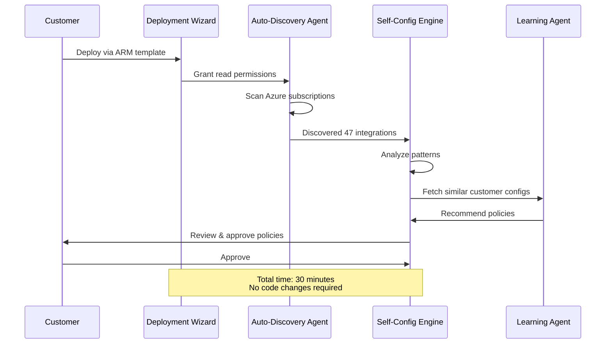

**Customer Experience**:
1. ☑️ Deploy ARM template (5 min)
2. ☑️ Grant Azure permissions (10 min)
3. ☑️ Review auto-discovered integrations (10 min)
4. ☑️ Approve AI-recommended policies (5 min)
5. ✅ **Live in production** (30 min total)

### 2. Self-Improving AI

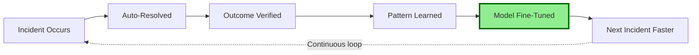

**How It Works**:
- 📈 **Week 1**: 40% auto-resolution rate (learning mode)
- 📈 **Week 4**: 65% auto-resolution rate (pattern recognition)
- 📈 **Week 12**: 80%+ auto-resolution rate (mature system)
- 📈 **Week 24**: 90%+ with proactive prevention

### 3. Multi-Tenant SaaS Architecture

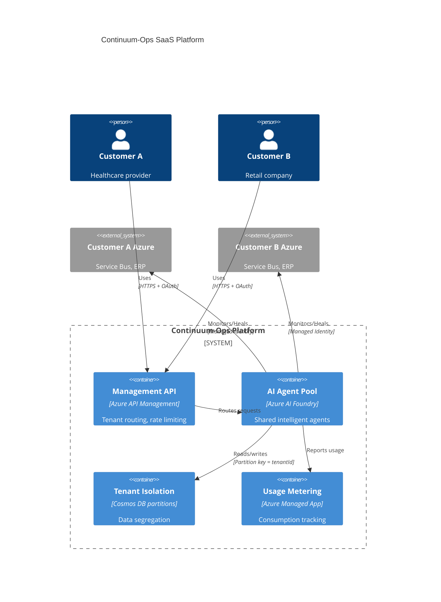

**Tenant Isolation**:
- 🔒 **Data**: Cosmos DB partition per tenant
- 🔒 **Compute**: Isolated Durable Function orchestrations
- 🔒 **Identity**: Customer-specific Managed Identity
- 🔒 **Network**: Azure Private Link per customer

---

## 💼 Business Model

### Pricing (Transparent & Predictable)

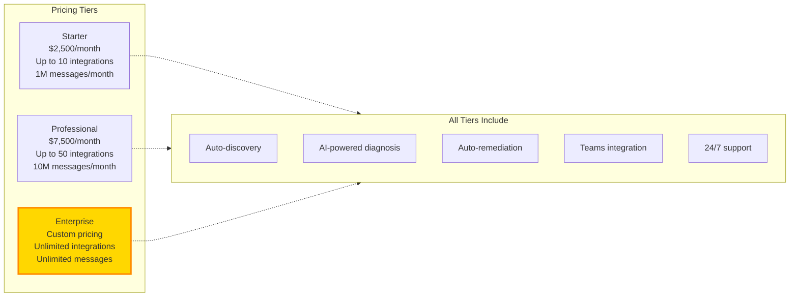

**Add-Ons**:
- 🔌 **Premium Connectors** (SAP, Salesforce, custom ERP): $500/connector/month
- 🎓 **Professional Services** (custom runbooks, training): $250/hour
- 🔐 **Advanced Security** (private deployment, SOC 2 audit): $2,000/month
- 🌍 **Multi-region DR**: $1,500/month per additional region

### ROI Calculator

**Typical Enterprise (100 integrations)**:
- **Current Cost**: 2 FTE ops engineers × $120K = $240K/year
- **Continuum-Ops Cost**: $90K/year (Professional tier)
- **Estimated Savings**: $150K/year (62% reduction)
- **Payback Period**: 3.6 months

**Plus Intangible Benefits**:
- ✅ Reduced MTTR from hours to minutes → higher availability
- ✅ No business-critical failures during off-hours → better customer experience
- ✅ Freed-up engineering time for innovation → competitive advantage

---

## 📊 Success Metrics & SLAs

### Platform SLAs (Production)

| Metric | SLA | Measurement |
|--------|-----|-------------|
| **Platform Uptime** | 99.99% | <4.38 min downtime/month |
| **Detection Latency** | <5 min | 95th percentile |
| **Diagnosis Latency** | <30 sec | 95th percentile |
| **Auto-Resolution Rate** | 60-80% | After 30-day maturity period |
| **False Positive Rate** | <5% | Verified incidents / total triggers |
| **Diagnosis Accuracy** | >90% | Validated against manual RCA |

### Customer Success Metrics (Guaranteed Improvements)

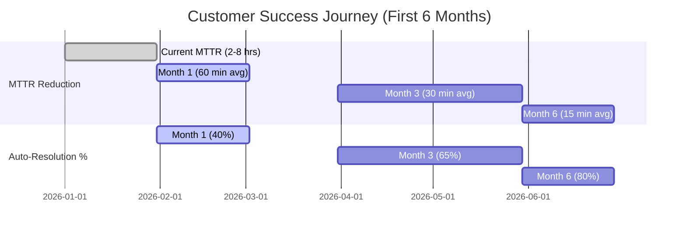

---

## 🚦 Go-to-Market Strategy

### Phase 1: Private Beta (Q1 2026)
- 🎯 **Target**: 5 design partners (enterprise customers)
- 🎯 **Goal**: Validate product-market fit, gather feedback
- 🎯 **Pricing**: Free during beta
- 🎯 **Success Criteria**: 3+ customers achieve 50%+ auto-resolution rate

### Phase 2: Limited Availability (Q2 2026)
- 🎯 **Target**: 25 customers (expansion from beta)
- 🎯 **Goal**: Prove scalability, refine pricing
- 🎯 **Pricing**: 50% discount (early adopter pricing)
- 🎯 **Success Criteria**: $500K ARR, 90% customer retention

### Phase 3: General Availability (Q3 2026)
- 🎯 **Target**: 100+ customers by EOY
- 🎯 **Goal**: Establish market leadership
- 🎯 **Pricing**: Full pricing with volume discounts
- 🎯 **Success Criteria**: $2M ARR, <10% churn rate

### Phase 4: Enterprise Scale (Q4 2026+)
- 🎯 **Target**: Fortune 500, global enterprises
- 🎯 **Goal**: Become category leader in AI-powered ops
- 🎯 **Pricing**: Custom enterprise agreements
- 🎯 **Success Criteria**: $10M ARR, analyst recognition (Gartner, Forrester)

---

## 🛡️ Security & Compliance

### Security Posture

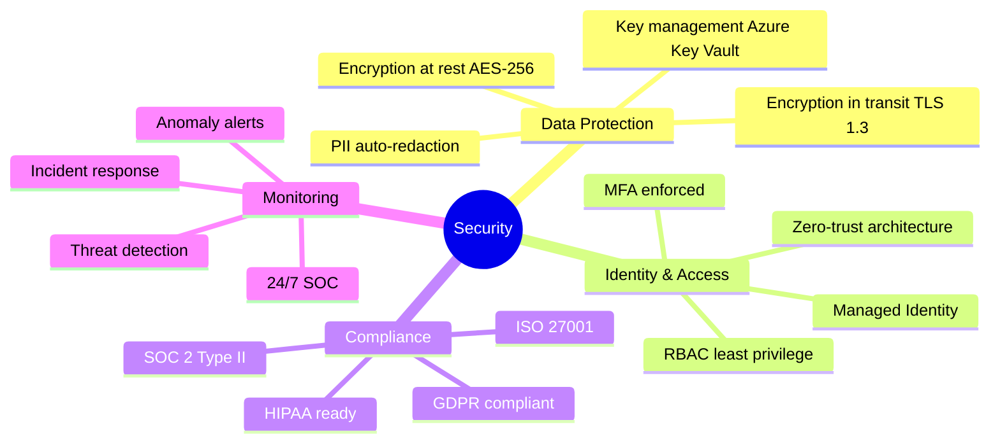

### Compliance Certifications (Roadmap)

| Certification | Status | Target Date |
|---------------|--------|-------------|
| **SOC 2 Type II** | 🟡 In Progress | Q2 2026 |
| **ISO 27001** | 🟡 In Progress | Q3 2026 |
| **GDPR** | ✅ Compliant | Current |
| **HIPAA** | 🟡 In Progress | Q4 2026 |
| **FedRAMP** | 🔴 Planned | Q2 2027 |

---

## 🎓 Customer Success Program

### Onboarding (White-Glove Service)

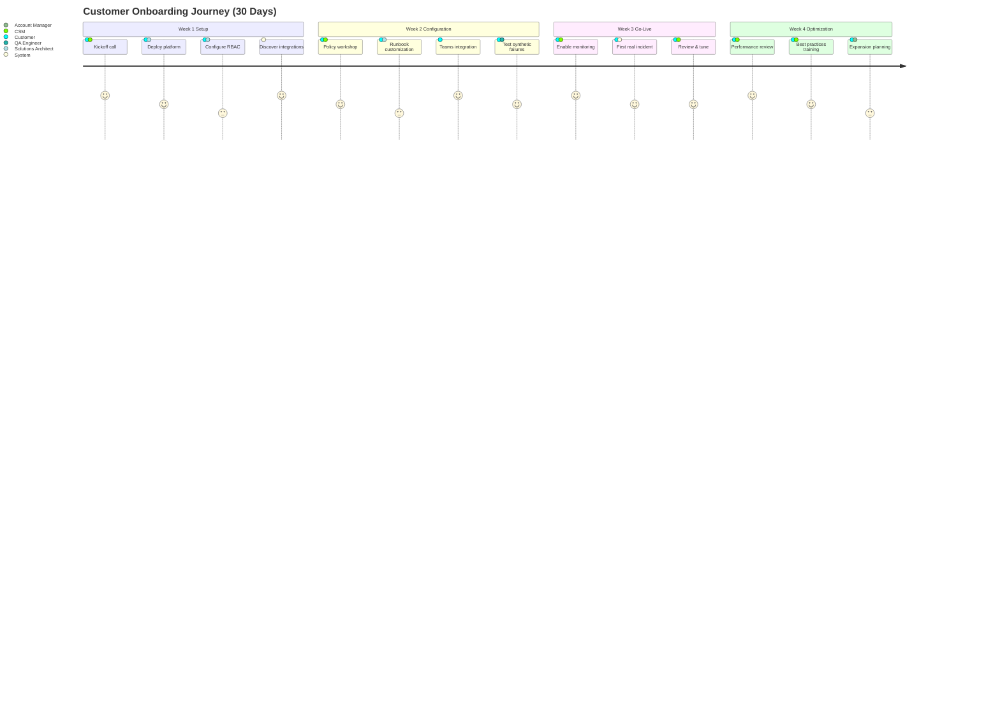

### Support Tiers

| Tier | Response Time | Channels | Included In |
|------|--------------|----------|-------------|
| **Standard** | 4 business hours | Email, Portal | Starter |
| **Priority** | 1 business hour | Email, Portal, Slack | Professional |
| **Premium** | 15 minutes 24/7 | Email, Portal, Slack, Phone | Enterprise |

---

## 📚 Documentation Structure (Final)

```
docs/
├── 00-Product-Overview.md              ⭐ This document
├── 01-Technical-Architecture.md        🏗️ System design, AI agents
├── 02-Deployment-Guide.md              🚀 Customer deployment (30 min)
├── 03-User-Manual.md                   📖 Operations guide
├── 04-API-Reference.md                 🔌 REST API, webhooks
├── 05-Security-Compliance.md           🛡️ Security & compliance
├── 06-Integration-Catalog.md           🔧 Supported systems & connectors
├── 07-Best-Practices.md                ✨ Policy tuning, optimization
├── 08-Troubleshooting.md               🔍 Common issues & solutions
└── 09-Release-Notes.md                 📝 Version history
```

---

## 🤝 Strategic Partnerships

### Microsoft Partner Ecosystem

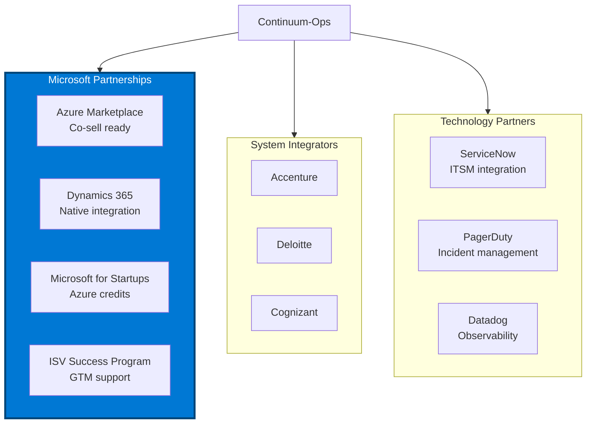

---

## 📞 Contact & Next Steps

### For Potential Customers
- 🌐 **Website**: www.continuum-ops.ai
- 📧 **Sales**: sales@continuum-ops.ai
- 📅 **Book Demo**: [calendly.com/continuum-ops-demo](https://calendly.com/continuum-ops-demo)
- 💬 **Slack Community**: [community.continuum-ops.ai](https://community.continuum-ops.ai)

### For Investors
- 📧 **Investor Relations**: investors@continuum-ops.ai
- 📊 **Pitch Deck**: Available on request
- 💰 **Funding Stage**: Seed round opening Q2 2026

### For Partners
- 🤝 **Partner Program**: partners@continuum-ops.ai
- 📜 **Partner Portal**: [partners.continuum-ops.ai](https://partners.continuum-ops.ai)

---

## 📝 Version History

| Version | Date | Changes |
|---------|------|---------|
| 2.0 | 2026-02-12 | Enterprise product launch version with AI Foundry integration |
| 1.0 | 2026-01-15 | Initial concept document |

---

**© 2026 Continuum-Ops Inc. All rights reserved.**

*Built with ❤️ on Microsoft Azure*
