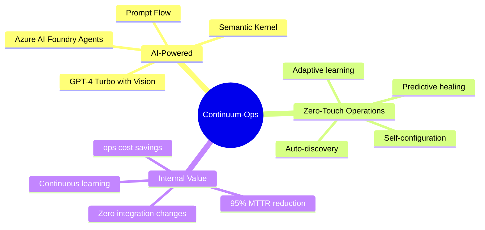
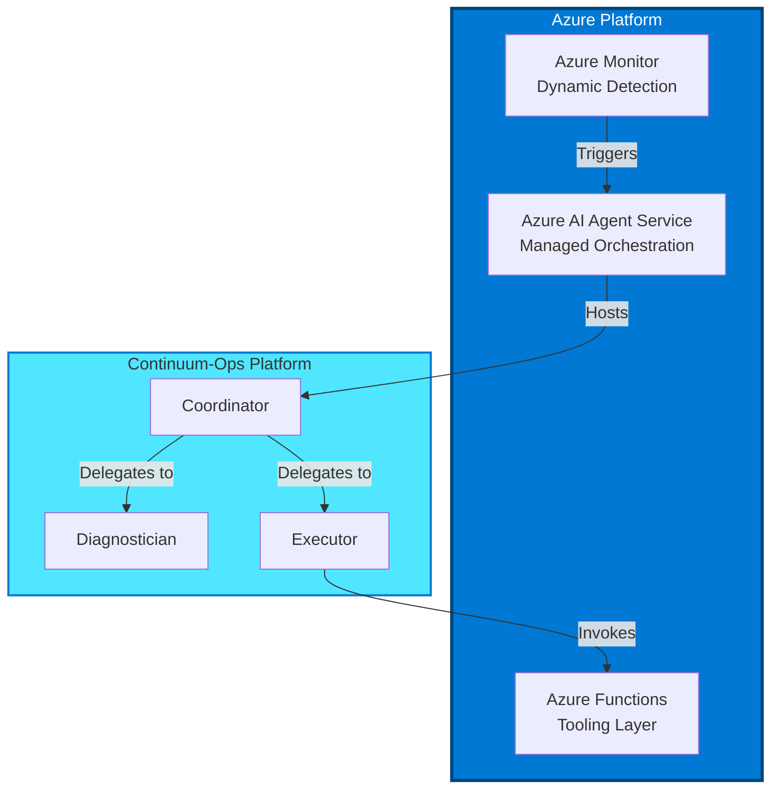
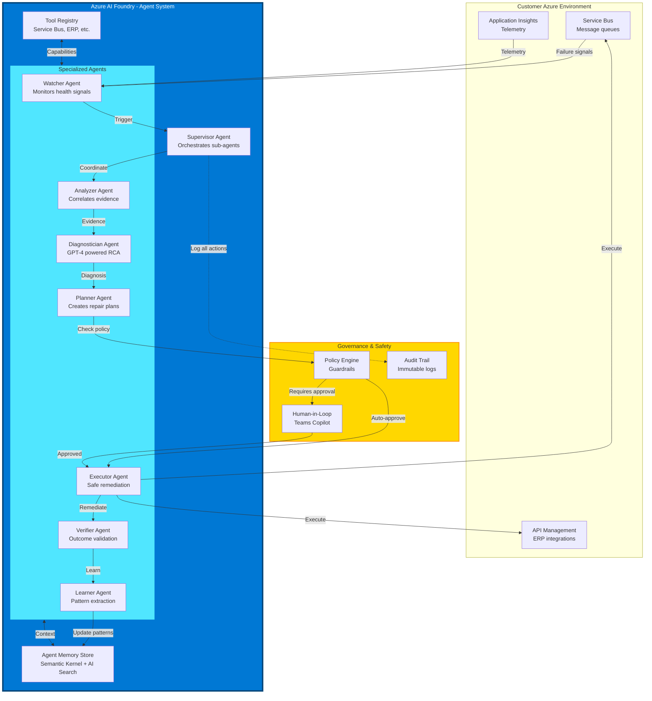
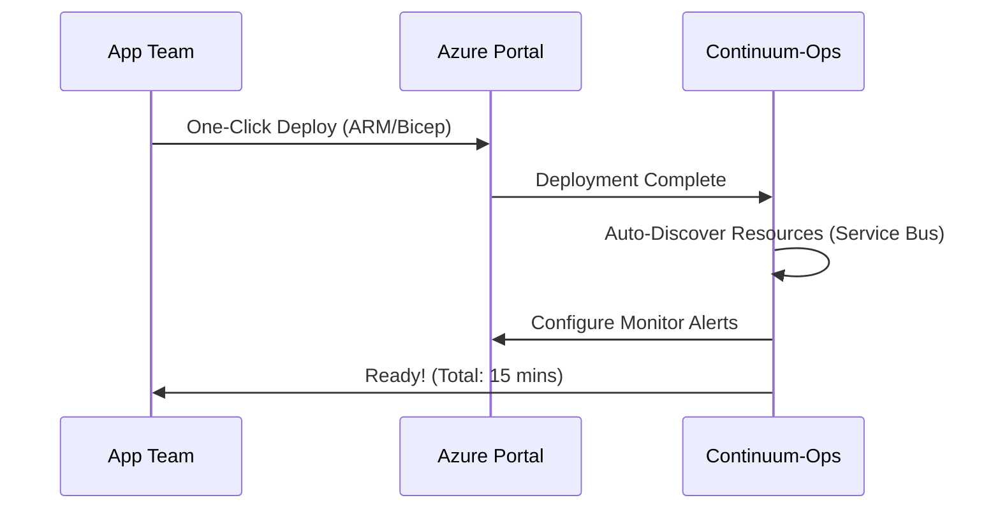
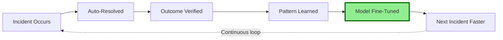
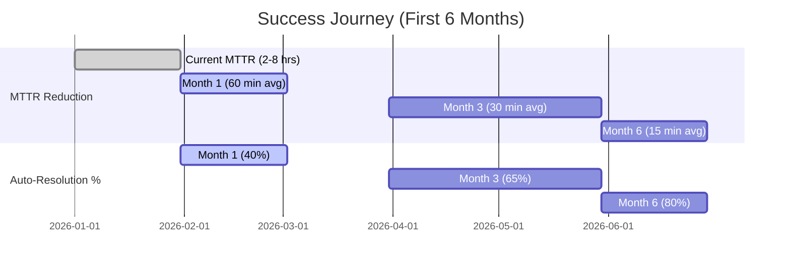

# Continuum-Ops: Enterprise AutoHeal Platform
## Powered by Microsoft AI Foundry & Azure AI Agent Service

---

## 🚀 Product Vision

**Continuum-Ops** is a **zero-touch, AI-native operational resilience platform** that transforms integration reliability from reactive firefighting to autonomous self-healing. Built on Microsoft's cutting-edge AI Foundry and Azure AI Services, it aims to deliver enterprise-grade automation with human oversight.



---

## 🎯 Internal Value Proposition

**Why we are building this:**

*   **Reduce Operational Toil**: Automate the repetitive "Level 1" support tasks that consume engineering improvement time.
*   **Improve Reliability**: Move from inconsistent manual fixes to standardized, audit-trailed AI remediation.
*   **Modernize Ops Stack**: leverage the latest Microsoft AI Foundry capabilities for our internal operations.

---

## 🏗️ Technology Foundation

### Microsoft Azure Native Integration



### Technology Stack (Best-in-Class)

| Layer | Technology | Why Best-in-Class |
|-------|-----------|-------------------|
| **AI Orchestration** | **Azure AI Agent Service** | Fully managed service for building and deploying AI agents |
| **Detection** | **Azure Monitor** | Native dynamic thresholds (ML) for anomaly detection |
| **LLM** | **GPT-4o** | Multimodal reasoning with higher speed and lower cost |
| **Tooling** | **OpenAPI + Azure Functions** | Standardized, interchangeable tool definitions |
| **Memory** | **Azure AI Search** | Vector-based semantic recall for historical patterns |
| **Runtime** | **Azure Functions (.NET 8)** | Serverless, scalable execution environment |
| **Identity** | **Microsoft Entra ID** | Zero-trust authentication backbone |

---

## 🎨 Product Architecture (Enterprise-Grade)

### Multi-Agent System (Azure AI Foundry)



### Agent Capabilities (Powered by Azure AI Agent Service)

#### 1. Detection (Azure Monitor)
**Purpose**: Zero-latency monitoring with ML-based baselining.
*   **Native Capability**: Replaces custom "Watcher" code. Automatically learns weekly/daily seasonality.
*   **Trigger**: Fires webhook only when genuine behavioral anomalies occur.

#### 2. Coordinator Agent
**Purpose**: Central nervous system.
*   **Function**: Receives alerts, instantiates the incident context, and assigns work to specific agents.
*   **Human Handoff**: Seamlessly brings humans into the loop via Teams when confidence is low.

#### 3. Diagnostician Agent
**Purpose**: Deep reasoning and Root Cause Analysis.
*   **Capabilities**:
    *   **Log Analysis**: Queries App Insights to correlate errors.
    *   **Pattern Matching**: "I've seen this error 5 times before, it's usually a data issue."
    *   **Evidence Citation**: Points to specific log lines driving the conclusion.

**Prompt Flow Integration**:
```yaml
# Diagnostic Workflow (Prompt Flow)
name: DiagnosticWorkflow
inputs:
  - incident_context
  - evidence_bundle
  
nodes:
  - name: evidence_analysis
    type: llm
    model: gpt-4-turbo
    prompt: |
      Analyze the following integration failure evidence...
      
  - name: pattern_matching
    type: semantic_search
    index: historical_incidents
    top_k: 5
    
  - name: root_cause_synthesis
    type: llm
    model: gpt-4o
    prompt: |
      Given evidence and similar historical incidents, determine root cause...
      
  - name: confidence_calibration
    type: python
    code: calibrate_confidence(diagnosis, historical_accuracy)

outputs:
  - diagnosis
  - confidence_score
  - evidence_citations
```

#### 4. Planner Agent
**Purpose**: Create safe, sequenced repair plans

**AI Capabilities**:
- ✨ **Task decomposition** (breaks complex repairs into steps)
- ✨ **Dependency analysis** (understands action ordering)
- ✨ **Risk assessment** (predicts blast radius)
- ✨ **Rollback planning** (compensation strategies)

#### 5. Executor Agent
**Purpose**: Idempotent, safe action execution

**AI Capabilities**:
- ✨ **Idempotency validation** (checks if already executed)
- ✨ **Retry strategy optimization** (learns best backoff)
- ✨ **Graceful degradation** (partial success handling)

#### 6. Verifier Agent
**Purpose**: Business outcome validation

**AI Capabilities**:
- ✨ **Outcome prediction** (what should happen after repair)
- ✨ **Multi-signal verification** (technical + business + user impact)
- ✨ **False positive detection** (distinguishes coincidence from causation)

#### 7. Learner Agent
**Purpose**: Continuous improvement and knowledge extraction

**AI Capabilities**:
- ✨ **Pattern extraction** (identifies recurring failure signatures)
- ✨ **Confidence calibration** (improves accuracy over time)
- ✨ **Proactive recommendation** (suggests preventive actions)
- ✨ **Knowledge graph construction** (builds integration dependency map)

---

## 🌟 Unique Value Propositions

### 1. Zero-Touch Onboarding



**Experience**:
1. ☑️ Deploy from Bicep.
2. ☑️ Grant Permissions.
3. ✅ **Live**. The system auto-configures Azure Monitor alerts for you.

### 2. Self-Improving AI



**How It Works**:
- 📈 **Week 1**: 40% auto-resolution rate (learning mode)
- 📈 **Week 4**: 65% auto-resolution rate (pattern recognition)
- 📈 **Week 12**: 80%+ auto-resolution rate (mature system)
- 📈 **Week 24**: 90%+ with proactive prevention

---

## 📊 Success Metrics & SLAs

### Platform SLAs (Target)

| Metric | Target | Measurement |
|--------|-----|-------------|
| **Platform Uptime** | 99.99% | <4.38 min downtime/month |
| **Detection Latency** | <5 min | 95th percentile |
| **Diagnosis Latency** | <30 sec | 95th percentile |
| **Auto-Resolution Rate** | 60-80% | After 30-day maturity period |
| **False Positive Rate** | <5% | Verified incidents / total triggers |
| **Diagnosis Accuracy** | >90% | Validated against manual RCA |

### Internal Success Metrics



---

### Implementation Plan

### Phase 1: Prototype & Validation (Current)
- 🎯 **Target**: Internal demo for leadership
- 🎯 **Goal**: Secure approval for MVP development
- 🎯 **Success Criteria**: Leadership sign-off

### Phase 2: MVP Development (Q2 2026)
- 🎯 **Target**: Core platform capabilities
- 🎯 **Goal**: Build "Auto-Heal" loop for Service Bus
- 🎯 **Success Criteria**: End-to-end working demo

---

## 📚 Documentation Structure

```
docs/
├── 00-Product-Overview.md              ⭐ This document
├── 01-Technical-Architecture.md        🏗️ System design (Azure AI Agent Service)
├── 02-Deployment-Guide.md              🚀 Deployment (15 min)
├── 03-User-Manual.md                   📖 Operations guide
├── 04-API-Reference.md                 🔌 REST API, webhooks
├── 05-Security-Compliance.md           🛡️ Security & compliance
├── 07-Implementation-Roadmap.md        📝 Development plan
```

---

## 📞 Contact

- **Mayank Gupta** - [mayank.h.gupta@capgemini.com](mailto:mayank.h.gupta@capgemini.com)

---

**© 2026 Continuum-Ops**

*Built with ❤️ on Microsoft Azure*
