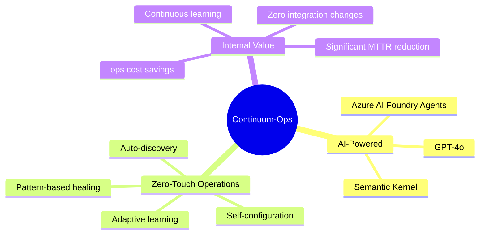
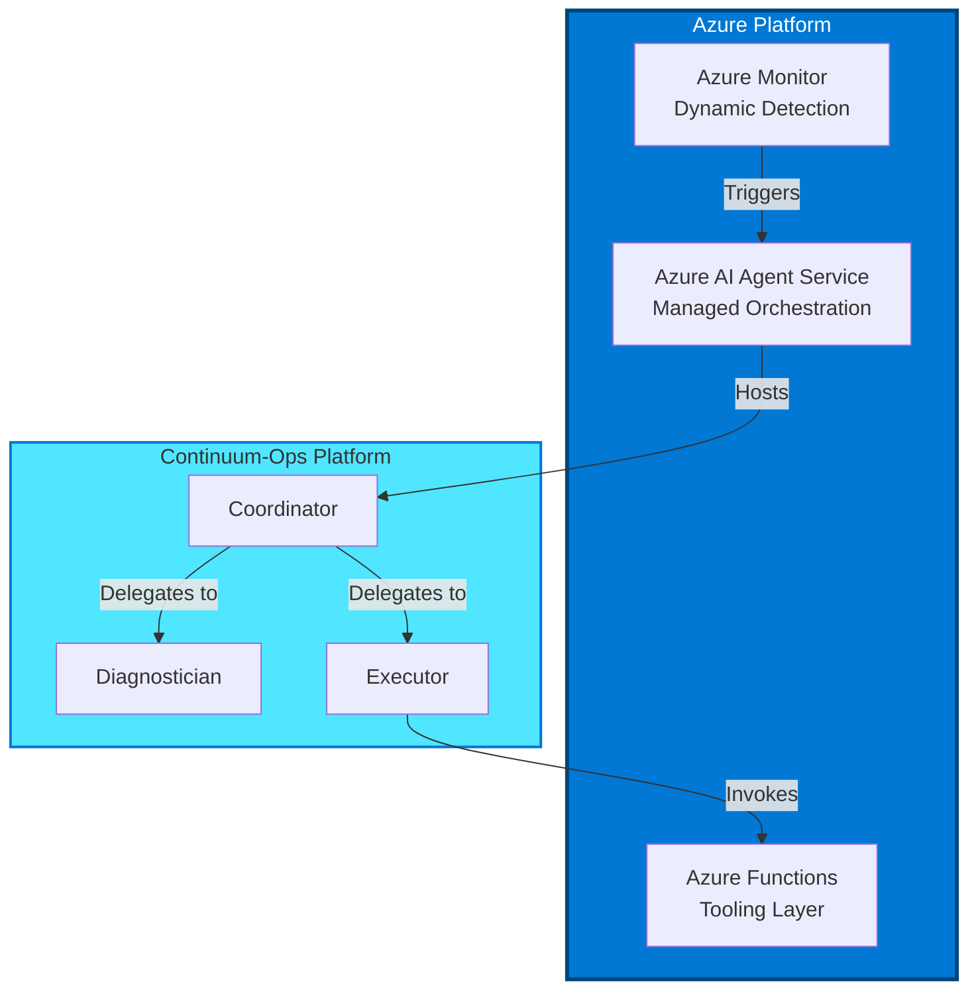
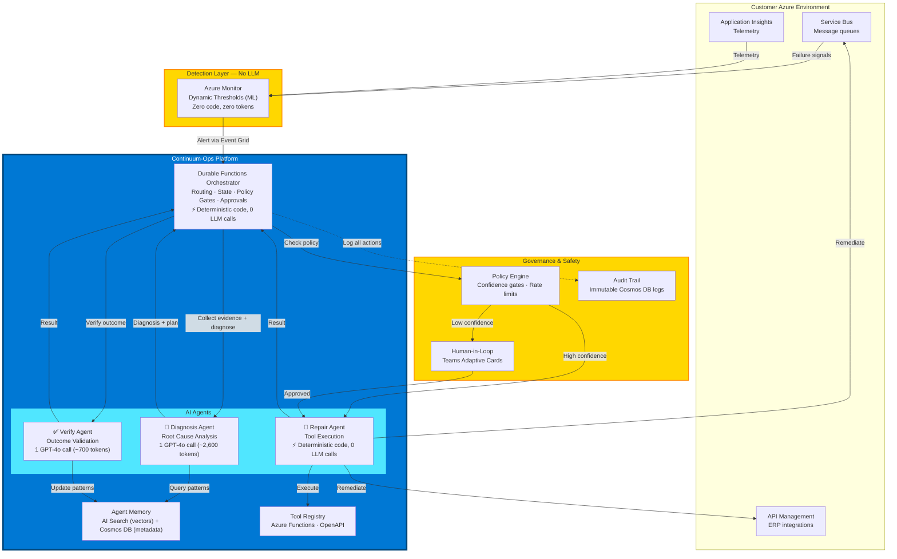
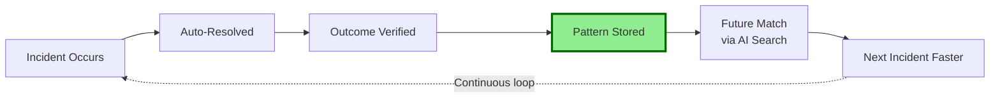
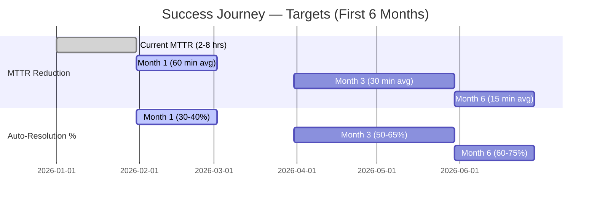

# Continuum-Ops: Enterprise AutoHeal Platform
## Powered by Microsoft AI Foundry & Azure AI Agent Service

---

## 🚀 Product Vision

**Continuum-Ops** is an **AI-native operational resilience platform** that aims to transform integration reliability from reactive firefighting to autonomous self-healing. Built on Microsoft AI Foundry and Azure AI Services, it targets enterprise-grade automation with human oversight.



---

## 🎯 Internal Value Proposition

**Why we are building this:**

*   **Reduce Operational Toil**: Automate the repetitive "Level 1" support tasks that consume engineering improvement time.
*   **Improve Reliability**: Move from inconsistent manual fixes to standardized, audit-trailed AI remediation.
*   **Modernize Ops Stack**: leverage the latest Microsoft AI Foundry capabilities for our internal operations.

---

## 🏗️ Technology Foundation

### Microsoft Azure Native Integration



### Technology Stack

| Layer | Technology | Why Chosen |
|-------|-----------|-------------------|
| **AI Orchestration** | **Azure AI Agent Service** | Managed agent hosting |
| **Detection** | **Azure Monitor** | Native dynamic thresholds (ML), zero LLM tokens for monitoring |
| **LLM** | **GPT-4o** | Fast structured output, multimodal reasoning, cost-effective |
| **Tooling** | **OpenAPI + Azure Functions** | Standardized, interchangeable tool definitions |
| **Memory** | **Azure AI Search** | Vector-based semantic recall for historical patterns |
| **Runtime** | **Azure Functions (.NET 8)** | Serverless, scalable execution environment |
| **Identity** | **Microsoft Entra ID** | Zero-trust authentication backbone |

---

## 🎨 Product Architecture (Enterprise-Grade)

### Agent Architecture (3 Agents + Orchestrator)

Continuum-Ops uses a lean, cost-optimized agent design: **3 specialized agents** coordinated by a **Durable Functions orchestrator**. Detection is handled by Azure Monitor natively — zero LLM tokens for monitoring.



### Why Only 3 Agents?

Every LLM call has fixed token overhead (system prompt, tool schemas, context). With 7 agents you pay that overhead 7× per incident. Our 3-agent design cuts token cost by **~70%**:

| Component | Role | LLM Cost |
|-----------|------|----------|
| **Azure Monitor** | Detection — ML-based anomaly detection | **$0** (no LLM) |
| **Durable Functions Orchestrator** | Routing, state, policy gates, approvals | **$0** (deterministic code) |
| **Diagnosis Agent** | Evidence collection + Root Cause Analysis + repair planning | **~2,600 tokens** (1 GPT-4o call) |
| **Repair Agent** | Execute OpenAPI tools (replay, create data, etc.) | **$0** (deterministic code) |
| **Verify Agent** | Validate business outcome + update patterns | **~700 tokens** (1 GPT-4o call) |

> **Total cost per incident: ~$0.01** at GPT-4o rates. See [Technical Architecture — Token Budget](01-Technical-Architecture.md#token-budget-per-incident) for full breakdown.

### Agent Capabilities

#### 1. Detection (Azure Monitor — No Code)
- **ML-based Dynamic Thresholds** on `DeadletterMessageCount`, `ActiveMessageCount`
- Automatically learns weekly/daily seasonality
- Fires alerts only for genuine anomalies → Event Grid → Durable Functions

#### 2. Diagnosis Agent (GPT-4o)
- **Evidence Collection**: Peeks DLQ messages, queries App Insights (KQL), searches historical patterns (AI Search)
- **Root Cause Analysis**: Identifies why messages failed with evidence citations
- **Repair Planning**: Proposes sequenced action plan with confidence score and risk level
- **Pattern Matching**: "I've seen this 5 times before — it's usually missing master data" (leverages vector similarity from resolved incidents)

#### 3. Repair Agent (Deterministic Code)
- **Idempotent Execution**: Checks if action already executed before running
- **OpenAPI Tools**: Calls Azure Functions (replay message, create customer, isolate poison message)
- **Graceful Failure**: Reports success/failure back to orchestrator; does NOT retry autonomously

#### 4. Verify Agent (GPT-4o)
- **Business Outcome Validation**: Checks ERP for created orders, verifies DLQ depth decreased
- **Multi-Signal Verification**: Technical success + business outcome + no duplicate side effects
- **Pattern Learning**: Extracts compact evidence summary → writes to AI Search + Cosmos DB for future matching

---

## 🌟 Unique Value Propositions

### 1. Streamlined Onboarding


**Experience**:
1. ☑️ Deploy from Bicep.
2. ☑️ Grant RBAC Permissions.
3. ☑️ Review discovered integrations & approve policies.
4. ✅ **Live**. The system auto-configures Azure Monitor alerts.

### 2. Continuously Improving Pattern Matching



**Expected Progression** (depends heavily on failure pattern diversity):
- 📈 **Week 1-2**: ~30-40% auto-resolution (learning mode, most actions need approval)
- 📈 **Month 1-2**: ~50-65% auto-resolution (common patterns recognized)
- 📈 **Month 3-6**: ~60-75% auto-resolution (mature pattern library)

> **Reality check**: These projections assume the majority of failures fall into a small
> number of recurring patterns (e.g., missing master data, transient timeouts, poison
> messages). Environments with highly diverse failure modes will see lower auto-resolution
> rates. The system always falls back to human escalation for novel failures.

---

## 📊 Success Metrics & SLAs

### Platform SLAs (Design Targets)

> These are **aspirational design targets**, not contractual SLAs. Actual numbers will
> be baselined during the pilot phase (Q3 2026).

| Metric | Design Target | Stretch Goal | Measurement |
|--------|--------------|--------------|-------------|
| **Platform Uptime** | 99.9% | 99.95% | Monthly (limited by Azure Functions Premium SLA of 99.95%) |
| **Detection Latency** | <5 min | <2 min | 95th percentile |
| **Diagnosis Latency** | <30 sec | <15 sec | 95th percentile |
| **Auto-Resolution Rate** | 50-65% | 75% | After 30-day maturity period (pattern-dependent) |
| **False Positive Rate** | <10% | <5% | Verified incidents / total triggers |
| **Diagnosis Accuracy** | >85% | >90% | Validated against manual RCA |

### Internal Success Metrics



---

### Implementation Plan

### Phase 1: Prototype & Validation (Current)
- 🎯 **Target**: Internal demo for leadership
- 🎯 **Goal**: Secure approval for MVP development
- 🎯 **Success Criteria**: Leadership sign-off

### Phase 2: MVP Development (Q2 2026)
- 🎯 **Target**: Core platform capabilities
- 🎯 **Goal**: Build "Auto-Heal" loop for Service Bus
- 🎯 **Success Criteria**: End-to-end working demo

---

## 📚 Documentation Structure

```
docs/
├── 00-Product-Overview.md              ⭐ This document
├── 01-Technical-Architecture.md        🏗️ System design (Azure AI Agent Service)
├── 02-Deployment-Guide.md              🚀 Deployment (15 min)
├── 03-User-Manual.md                   📖 Operations guide
├── 04-API-Reference.md                 🔌 REST API, webhooks
├── 05-Security-Compliance.md           🛡️ Security & compliance
```

---
