# Continuum-Ops: Technical Architecture
## AI Foundry Multi-Agent System Design

---

## Document Overview

This document provides the **complete technical architecture** for Continuum-Ops, an AI-native operational resilience platform built on Microsoft Azure AI Foundry.

**Related Documentation:**
- **[00-Product-Overview.md](00-Product-Overview.md)** - Product vision, market positioning, pricing
- **[02-Deployment-Guide.md](02-Deployment-Guide.md)** - 30-minute deployment playbook
- **[03-User-Manual.md](03-User-Manual.md)** - Operations guide for daily use
- **[10-Implementation-Roadmap.md](10-Implementation-Roadmap.md)** - Development sprint plan

---

## Architecture Principles

### 1. AI-First, Not AI-Retrofitted

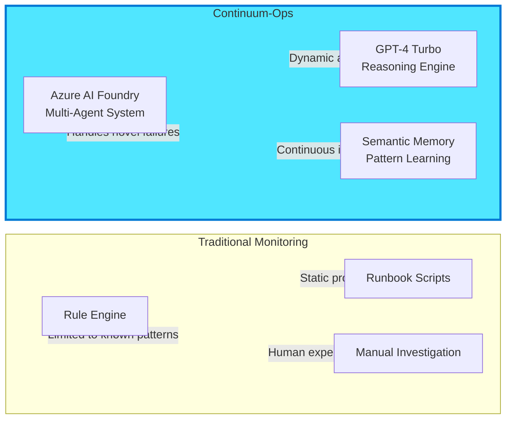

**Core Principle**: Every component is AI-native from the ground up, not rules with AI added on top.

### 2. Zero-Configuration Onboarding

**Vision**: Customer deploys → System auto-discovers → AI configures → Production ready in 30 minutes.

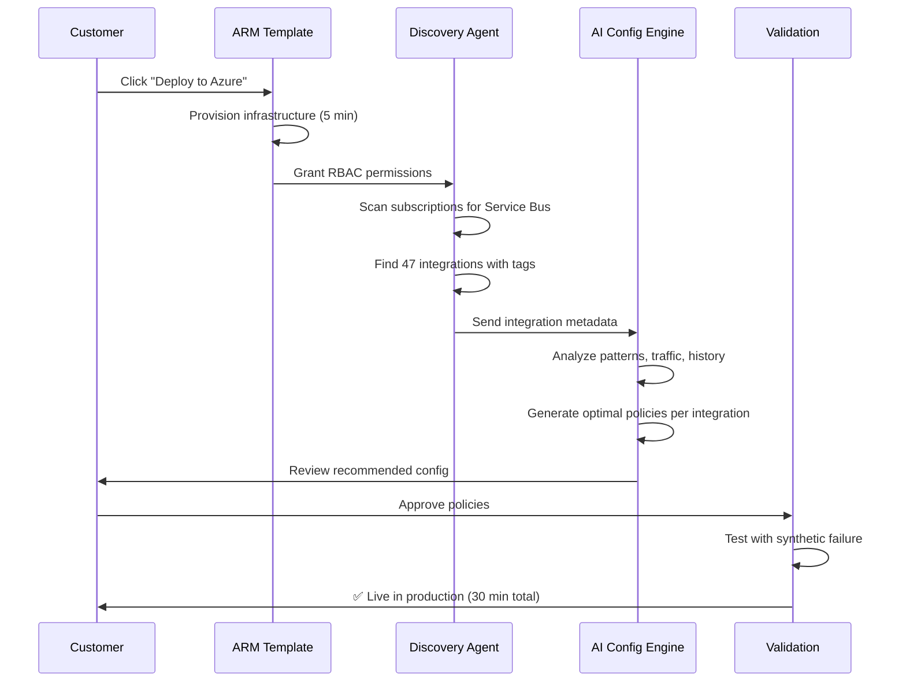

### 3. Business Outcome Focused

Traditional systems verify **technical success** (message processed).  
Continuum-Ops verifies **business outcomes** (order completed in ERP).

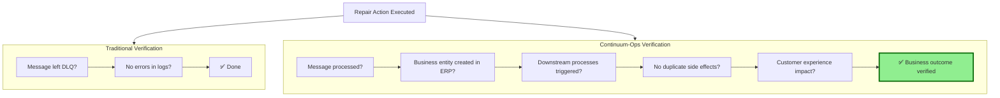

---

## System Architecture

### High-Level Architecture (Azure AI Foundry)

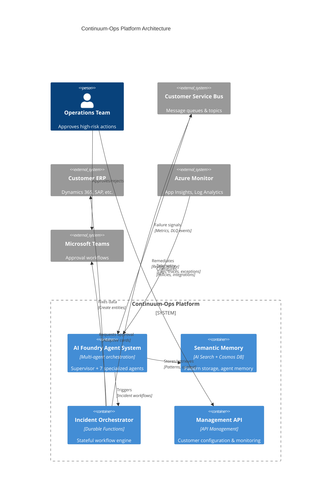

---

## Azure AI Foundry Multi-Agent System

### Agent Topology

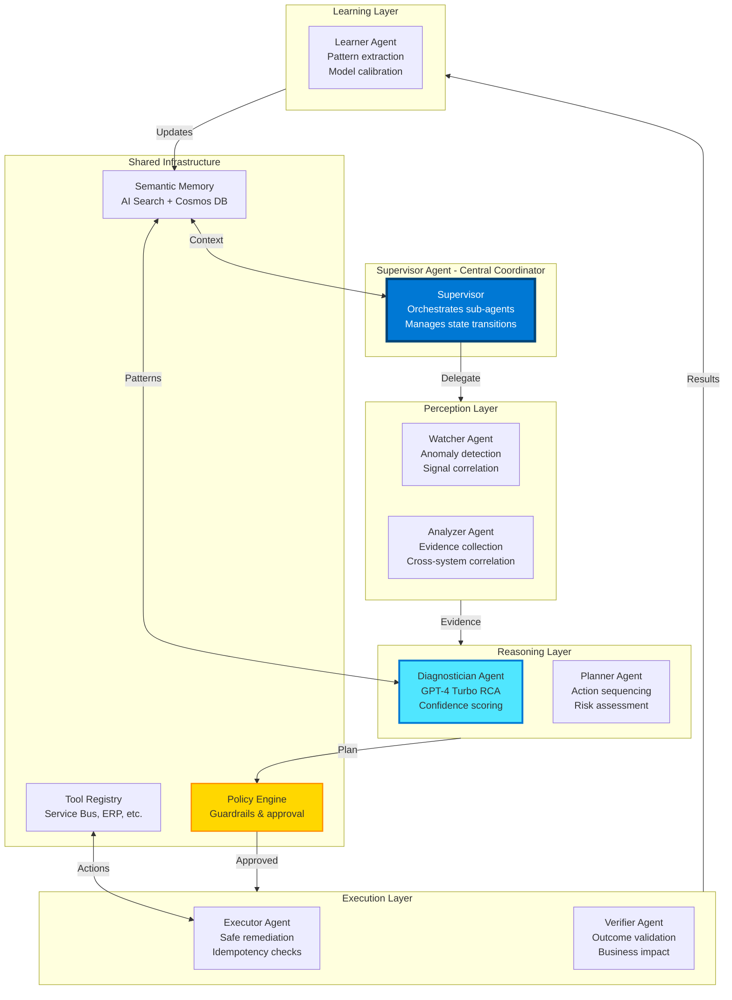

### Agent Specifications

#### Supervisor Agent
**Technology**: Azure AI Foundry Orchestrator + Semantic Kernel

**Responsibilities**:
- Central coordination of all sub-agents
- Incident state management (Detected → Closed)
- Sub-agent task assignment and monitoring
- Escalation decision-making
- Audit trail generation

**AI Capabilities**:
- ✨ **Dynamic task planning**: Adapts workflow based on incident complexity
- ✨ **Agent selection**: Chooses which sub-agents to invoke
- ✨ **Conflict resolution**: Handles disagreements between agents
- ✨ **Timeout management**: Escalates stuck incidents

---

#### Watcher Agent (Perception)
**Technology**: Azure Functions + Azure Monitor AI + GPT-4 Turbo

**Responsibilities**:
- Monitor Service Bus metrics (DLQ depth, active count, age)
- Detect anomalies in message flow patterns
- Correlate Service Bus events with Application Insights exceptions
- Generate incident triggers with initial context

**AI Capabilities**:
- ✨ **Anomaly detection**: Learns normal behavior, flags deviations
- ✨ **Pattern recognition**: Identifies recurring failure signatures
- ✨ **Semantic correlation**: Links messages, logs, and metrics by meaning
- ✨ **Adaptive thresholds**: Adjusts sensitivity based on time-of-day, load

**Implementation**:
```csharp
// Watcher Agent - Anomaly Detection with AI
public class WatcherAgent : IAgent
{
    private readonly IAIFoundryClient _aiFoundry;
    private readonly ISemanticMemory _memory;
    
    public async Task<IncidentTrigger?> DetectAnomalyAsync(ServiceBusMetrics metrics)
    {
        // 1. Check if metrics are anomalous (AI-powered)
        var baseline = await _memory.GetBaselineBehaviorAsync(metrics.IntegrationId);
        var anomalyScore = await _aiFoundry.DetectAnomalyAsync(metrics, baseline);
        
        if (anomalyScore < 0.7) return null; // Not anomalous
        
        // 2. Correlate with other signals
        var exceptions = await _observability.GetRecentExceptionsAsync(metrics.CorrelationId);
        var similarIncidents = await _memory.FindSimilarIncidentsAsync(metrics.Signature);
        
        // 3. Generate incident trigger
        return new IncidentTrigger
        {
            IntegrationId = metrics.IntegrationId,
            DetectedAt = DateTime.UtcNow,
            AnomalyScore = anomalyScore,
            InitialEvidence = new { metrics, exceptions, similarIncidents }
        };
    }
}
```

---

#### Analyzer Agent (Perception)
**Technology**: Semantic Kernel + Application Insights SDK + Log Analytics SDK

**Responsibilities**:
- Collect detailed evidence (DLQ messages, logs, metrics, traces)
- Cross-reference data across multiple Azure services
- PII detection and auto-redaction
- Build structured evidence bundle for Diagnostician

**AI Capabilities**:
- ✨ **Intelligent log parsing**: Extracts key entities (IDs, timestamps, errors)
- ✨ **Temporal reasoning**: Understands event sequence causality
- ✨ **PII detection**: Auto-identifies and redacts sensitive data
- ✨ **Context enrichment**: Adds integration metadata, historical patterns

**Evidence Bundle Schema**:
```json
{
  "incident_id": "inc-2026-02-13-001",
  "collected_at": "2026-02-13T10:45:00Z",
  "evidence": {
    "service_bus": {
      "dlq_messages": [
        {
          "message_id": "msg-12345",
          "body": "<redacted>",
          "headers": {"correlationId": "ORD-67890"},
          "dead_letter_reason": "Customer not found",
          "enqueued_at": "2026-02-13T10:30:00Z"
        }
      ],
      "metrics": {
        "dlq_depth": 47,
        "active_count": 120,
        "avg_processing_time_ms": 250
      }
    },
    "application_insights": {
      "exceptions": [
        {
          "timestamp": "2026-02-13T10:30:15Z",
          "type": "CustomerNotFoundException",
          "message": "Customer CUS-12345 not found in ERP",
          "operation_name": "ProcessOrder",
          "dependency": "erp-api"
        }
      ],
      "traces": [/* correlated traces */]
    },
    "historical_context": {
      "similar_incidents": 5,
      "typical_resolution": "create_customer",
      "success_rate": 0.95
    }
  },
  "pii_redacted": true,
  "redaction_summary": ["customer_name", "email", "phone"]
}
```

---

#### Diagnostician Agent (Reasoning)
**Technology**: GPT-4 Turbo + Prompt Flow + Semantic Kernel

**Responsibilities**:
- Root cause analysis from evidence bundle
- Confidence scoring (calibrated against historical accuracy)
- Proposed action plan with sequencing
- Evidence citations for explainability

**AI Capabilities**:
- ✨ **Multi-modal reasoning**: Analyzes text logs + metrics + message payloads
- ✨ **Chain-of-thought**: Explains reasoning process step-by-step
- ✨ **Pattern matching**: Compares to historical incidents (semantic similarity)
- ✨ **Confidence calibration**: Adjusts based on past prediction accuracy

**Prompt Flow Implementation**:
```yaml
name: DiagnosisWorkflow
display_name: Incident Diagnosis with GPT-4 Turbo

inputs:
  evidence_bundle:
    type: object
  integration_metadata:
    type: object

outputs:
  diagnosis:
    type: object

nodes:
  # Node 1: Pattern Matching (Semantic Search)
  - name: find_similar_patterns
    type: python
    source:
      type: code
      path: semantic_search.py
    inputs:
      query: ${inputs.evidence_bundle.signature}
      index: historical_incidents
      top_k: 5
    
  # Node 2: Evidence Analysis (GPT-4 Turbo)
  - name: analyze_evidence
    type: llm
    source:
      type: code
      path: prompts/analyze_evidence.jinja2
    inputs:
      deployment_name: gpt-4-turbo
      temperature: 0.1
      max_tokens: 2000
      evidence: ${inputs.evidence_bundle}
      similar_patterns: ${find_similar_patterns.output}
    
  # Node 3: Root Cause Synthesis (GPT-4o with reasoning)
  - name: synthesize_root_cause
    type: llm
    source:
      type: code
      path: prompts/synthesize_rca.jinja2
    inputs:
      deployment_name: gpt-4o
      temperature: 0.0
      response_format: 
        type: json_schema
        json_schema:
          name: diagnosis_output
          schema:
            type: object
            properties:
              root_cause_hypothesis: {type: string}
              evidence_citations: {type: array}
              proposed_actions: {type: array}
              confidence_raw: {type: number}
              risk_level: {type: string, enum: [low, medium, high]}
      analysis: ${analyze_evidence.output}
      patterns: ${find_similar_patterns.output}
    
  # Node 4: Confidence Calibration (Python)
  - name: calibrate_confidence
    type: python
    source:
      type: code
      path: calibrate_confidence.py
    inputs:
      diagnosis: ${synthesize_root_cause.output}
      integration_id: ${inputs.integration_metadata.integrationId}
      historical_accuracy: ${find_similar_patterns.output.success_rate}
    outputs:
      - calibrated_diagnosis
```

**Sample Diagnosis Output**:
```json
{
  "diagnosis_id": "diag-2026-02-13-001",
  "incident_id": "inc-2026-02-13-001",
  "root_cause_hypothesis": "Order processing failed because customer CUS-12345 does not exist in the ERP system. The customer sync job from CRM failed 2 hours prior, leaving a data gap.",
  "evidence_citations": [
    "Service Bus DLQ message: 'Customer not found' (dead_letter_reason)",
    "Application Insights exception: CustomerNotFoundException at 10:30:15 UTC",
    "Log Analytics trace: ERP API returned HTTP 404 for GET /customers/CUS-12345",
    "Historical pattern match: 5 similar incidents resolved by creating customer (95% success)"
  ],
  "proposed_actions": [
    {
      "sequence": 1,
      "action": "create_customer",
      "parameters": {
        "customer_id": "CUS-12345",
        "source": "crm_sync_backfill",
        "minimal_profile": true
      },
      "estimated_duration_seconds": 30,
      "idempotency_check": "GET /customers/CUS-12345 returns 404"
    },
    {
      "sequence": 2,
      "action": "replay_messages",
      "parameters": {
        "queue_path": "orders-queue/$DeadLetterQueue",
        "filter": "correlationId = 'ORD-67890'",
        "batch_size": 3
      },
      "estimated_duration_seconds": 60,
      "depends_on": ["create_customer"]
    }
  ],
  "confidence": 0.92,
  "confidence_raw": 0.88,
  "confidence_calibration": {
    "reason": "Boosted by 0.04 due to 95% historical success rate for this pattern",
    "historical_accuracy": 0.95
  },
  "risk_level": "medium",
  "risk_factors": [
    "Creating master data in production ERP (medium risk)",
    "Replaying 3 messages (low risk)",
    "High confidence in diagnosis (reduces risk)"
  ],
  "reasoning_trace": [
    "Step 1: Identified 'Customer not found' as primary error from DLQ message",
    "Step 2: Correlated with HTTP 404 from ERP API call to /customers/CUS-12345",
    "Step 3: Found 5 historical incidents with identical signature",
    "Step 4: Verified customer sync job failed 2 hours prior (root cause)",
    "Step 5: Proposed creating customer + replaying messages (proven pattern)"
  ]
}
```

---

#### Planner Agent (Reasoning)
**Technology**: Semantic Kernel + GPT-4 Turbo

**Responsibilities**:
- Validate proposed actions against runbook catalog
- Sequence actions with dependency awareness
- Calculate blast radius and rollback requirements
- Generate compensation plan for failures

**AI Capabilities**:
- ✨ **Dependency resolution**: Orders actions correctly (create before replay)
- ✨ **Risk quantification**: Calculates blast radius per action
- ✨ **Rollback planning**: Defines undo steps for each action
- ✨ **Optimization**: Parallelizes independent actions

---

#### Executor Agent (Execution)
**Technology**: Azure Functions + Semantic Kernel + Polly (resilience)

**Responsibilities**:
- Execute approved action plan
- Idempotency validation before each action
- Retry with exponential backoff for transient failures
- Emit detailed execution logs

**AI Capabilities**:
- ✨ **Idempotency validation**: Checks if action already executed
- ✨ **Adaptive retry**: Learns optimal backoff strategy per integration
- ✨ **Graceful degradation**: Handles partial success scenarios

**Implementation**:
```csharp
public class ExecutorAgent : IAgent
{
    private readonly IActionCatalog _catalog;
    private readonly IIdempotencyService _idempotency;
    
    public async Task<ExecutionResult> ExecuteActionPlanAsync(
        ActionPlan plan, 
        ApprovalContext approval)
    {
        var results = new List<ActionResult>();
        
        foreach (var action in plan.Actions.OrderBy(a => a.Sequence))
        {
            // 1. Idempotency check
            if (await _idempotency.WasAlreadyExecutedAsync(action.ActionId))
            {
                _logger.LogInformation("Action {ActionId} already executed, skipping", action.ActionId);
                results.Add(new ActionResult { Status = "Skipped", Reason = "Idempotent" });
                continue;
            }
            
            // 2. Get runbook executor
            var executor = await _catalog.GetExecutorAsync(action.Action);
            
            // 3. Execute with retry policy
            var retryPolicy = Policy
                .Handle<TransientException>()
                .WaitAndRetryAsync(3, retryAttempt => 
                    TimeSpan.FromSeconds(Math.Pow(2, retryAttempt)));
            
            try
            {
                var result = await retryPolicy.ExecuteAsync(async () =>
                    await executor.ExecuteAsync(action.Parameters));
                
                results.Add(result);
                
                // 4. Mark as executed (idempotency tracking)
                await _idempotency.MarkExecutedAsync(action.ActionId, result);
            }
            catch (Exception ex)
            {
                // 5. Compensation (rollback)
                await CompensateAsync(results, action);
                throw;
            }
        }
        
        return new ExecutionResult { Actions = results };
    }
}
```

---

#### Verifier Agent (Execution)
**Technology**: Azure Functions + GPT-4 Turbo

**Responsibilities**:
- Wait for async processing to complete (with timeout)
- Verify technical success (message consumed, DLQ cleared)
- Verify business outcome (entity state in ERP)
- Detect duplicate side effects

**AI Capabilities**:
- ✨ **Outcome prediction**: Predicts what should happen after repair
- ✨ **Multi-signal verification**: Checks technical + business + user impact
- ✨ **False positive detection**: Distinguishes correlation from causation

**Verification Workflow**:
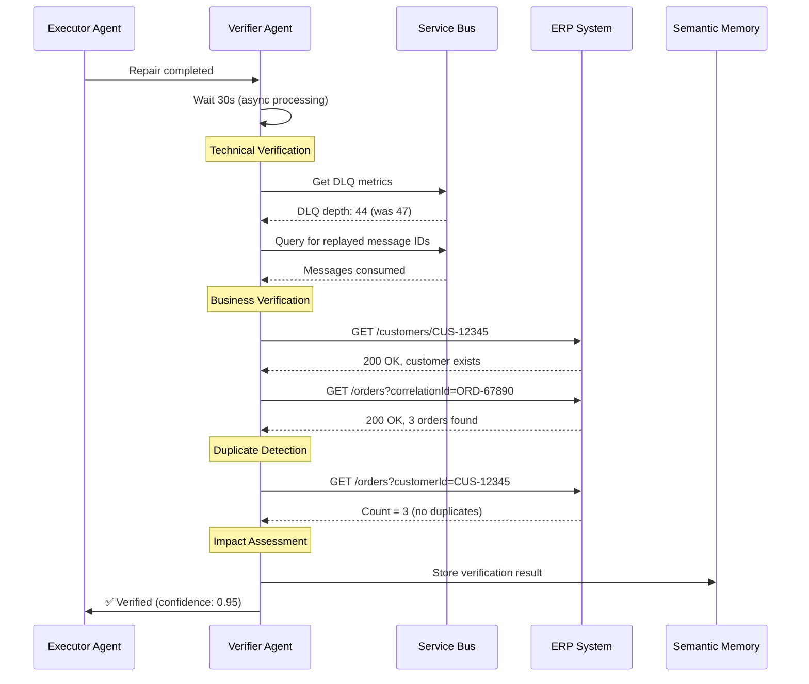

---

#### Learner Agent (Learning)
**Technology**: AI Search + Cosmos DB + GPT-4 Turbo

**Responsibilities**:
- Extract failure patterns from incidents
- Update pattern success rates
- Calibrate confidence models
- Generate preventive recommendations

**AI Capabilities**:
- ✨ **Pattern extraction**: Identifies recurring failure signatures
- ✨ **Confidence calibration**: Improves accuracy over time
- ✨ **Proactive recommendations**: Suggests preventive measures
- ✨ **Knowledge graph construction**: Builds integration dependency map

**Pattern Learning Flow**:
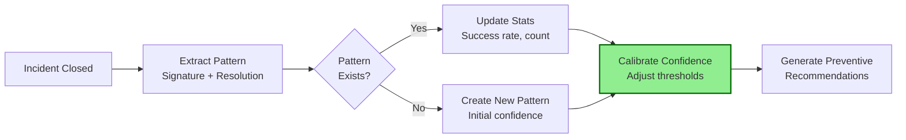

---

## Data Architecture

### Cosmos DB Container Design

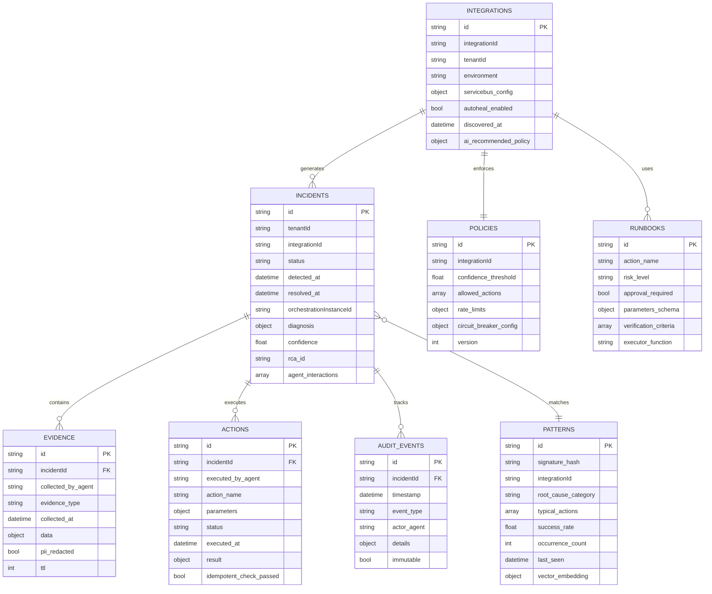

**Partition Keys**:
- `Incidents`: `/integrationId` (co-locates all incidents for same integration)
- `Evidence`: `/incidentId` (co-locates evidence with parent incident)
- `Patterns`: `/integrationId` (efficient pattern lookup per integration)
- `Integrations`: `/tenantId` (multi-tenant isolation)

### AI Search Index (Semantic Memory)

```json
{
  "name": "incident-patterns",
  "fields": [
    {"name": "id", "type": "Edm.String", "key": true},
    {"name": "signature_hash", "type": "Edm.String", "filterable": true},
    {"name": "root_cause_text", "type": "Edm.String", "searchable": true},
    {"name": "resolution_text", "type": "Edm.String", "searchable": true},
    {"name": "evidence_summary", "type": "Edm.String", "searchable": true},
    {"name": "embedding", "type": "Collection(Edm.Single)", "vectorSearch": true, "dimensions": 1536},
    {"name": "success_rate", "type": "Edm.Double", "filterable": true, "sortable": true},
    {"name": "occurrence_count", "type": "Edm.Int32", "sortable": true},
    {"name": "integration_id", "type": "Edm.String", "filterable": true}
  ],
  "vectorSearch": {
    "algorithms": [
      {
        "name": "hnsw-config",
        "kind": "hnsw",
        "hnswParameters": {
          "m": 4,
          "efConstruction": 400,
          "efSearch": 500,
          "metric": "cosine"
        }
      }
    ]
  }
}
```

**Semantic Search Query** (from Diagnostician Agent):
```csharp
var searchClient = new SearchClient(endpoint, "incident-patterns", credential);

var searchOptions = new SearchOptions
{
    VectorSearch = new()
    {
        Queries = { new VectorizedQuery(evidenceEmbedding) { KNearestNeighborsCount = 5 } }
    },
    Filter = $"integration_id eq '{integrationId}' and success_rate gt 0.7",
    OrderBy = { "occurrence_count desc" }
};

var results = await searchClient.SearchAsync<IncidentPattern>(null, searchOptions);
```

---

## Infrastructure Architecture

### Multi-Tenant Deployment


---

## Security Architecture

### Zero-Trust Model

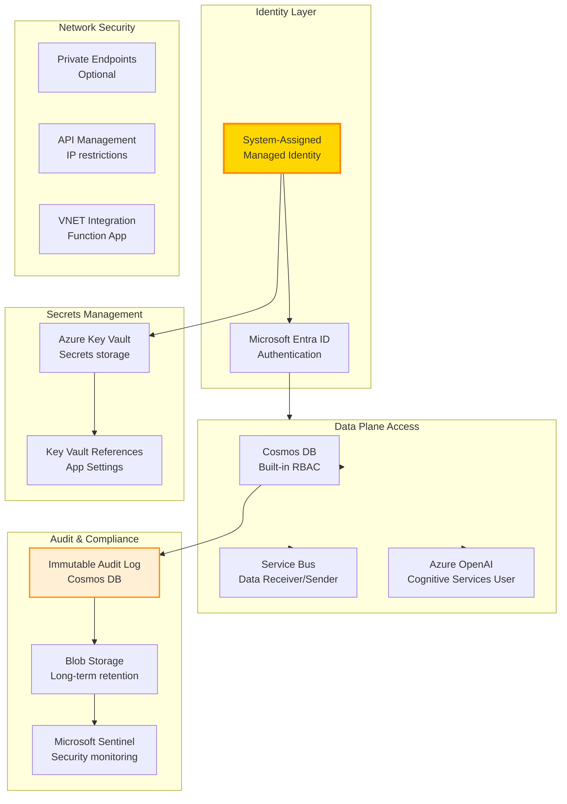

---

## Deployment Models

### Model 1: SaaS (Recommended for Most Customers)

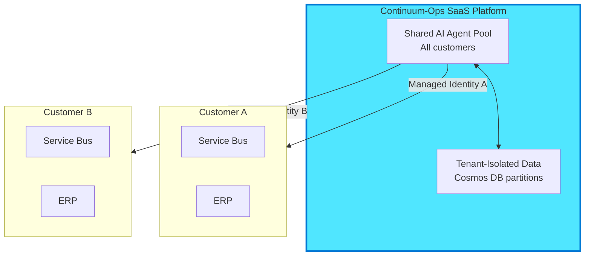

**Pros**: Fastest deployment, lowest cost, automatic updates  
**Cons**: Shared infrastructure (isolated data)

---

### Model 2: Private Deployment (Enterprise)

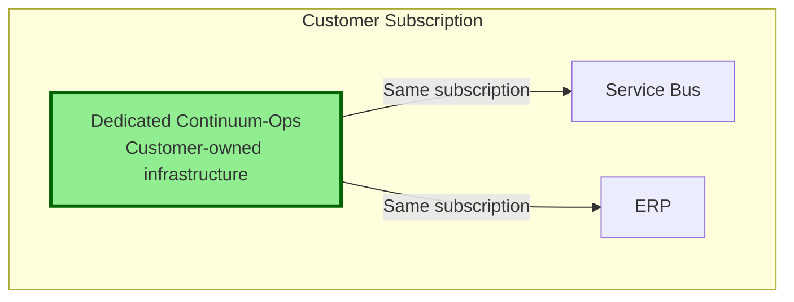

**Pros**: Complete isolation, private network, customer control  
**Cons**: Higher cost, customer manages updates

---

## Scalability & Performance

### Scaling Dimensions

| Component | Scaling Strategy | Target Capacity |
|-----------|------------------|-----------------|
| **AI Agents** | Azure Functions auto-scale (EP2 plan) | 100+ concurrent incidents |
| **Durable Functions** | Partition count = 16 | 1000+ orchestrations/min |
| **Cosmos DB** | Autoscale 4000-40000 RU/s | 10K writes/sec |
| **AI Search** | Standard tier, 3 replicas | 50 queries/sec |
| **Azure OpenAI** | 100K TPM quota | 500 diagnoses/hour |

**Performance Targets**:
- Detection latency: <2 min (P95)
- Diagnosis latency: <30 sec (P95)
- Repair latency: <60 sec (P95)
- End-to-end MTTR: <10 min (P95)

---

## Technology Stack Summary

| Category | Technology | Version | Purpose |
|----------|-----------|---------|---------|
| **AI Orchestration** | Azure AI Foundry | Preview | Multi-agent system |
| **LLM** | Azure OpenAI GPT-4 Turbo | 1106-preview | Reasoning, diagnosis |
| **LLM (Advanced)** | Azure OpenAI GPT-4o | Latest | Chain-of-thought reasoning |
| **AI Framework** | Semantic Kernel | 1.x | Agent development |
| **LLM Workflows** | Prompt Flow | 1.x | Visual LLM pipelines |
| **Orchestration** | Durable Functions | 2.x | Stateful workflows |
| **Runtime** | .NET | 8.0 | Function App runtime |
| **Database** | Cosmos DB | Core SQL API | Incidents, patterns, audit |
| **Vector DB** | AI Search | Standard | Semantic memory |
| **Observability** | Application Insights | Latest | Telemetry, monitoring |
| **Identity** | Managed Identity | System-assigned | Zero-trust auth |
| **Collaboration** | Microsoft Teams | Latest | Approval workflows |
| **IaC** | Bicep | 0.24+ | Infrastructure provisioning |

---

## References

- **[00-Product-Overview.md](00-Product-Overview.md)** - Product vision & business model
- **[02-Deployment-Guide.md](02-Deployment-Guide.md)** - Deployment playbook
- **[03-User-Manual.md](03-User-Manual.md)** - Operations guide
- **[10-Implementation-Roadmap.md](10-Implementation-Roadmap.md)** - Development plan

---

## Version History

| Version | Date | Author | Changes |
|---------|------|--------|---------|
| 3.0 | 2026-02-13 | Architecture Team | Complete rewrite with AI Foundry multi-agent design |
| 2.0 | 2026-02-12 | Architecture Team | Added multi-customer deployment vision |
| 1.0 | 2026-01-15 | Architecture Team | Initial architecture document |
