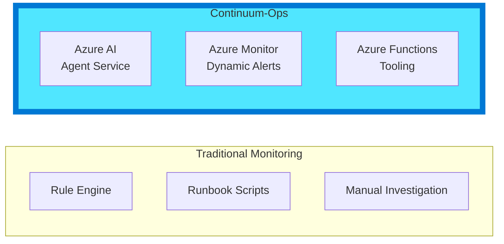
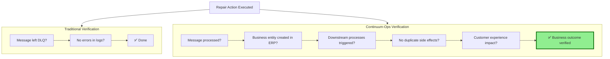
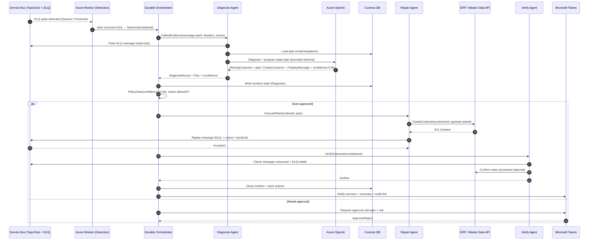
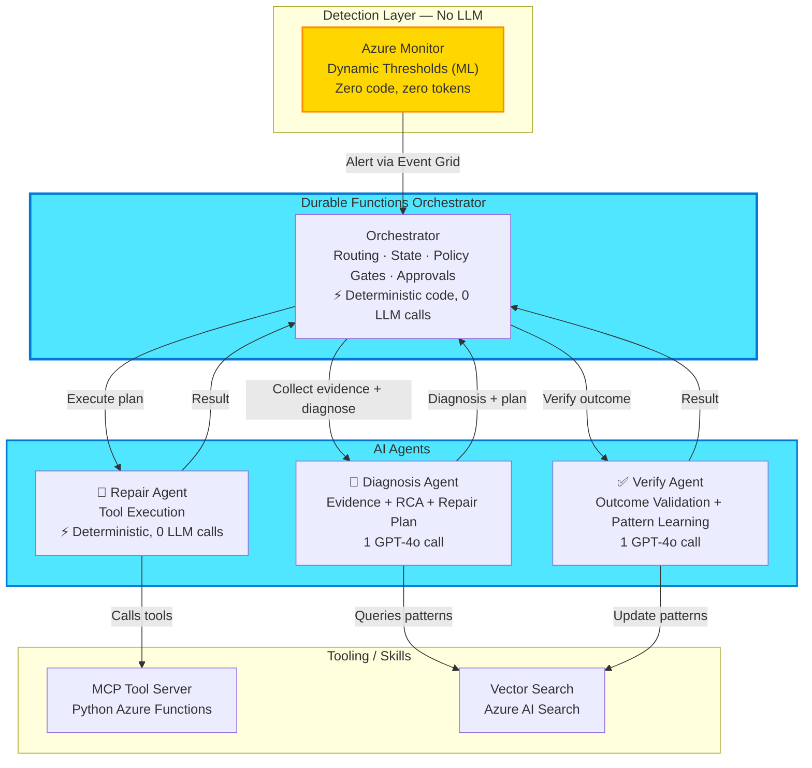
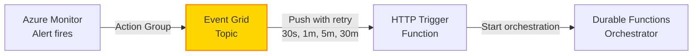
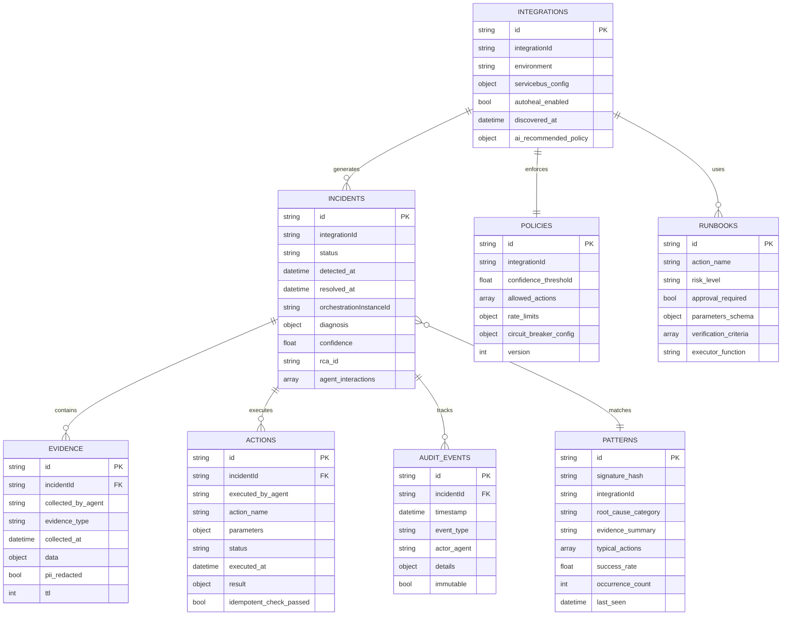
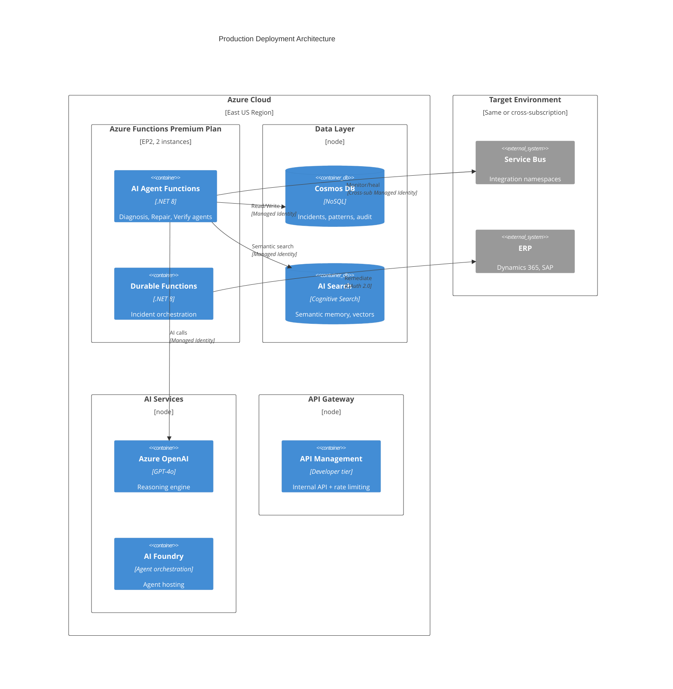
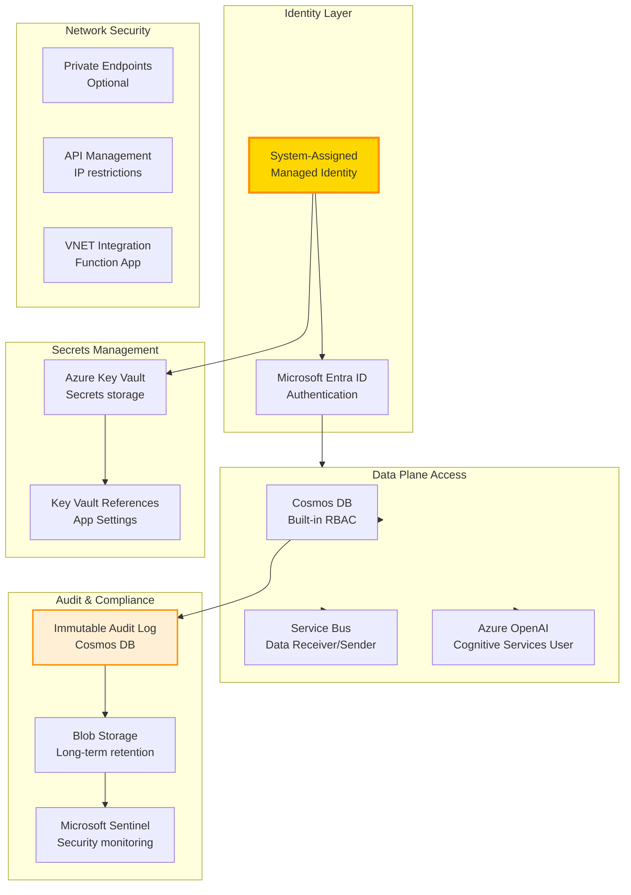
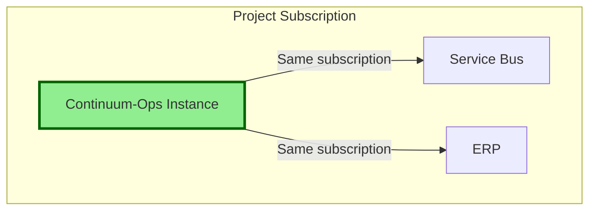

# Continuum-Ops: Technical Architecture
## Powered by Microsoft Foundry Agent Service

---

## Document Overview

This document provides the **complete technical architecture** for Continuum-Ops, an AI-native operational resilience platform built on Microsoft Azure AI Foundry.

**Related Documentation:**
- **[00-Product-Overview.md](00-Product-Overview.md)** - Product vision, internal value proposition
- **[02-Deployment-Guide.md](02-Deployment-Guide.md)** - 30-minute deployment playbook
- **[03-User-Manual.md](03-User-Manual.md)** - Operations guide for daily use
- **[04-API-Reference.md](04-API-Reference.md)** - REST API endpoints
- **[05-Security-Compliance.md](05-Security-Compliance.md)** - Security & compliance controls

---

## Architecture Principles

### 1. AI-First, Using Native Azure Capabilities



**Core Principle**: Every component is AI-native from the ground up, not rules with AI added on top.

### 2. Zero-Configuration Onboarding

**Vision**: App Team deploys → System auto-discovers → AI configures → Production ready in 30 minutes.


### 3. Business Outcome Focused

Traditional systems verify **technical success** (message processed).  
Continuum-Ops verifies **business outcomes** (order completed in ERP).



---

## Sequence diagram (example)

Scenario: **Order message fails → agent diagnoses missing customer → creates customer → replays message → order succeeds → Teams notification**



---

## Microsoft Foundry Agent Service Design

### Agent Topology

We use **3 specialized agents** coordinated by a **Durable Functions orchestrator**. Detection is offloaded entirely to Azure Monitor (zero LLM tokens).



### Component Specifications

#### 1. Detection: Azure Monitor (Dynamic Thresholds)
*No custom code — we leverage Azure's native ML capabilities.*
*   **Feature**: Azure Monitor Metric Alerts with Dynamic Thresholds.
*   **Metric**: `DeadletterMessageCount`, `ActiveMessageCount`.
*   **Configuration**: High Sensitivity.
*   **Action**: Fires alert → Event Grid → Durable Functions Orchestrator.
*   **Benefit**: Zero code to maintain, built-in seasonality learning, zero LLM tokens.

#### 2. Durable Functions Orchestrator (Deterministic Code)
*   **Role**: The entry point for all incidents. Replaces what earlier drafts called a "Coordinator Agent".
*   **Responsibility**: State management, routing tasks to agents, policy gates, approval flow, error handling.
*   **Implementation**: Azure Durable Functions (.NET 8) — deterministic code, zero LLM calls.
*   **Idempotency**: Uses `alertId` as orchestration instance ID for deduplication.

#### 3. Diagnosis Agent (GPT-4o — 1 LLM Call)
*   **Role**: Evidence collection, Root Cause Analysis, and repair planning (combined into a single agent call).
*   **Tools**: 
    *   `peek_dlq_message` (Service Bus read-only peek)
    *   `query_logs` (App Insights via KQL)
    *   `search_patterns` (Azure AI Search vector similarity)
*   **Model**: GPT-4o (standardized — see [Technology Stack Summary](#technology-stack-summary)).
*   **Output**: Structured JSON: `{root_cause, confidence, risk_level, evidence_citations[], repair_plan[]}`.

#### 4. Repair Agent (Deterministic Code — 0 LLM Calls)
*   **Role**: Execute the repair plan proposed by the Diagnosis Agent.
*   **Implementation**: Deterministic .NET code that calls tools on the MCP tool server (Python Azure Functions). No LLM involved.
*   **Key Properties**: Idempotent execution, graceful failure reporting, no autonomous retries.

**Underlying tool HTTP contract (exposed to agents via MCP — see decision below):**
```yaml
paths:
  /servicebus/replay:
    post:
      operationId: ReplayMessages
      summary: Replays messages from DLQ back to active queue
      parameters:
        - name: namespace
          in: query
          required: true
          type: string
        - name: queue
          in: query
          required: true
          type: string
        - name: count
          in: query
          type: integer
```

**Tool Interface Decision (revised — see [08-AIOps-Solution-Architecture-Review.md](08-AIOps-Solution-Architecture-Review.md#45-mcp-vs-openapi-for-tools--reverse-the-existing-decision)):**
*   **We now use the Model Context Protocol (MCP)** for tool definitions, hosted as a custom MCP server on Azure Functions (`/runtime/webhooks/mcp`) and registered centrally in Foundry's **Toolbox**.
*   **Rationale (updated)**: An earlier version of this document rejected MCP as "still experimental." That is no longer accurate — Microsoft Foundry Agent Service now has native remote/custom MCP support and a Toolbox feature purpose-built for centrally managing and versioning MCP tool sets across agents. MCP tools are reusable across both Diagnosis and Verify Agents, support Entra managed-identity or OBO authentication the same way OpenAPI did, and give us one governed tool surface instead of duplicated OpenAPI function definitions per agent.
*   The raw OpenAPI YAML example above remains valid as a description of the *underlying HTTP contract* each tool implements — MCP is the calling convention layered on top, not a replacement for the Azure Function endpoints themselves.

#### 5. Verify Agent (GPT-4o — 1 LLM Call, Conditional)
*   **Role**: Validate that the repair achieved the desired business outcome, then extract a learning pattern.
*   **Runs**: Only if the Repair Agent succeeded. Skipped if repair failed.
*   **Tools**: `check_dlq_depth` (Service Bus), `query_erp` (ERP API), `upsert_pattern` (AI Search + Cosmos DB).
*   **Model**: GPT-4o.
*   **Output**: Structured JSON: `{verified: bool, evidence, failure_reason?, pattern_summary}`.

---

## Alert Ingestion: Async Buffer (Event Grid)

> **Critical design decision**: Azure Monitor does NOT call our Function App webhook directly.
> Alerts go through Azure Event Grid first, providing reliable delivery with retry.

### Why This Matters

Azure Monitor Action Group webhooks have a **30-second timeout**. If our Function App has a cold start (5–15 sec on EP1) plus initial Cosmos DB read (1–2 sec), the webhook can timeout and the alert is lost.

### Ingestion Flow



**Event Grid provides:**
- At-least-once delivery with exponential backoff retry (up to 24 hours)
- Dead-letter queue for failed deliveries → alerts are never silently lost
- Native Azure Monitor integration (Action Group → Event Grid is a built-in option)
- Filtering: only forward alerts matching our subscriptions

**Alternative considered**: Azure Service Bus queue as buffer. Rejected because Event Grid is lower-latency for event-driven push and avoids adding another Service Bus dependency.

**Complementary collector path (added — see [08-AIOps-Solution-Architecture-Review.md §3](08-AIOps-Solution-Architecture-Review.md#3-reference-architecture-the-datadog-collector-pattern))**: Event Grid remains the fast path for the specific alert that *triggers* an incident. Separately, Diagnostic Settings on Service Bus, App Service, SQL, and AKS resources stream into an **Event Hub namespace**, consumed by a normalizer Function — the same collector pattern Datadog, Splunk, and SumoLogic use to ingest Azure telemetry. This second path enriches the Diagnosis Agent's evidence bundle with broader context beyond the triggering alert, and is the on-ramp to multi-tenant, multi-source ingestion at product scale.

**Idempotency**: The Durable Functions orchestrator uses `alertId` from Azure Monitor as the orchestration instance ID. If Event Grid retries a delivery, the second `StartNewAsync(alertId)` call is a no-op because Durable Functions deduplicates by instance ID.

---

## Failure Handling

Every external dependency can fail. Here's what happens for each:

### Azure OpenAI Failures

| Failure | Detection | Response |
|---------|-----------|----------|
| **429 Too Many Requests** | HTTP status code | Retry with `Retry-After` header. If 3 retries fail, fall back to **pattern-match-only mode**: check AI Search for matching pattern, skip LLM reasoning. If no pattern match, escalate to Teams as "Manual diagnosis needed." |
| **500/503 Service Error** | HTTP status code | Retry 3 times with exponential backoff (1s, 4s, 16s). If still failing, escalate incident to Teams with raw evidence (DLQ message + logs) for manual diagnosis. |
| **Timeout (>30 sec)** | HTTP timeout | Cancel request, retry once. If second attempt times out, escalate. |
| **Quota exhausted (daily)** | Token counter in Cosmos DB | Switch to **degraded mode**: detection continues, all incidents are escalated to Teams with evidence bundle but no AI diagnosis. Log alert: "LLM quota exhausted." |

### Cosmos DB Failures

| Failure | Detection | Response |
|---------|-----------|----------|
| **429 Throttled** | HTTP 429 from SDK | SDK auto-retries (built into Azure Cosmos DB .NET SDK). If RU/s consistently maxed, autoscale kicks in (4K → 40K RU/s). |
| **Partition unavailable** | SDK exception | Durable Functions orchestration pauses and retries automatically (built-in). Incident state is preserved in orchestration history. |
| **Write conflict** | HTTP 409 | Use optimistic concurrency with `_etag`. Retry read-modify-write cycle. |

### ERP / Downstream API Failures

| Failure | Detection | Response |
|---------|-----------|----------|
| **ERP returns 5xx** | HTTP status | Repair Agent retries 3 times with backoff. If still failing, mark repair as `failed`, notify Teams: "Repair blocked — ERP unavailable." Do NOT retry DLQ replay (data fix hasn't happened yet). |
| **ERP timeout (>30 sec)** | HTTP timeout | Same as 5xx. ERP slowness is common (esp. SAP). Configurable timeout per integration policy (default 60s). |
| **ERP returns 4xx (bad data)** | HTTP status | Do NOT retry. Log as diagnosis error (AI proposed wrong fix). Escalate to Teams. Feed back to learning: "this plan failed for this evidence pattern." |

### Teams Webhook Failures

| Failure | Detection | Response |
|---------|-----------|----------|
| **Webhook URL invalid/expired** | HTTP 4xx | Log error. Fall back to email notification (if configured in policy). Store pending approval in Cosmos DB for API-based approval. |
| **Teams service outage** | HTTP 5xx / timeout | Retry 3 times. If failing, queue approval request in Cosmos DB. Expose pending approvals via `GET /api/approvals/pending` so operators can approve via API or portal. |

### Circuit Breaker (Per-Integration)

Circuit breaker state is stored in the `Policies` container in Cosmos DB:

```
CLOSED → (5 consecutive repair failures) → OPEN
OPEN → (30 min timeout) → HALF-OPEN
HALF-OPEN → (1 test repair succeeds) → CLOSED
HALF-OPEN → (test repair fails) → OPEN
```

When circuit is **OPEN**: incidents are still detected and diagnosed, but repair is skipped. Teams notification says: "Circuit breaker open for {integration}. Manual intervention required."

---

## Agent Design Rationale: Why 3 Agents Save Tokens

> **Canonical agent count: 3 specialized agents + 1 Durable Functions orchestrator.**
> Earlier drafts of this project described 7 separate micro-agents (Watcher, Analyzer,
> Diagnostician, Planner, Executor, Verifier, Learner). We consolidated to 3 for cost
> and reliability reasons. This section is the authoritative reference.

### The Problem with Many Agents

Every LLM call has fixed token overhead:
- **System prompt**: 200–800 tokens (agent identity, rules, tool schemas)
- **Function/tool definitions**: 100–400 tokens per tool
- **Conversation context**: grows with each agent-to-agent handoff

With 7 agents in a chain, you pay this overhead 7 times per incident. Worse, inter-agent messages ("Analyzer → Diagnostician: here's the evidence") duplicate data across calls.

### Our 3-Agent Design

| Agent | LLM Calls | System Prompt | Input Context | Output |
|-------|-----------|---------------|---------------|--------|
| **Diagnosis Agent** | 1 call | ~500 tokens (focused RCA instructions) | DLQ message body (truncated to 1K chars) + App Insights errors (top 5, ~500 chars) + similar patterns from AI Search (top 3, ~300 chars) | Structured JSON: `{root_cause, confidence, risk_level, repair_plan[]}` |
| **Repair Agent** | 0 LLM calls (deterministic) | N/A — this is code, not an LLM agent | Action plan from Diagnosis Agent | Executes MCP-registered tools, returns success/failure |
| **Verify Agent** | 1 call (only if repair succeeded) | ~200 tokens (outcome validation) | Expected outcome + current state (DLQ depth, ERP query result) | Structured JSON: `{verified: bool, evidence, failure_reason?}` |

**The Durable Functions Orchestrator** handles all routing, state management, policy gates, approval flow, and error handling — **zero LLM tokens** for orchestration.

### Token Budget Per Incident

```
Diagnosis Agent:
  System prompt:           ~500 tokens
  Input (evidence bundle): ~1,800 tokens (truncated)
  Output (structured JSON):  ~300 tokens
  Subtotal:                ~2,600 tokens

Verify Agent (if repair runs):
  System prompt:           ~200 tokens
  Input (state check):     ~400 tokens
  Output (structured JSON):  ~100 tokens
  Subtotal:                  ~700 tokens

Pattern shortcut (if AI Search match > 0.90 similarity):
  Skip Diagnosis Agent reasoning, use cached plan
  Cost: ~500 tokens (embedding query only)

TOTAL PER INCIDENT:        ~2,600–3,300 tokens (normal)
                           ~500 tokens (pattern cache hit)
```

**Cost comparison at GPT-4o rates ($2.50/1M input, $10/1M output):**

| Design | Tokens/incident | Cost/incident | Cost at 100 incidents/day |
|--------|----------------|---------------|--------------------------|
| 7 micro-agents (old design) | ~8,000–15,000 | $0.02–0.06 | $2–6/day |
| **3 focused agents (current)** | **~2,600–3,300** | **$0.007–0.01** | **$0.70–1.00/day** |
| Single god-agent | ~6,000–10,000 | $0.02–0.04 | $2–4/day |

### Why Not a Single Agent?

A single agent with all tools and all context seems simpler, but:
1. **Prompt bloat**: One agent needs ALL tool definitions (replay, create customer, query logs, search patterns, verify ERP) = ~2,000 tokens of function schemas in every call, even when only diagnosing.
2. **Hallucination risk**: An agent with both "diagnose" and "execute" capabilities may try to execute during diagnosis if the prompt isn't perfectly constrained.
3. **Auditability**: Separate agents produce clean audit trail entries — "Diagnosis Agent said X" vs "Repair Agent did Y" — critical for compliance.

### Detection Layer: No LLM Needed

Azure Monitor Dynamic Thresholds replace a custom "Watcher Agent" entirely:
- Zero token cost for detection
- Built-in ML seasonality learning
- No code to maintain or prompt to tune

---

## Data Architecture

### Deployment Model: Single-Tenant Data Plane, Shared Control Plane

> **Decision (revised — see [08-AIOps-Solution-Architecture-Review.md §5.1](08-AIOps-Solution-Architecture-Review.md#51-multi-tenant-control-plane--data-plane-split))**: Each client's operational data — Service Bus, Cosmos DB evidence store, AI Search pattern index — stays in **that client's own Azure subscription** (data plane isolation, same guarantee as the original single-tenant decision). However, if Continuum-Ops is going to be pitched and sold to multiple clients, the **agent definitions, tool Toolbox, Agent Optimizer runs, and evaluation pipelines** should live in a shared Foundry **control plane**, using Foundry's "bring your own resources" capability to point at each client's own Cosmos DB/AI Search for conversation state.
>
> Keep the `tenantId` partition key in Cosmos DB/AI Search **from day one**, even during the single-client POC — it costs nothing at small scale and avoids a schema migration when a second client onboards. Building without it (as previously decided) only makes sense if the product will genuinely never have more than one deployment.

### Vector Storage: AI Search Is the Single Source of Truth

> **Decision**: Vector embeddings for pattern matching live **only in Azure AI Search**.
> Cosmos DB `Patterns` container stores structured metadata (success rate, occurrence count,
> typical actions) but does NOT store embeddings. This avoids dual-storage sync issues.
>
> **Data flow**: When a pattern is learned, the orchestrator writes metadata to Cosmos DB
> AND upserts the embedding to AI Search in a single transaction-like operation. If either
> write fails, the pattern update is retried. Cosmos DB is the source of truth for pattern
> metadata; AI Search is the source of truth for similarity search.

### Evidence Retention vs. Learning

> **Problem**: Evidence has a 90-day TTL, but the Learner needs historical data.
>
> **Solution**: When an incident closes successfully, the orchestrator extracts a
> **compact evidence summary** (~200 chars) and writes it to the `Patterns` container
> (`evidence_summary` field) and AI Search index. This summary survives the 90-day
> evidence TTL. Full raw evidence still expires after 90 days per retention policy.

### Cosmos DB Container Design



**Partition Keys**:
- `Incidents`: `/integrationId` — co-locates all incidents for same integration. For cross-integration queries (`GET /api/incidents?hours=24`), use a Cosmos DB [change feed](https://learn.microsoft.com/en-us/azure/cosmos-db/change-feed) to project recent incidents into a `RecentIncidents` materialized view partitioned by `/yearMonth` for efficient time-range queries.
- `Evidence`: `/incidentId` — co-locates evidence with parent incident
- `Patterns`: `/integrationId` — efficient pattern lookup per integration
- `Integrations`: `/environment` — small container, any partition key works
- `Policies`: `/integrationId` — 1:1 with integration
- `AuditEvents`: `/yearMonth` — enables efficient time-range queries and archival. Events older than 1 year are archived to Blob Storage via a timer-triggered Function.

### AI Search Index (Semantic Memory)

```json
{
  "name": "incident-patterns",
  "fields": [
    {"name": "id", "type": "Edm.String", "key": true},
    {"name": "signature_hash", "type": "Edm.String", "filterable": true},
    {"name": "root_cause_text", "type": "Edm.String", "searchable": true},
    {"name": "resolution_text", "type": "Edm.String", "searchable": true},
    {"name": "evidence_summary", "type": "Edm.String", "searchable": true},
    {"name": "embedding", "type": "Collection(Edm.Single)", "vectorSearch": true, "dimensions": 1536},
    {"name": "success_rate", "type": "Edm.Double", "filterable": true, "sortable": true},
    {"name": "occurrence_count", "type": "Edm.Int32", "sortable": true},
    {"name": "integration_id", "type": "Edm.String", "filterable": true}
  ],
  "vectorSearch": {
    "algorithms": [
      {
        "name": "hnsw-config",
        "kind": "hnsw",
        "hnswParameters": {
          "m": 4,
          "efConstruction": 400,
          "efSearch": 500,
          "metric": "cosine"
        }
      }
    ]
  }
}
```

**Semantic Search Query** (from Diagnostician Agent):
```csharp
var searchClient = new SearchClient(endpoint, "incident-patterns", credential);

var searchOptions = new SearchOptions
{
    VectorSearch = new()
    {
        Queries = { new VectorizedQuery(evidenceEmbedding) { KNearestNeighborsCount = 5 } }
    },
    Filter = $"integration_id eq '{integrationId}' and success_rate gt 0.7",
    OrderBy = { "occurrence_count desc" }
};

var results = await searchClient.SearchAsync<IncidentPattern>(null, searchOptions);
```

---

## Infrastructure Architecture

### Production Deployment



---

## Security Architecture

### Zero-Trust Model



---

## Deployment Models

### Deployment Architecture



The platform is designed to be deployed directly into the project's Azure subscription, ensuring complete data isolation and security. For a multi-client product offering, this becomes the **data plane** per client, paired with a shared **control plane** for agent definitions and optimization — see [08-AIOps-Solution-Architecture-Review.md](08-AIOps-Solution-Architecture-Review.md#5-revised-target-architecture).

---

## Scalability & Performance

### Scaling Dimensions

> **Note**: These are theoretical capacity targets based on Azure service limits, not
> validated benchmarks. Actual throughput will be baselined during the pilot phase.
> Concurrent incident capacity is primarily constrained by Azure OpenAI TPM (tokens per minute) quota.

| Component | Scaling Strategy | Target Capacity | Constraint |
|-----------|------------------|-----------------|------------|
| **AI Agents** | Azure Functions auto-scale (EP2 plan) | 20-50 concurrent incidents | Limited by Azure OpenAI TPM quota, not compute |
| **Durable Functions** | Partition count = 16 | 1000+ orchestrations/min | Well-proven at this scale |
| **Cosmos DB** | Autoscale 4000-40000 RU/s | 10K writes/sec | Standard autoscale behavior |
| **AI Search** | Standard tier, 3 replicas | 50 queries/sec | Adequate for expected volume |
| **Azure OpenAI** | 100K TPM quota (default) | ~150 diagnoses/hour | Requires quota increase for higher volume; consider PTU for >200/day |

**Performance Targets** (design goals — to be validated during pilot):
- Detection latency: <5 min (P95)
- Diagnosis latency: <30 sec (P95)
- Repair latency: <60 sec (P95)
- End-to-end MTTR: <15 min (P95) for known patterns

---

## Technology Stack Summary

> **LLM Model Decision**: We standardize on **GPT-4o** for all LLM calls.
> Earlier drafts mixed GPT-4 Turbo, GPT-4o, and GPT-4 Turbo with Vision.
> GPT-4o is faster, cheaper, and multimodal — there is no reason to use older models.

| Category | Technology | Version | Purpose |
|----------|-----------|---------|---------|
| **LLM** | Azure OpenAI GPT-4o | Latest GA | All diagnosis and verification calls |
| **AI Orchestration** | Microsoft Foundry Agent Service | GA — Prompt Agents | Fully managed agent hosting, tracing, evaluation, optimizer, versioning |
| **Tool Governance** | Foundry Toolbox (MCP) | GA | Centrally managed, versioned MCP tool set for both agents |
| **AI Framework (if Hosted Agents needed later)** | Microsoft Agent Framework | Current | Only required if/when custom multi-agent orchestration code is added — not needed for Prompt Agents |
| **Orchestration** | Durable Functions | 2.x | Stateful incident workflows |
| **Runtime** | .NET | 8.0 | Function App runtime |
| **Async Buffer** | Azure Event Grid | GA | Reliable alert ingestion from Azure Monitor |
| **Database** | Cosmos DB | Core SQL API | Incidents, patterns, policies, audit |
| **Vector Search** | Azure AI Search | Standard | Semantic pattern recall (sole vector store) |
| **Observability** | Application Insights | Latest | Telemetry, distributed tracing |
| **Identity** | Managed Identity | System-assigned | Zero-trust auth for all data plane access |
| **Approval UI** | Microsoft Teams | Adaptive Cards | Human-in-the-loop approval |
| **IaC** | Bicep | 0.24+ | Infrastructure provisioning |

> **Removed from stack**: Prompt Flow (unnecessary complexity for 2 LLM calls per incident).
> If prompt orchestration becomes complex post-pilot, Prompt Flow can be re-added.

---

## Cost Management

### Daily Token Budget

A configurable daily token cap prevents runaway LLM costs during incident storms:

| Setting | Default | Configurable Via |
|---------|---------|-----------------|
| `DailyTokenBudget` | 200,000 tokens | App Settings / Key Vault |
| `DailyTokenWarningThreshold` | 150,000 tokens (75%) | App Settings |

**Enforcement**: A Cosmos DB document (`token-usage-{date}`) tracks cumulative token usage. Each LLM call increments this counter atomically. When budget is exceeded:
1. All new incidents switch to **pattern-match-only** mode (no LLM calls)
2. Alert fires to Teams: "Daily LLM budget exhausted. Incidents will be escalated without AI diagnosis until midnight UTC."
3. Detection and evidence collection continue normally
4. Counter resets at midnight UTC

### Monthly Cost Projections

| Incident Volume | LLM Cost | Cosmos DB | AI Search | Functions (EP1) | Total |
|-----------------|----------|-----------|-----------|-----------------|-------|
| **10/day (pilot)** | ~$3/mo | ~$25/mo (serverless) | ~$75/mo (Basic) | ~$5/mo (Consumption) | **~$108/mo** |
| **50/day (production)** | ~$15/mo | ~$50/mo (serverless) | ~$75/mo (Basic) | ~$175/mo (EP1) | **~$315/mo** |
| **200/day (high volume)** | ~$60/mo | ~$200/mo (autoscale) | ~$250/mo (Standard) | ~$350/mo (EP2) | **~$860/mo** |

### Cost Alerts

Configure Azure Cost Management alerts:
```bash
# Alert when monthly spend exceeds $500
az consumption budget create \
  --budget-name continuumops-monthly \
  --amount 500 \
  --time-grain Monthly \
  --resource-group rg-continuumops-prod-eastus \
  --notifications '[{"enabled":true,"operator":"GreaterThan","threshold":80,"contactEmails":["ops-team@company.com"]}]'
```

---

## Background Jobs

| Job | Trigger | Schedule | Purpose |
|-----|---------|----------|---------|
| **Auto-Discovery** | Timer | Every 1 hour | Scan for new Service Bus namespaces tagged `AutoHeal=Enabled` |
| **Audit Archival** | Timer | Daily at 02:00 UTC | Move AuditEvents older than 1 year from Cosmos DB to Blob Storage |
| **Token Usage Reset** | Timer | Daily at 00:00 UTC | Reset daily token counter |
| **Circuit Breaker Cleanup** | Timer | Every 15 min | Check and reset expired HALF-OPEN circuit breakers |
| **Pattern Sync** | Change Feed | Continuous | Sync Cosmos DB pattern metadata to AI Search index on every pattern upsert |
| **Health Check** | Timer | Every 5 min | Verify connectivity to Cosmos DB, Azure OpenAI, AI Search, Service Bus |

---

## References

- **[00-Product-Overview.md](00-Product-Overview.md)** - Product vision
- **[02-Deployment-Guide.md](02-Deployment-Guide.md)** - Deployment playbook
- **[03-User-Manual.md](03-User-Manual.md)** - Operations guide
- **[04-API-Reference.md](04-API-Reference.md)** - API endpoints
- **[05-Security-Compliance.md](05-Security-Compliance.md)** - Security & compliance

---