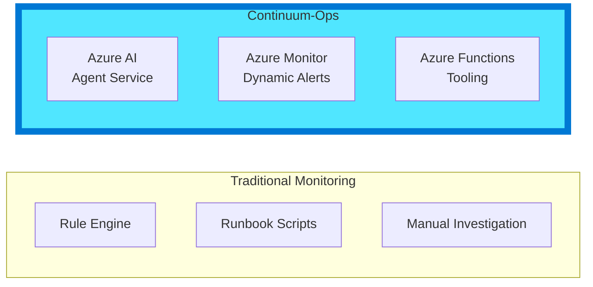
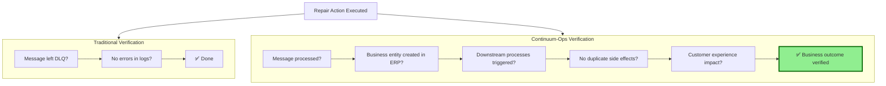
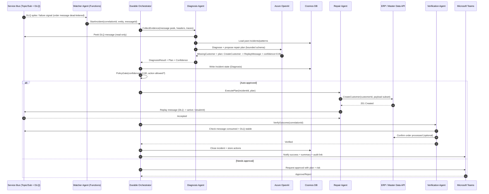
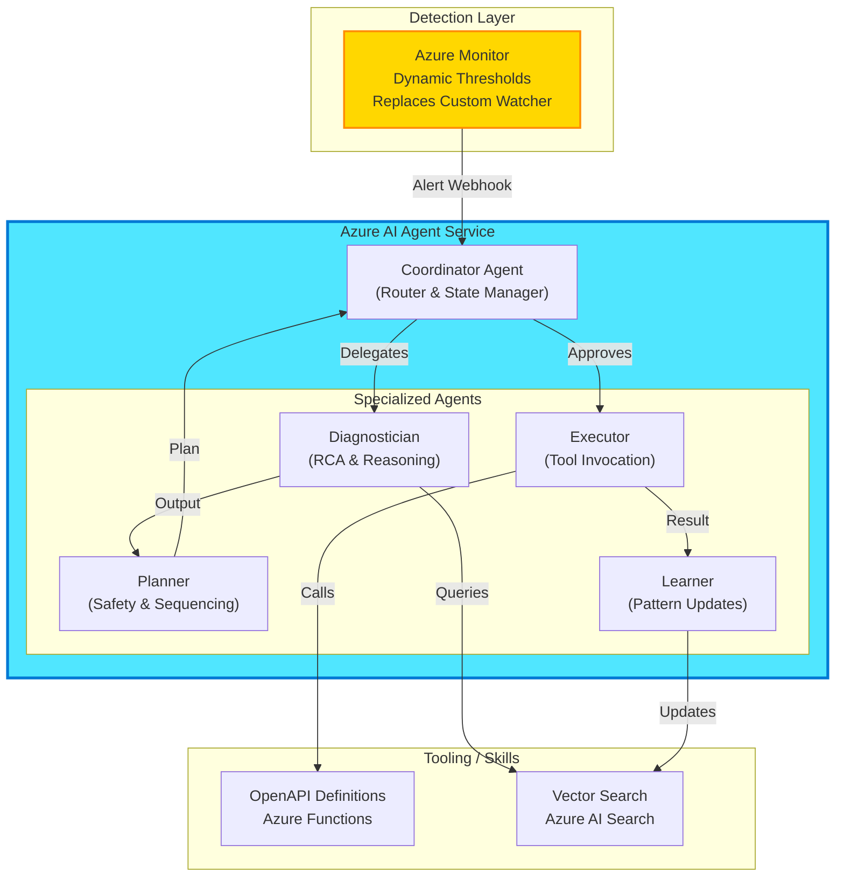
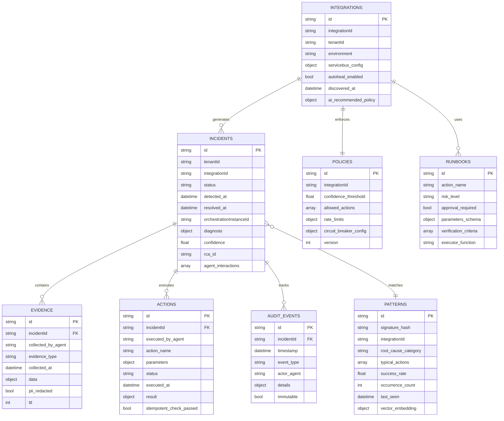
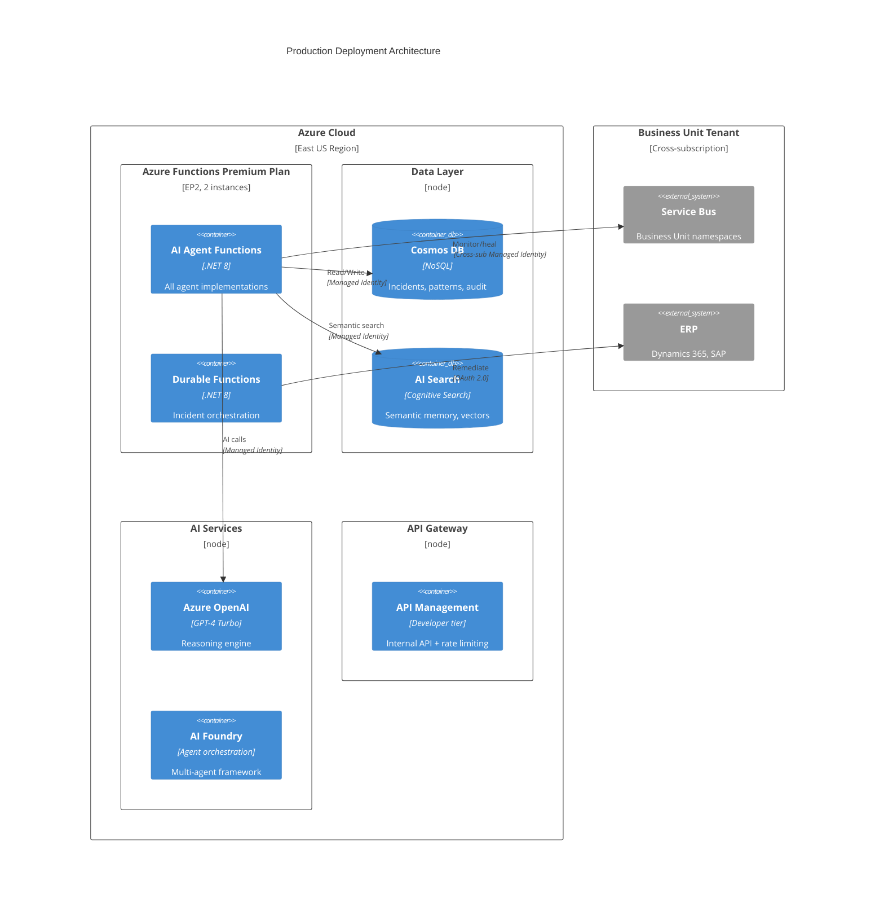
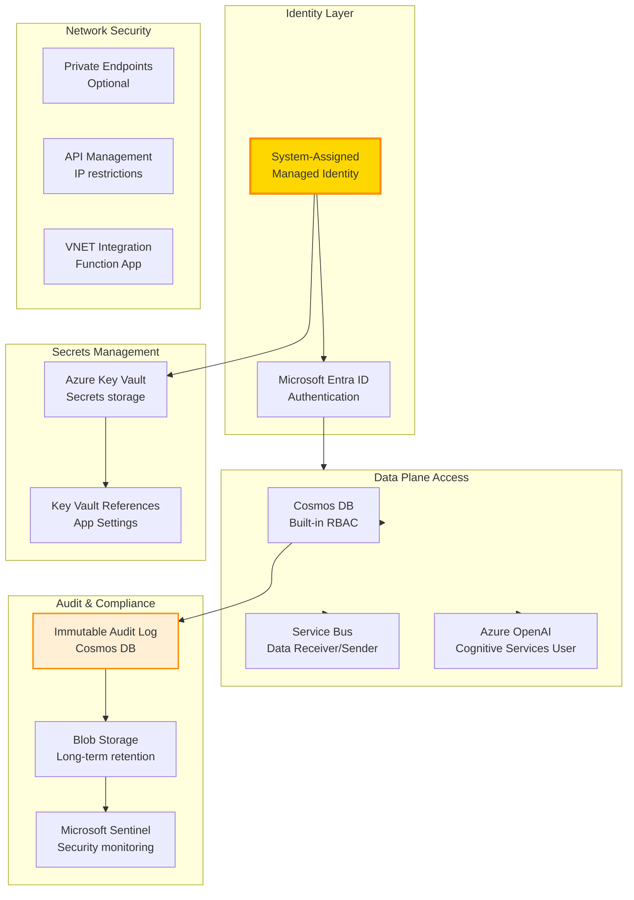
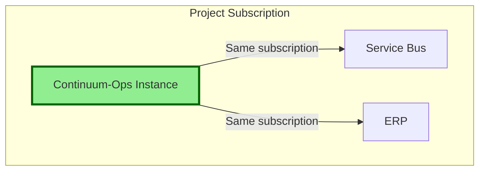

# Continuum-Ops: Technical Architecture
## Powered by Azure AI Agent Service

---

## Document Overview

This document provides the **complete technical architecture** for Continuum-Ops, an AI-native operational resilience platform built on Microsoft Azure AI Foundry.

**Related Documentation:**
- **[00-Product-Overview.md](00-Product-Overview.md)** - Product vision, internal value proposition
- **[02-Deployment-Guide.md](02-Deployment-Guide.md)** - 30-minute deployment playbook
- **[03-User-Manual.md](03-User-Manual.md)** - Operations guide for daily use
- **[10-Implementation-Roadmap.md](10-Implementation-Roadmap.md)** - Development sprint plan

---

## Architecture Principles

### 1. AI-First, Using Native Azure Capabilities



**Core Principle**: Every component is AI-native from the ground up, not rules with AI added on top.

### 2. Zero-Configuration Onboarding

**Vision**: App Team deploys → System auto-discovers → AI configures → Production ready in 30 minutes.


### 3. Business Outcome Focused

Traditional systems verify **technical success** (message processed).  
Continuum-Ops verifies **business outcomes** (order completed in ERP).



---

## Sequence diagram (example)

Scenario: **Order message fails → agent diagnoses missing customer → creates customer → replays message → order succeeds → Teams notification**



---

## Azure AI Agent Service Design

### Agent Topology

We utilize the **Azure AI Agent Service** to host a "Coordinator" agent that manages specialized worker agents. This replaces custom orchestrators with a managed, scalable runtime.



### Component Specifications

#### 1. Detection: Azure Monitor (Dynamic Thresholds)
*Instead of a custom "Watcher Agent", we leverage Azure's native ML capabilities.*
*   **Feature**: Azure Monitor Metric Alerts with Dynamic Thresholds.
*   **Metric**: `DeadletterMessageCount`, `ActiveMessageCount`.
*   **Configuration**: High Sensitivity.
*   **Action**: Calls Continuum-Ops Webhook (starts investigation workflow).
*   **Benefit**: Zero code to maintain, built-in seasonality learning.

#### 2. Coordinator Agent (Azure AI Agent Service)
*   **Role**: The entry point for all incidents.
*   **Responsibility**: Maintains conversation state, routes tasks to sub-agents, and handles "Human-in-the-loop" transitions.
*   **Implementation**: Azure AI Agent configured with `Router` instructions.

#### 3. Diagnostician Agent
*   **Role**: Root Cause Analysis.
*   **Tools**: 
    *   `query_logs` (App Insights via KQL)
    *   `search_patterns` (Azure AI Search)
*   **Model**: GPT-4 Turbo (or GPT-4o for complex reasoning).

#### 4. Executor Agent & Standardized Tooling
*Instead of proprietary MCP servers, we use standard Azure Functions with OpenAPI definitions.*
*   **Decision**: We deliberately chose **OpenAPI** over the emerging Model Context Protocol (MCP) for the discovery layer.
*   **Rationale**:
    *   **Maturity**: OpenAPI (Swagger) is the industry standard for REST APIs, supported natively by Azure Functions, Logic Apps, and Power Platform.
    *   **Ecosystem**: Every Azure service emits OpenAPI definitions; MCP is still experimental and lacks native Azure integration.
    *   **Security**: OpenAPI integrates directly with Azure AD (Entra ID) authentication flows, whereas MCP requires custom transport security.
*   **Implementation**: Azure Functions (.NET 8) exposing Swagger/OpenAPI.
*   **Integration**: Azure AI Agents ingest the OpenAPI spec to understand available tools.

**Tool Interface (OpenAPI):**
```yaml
paths:
  /servicebus/replay:
    post:
      operationId: ReplayMessages
      summary: Replays messages from DLQ back to active queue
      parameters:
        - name: namespace
          in: query
          required: true
          type: string
        - name: queue
          in: query
          required: true
          type: string
        - name: count
          in: query
          type: integer
```

---

## Data Architecture

### Cosmos DB Container Design



**Partition Keys**:
- `Incidents`: `/integrationId` (co-locates all incidents for same integration)
- `Evidence`: `/incidentId` (co-locates evidence with parent incident)
- `Patterns`: `/integrationId` (efficient pattern lookup per integration)
- `Integrations`: `/tenantId` (multi-tenant isolation)

### AI Search Index (Semantic Memory)

```json
{
  "name": "incident-patterns",
  "fields": [
    {"name": "id", "type": "Edm.String", "key": true},
    {"name": "signature_hash", "type": "Edm.String", "filterable": true},
    {"name": "root_cause_text", "type": "Edm.String", "searchable": true},
    {"name": "resolution_text", "type": "Edm.String", "searchable": true},
    {"name": "evidence_summary", "type": "Edm.String", "searchable": true},
    {"name": "embedding", "type": "Collection(Edm.Single)", "vectorSearch": true, "dimensions": 1536},
    {"name": "success_rate", "type": "Edm.Double", "filterable": true, "sortable": true},
    {"name": "occurrence_count", "type": "Edm.Int32", "sortable": true},
    {"name": "integration_id", "type": "Edm.String", "filterable": true}
  ],
  "vectorSearch": {
    "algorithms": [
      {
        "name": "hnsw-config",
        "kind": "hnsw",
        "hnswParameters": {
          "m": 4,
          "efConstruction": 400,
          "efSearch": 500,
          "metric": "cosine"
        }
      }
    ]
  }
}
```

**Semantic Search Query** (from Diagnostician Agent):
```csharp
var searchClient = new SearchClient(endpoint, "incident-patterns", credential);

var searchOptions = new SearchOptions
{
    VectorSearch = new()
    {
        Queries = { new VectorizedQuery(evidenceEmbedding) { KNearestNeighborsCount = 5 } }
    },
    Filter = $"integration_id eq '{integrationId}' and success_rate gt 0.7",
    OrderBy = { "occurrence_count desc" }
};

var results = await searchClient.SearchAsync<IncidentPattern>(null, searchOptions);
```

---

## Infrastructure Architecture

### Multi-Tenant Deployment



---

## Security Architecture

### Zero-Trust Model



---

## Deployment Models

### Deployment Architecture



The platform is designed to be deployed directly into the project's Azure subscription, ensuring complete data isolation and security.

---

## Scalability & Performance

### Scaling Dimensions

| Component | Scaling Strategy | Target Capacity |
|-----------|------------------|-----------------|
| **AI Agents** | Azure Functions auto-scale (EP2 plan) | 100+ concurrent incidents |
| **Durable Functions** | Partition count = 16 | 1000+ orchestrations/min |
| **Cosmos DB** | Autoscale 4000-40000 RU/s | 10K writes/sec |
| **AI Search** | Standard tier, 3 replicas | 50 queries/sec |
| **Azure OpenAI** | 100K TPM quota | 500 diagnoses/hour |

**Performance Targets**:
- Detection latency: <2 min (P95)
- Diagnosis latency: <30 sec (P95)
- Repair latency: <60 sec (P95)
- End-to-end MTTR: <10 min (P95)

---

## Technology Stack Summary

| Category | Technology | Version | Purpose |
|----------|-----------|---------|---------|
| **AI Orchestration** | Azure AI Foundry | Preview | Multi-agent system |
| **LLM** | Azure OpenAI GPT-4 Turbo | 1106-preview | Reasoning, diagnosis |
| **LLM (Advanced)** | Azure OpenAI GPT-4o | Latest | Chain-of-thought reasoning |
| **AI Framework** | Semantic Kernel | 1.x | Agent development |
| **LLM Workflows** | Prompt Flow | 1.x | Visual LLM pipelines |
| **Orchestration** | Durable Functions | 2.x | Stateful workflows |
| **Runtime** | .NET | 8.0 | Function App runtime |
| **Database** | Cosmos DB | Core SQL API | Incidents, patterns, audit |
| **Vector DB** | AI Search | Standard | Semantic memory |
| **Observability** | Application Insights | Latest | Telemetry, monitoring |
| **Identity** | Managed Identity | System-assigned | Zero-trust auth |
| **Collaboration** | Microsoft Teams | Latest | Approval workflows |
| **IaC** | Bicep | 0.24+ | Infrastructure provisioning |

---

## References

- **[00-Product-Overview.md](00-Product-Overview.md)** - Product vision
- **[02-Deployment-Guide.md](02-Deployment-Guide.md)** - Deployment playbook
- **[03-User-Manual.md](03-User-Manual.md)** - Operations guide
- **[10-Implementation-Roadmap.md](10-Implementation-Roadmap.md)** - Development plan

---
`````
