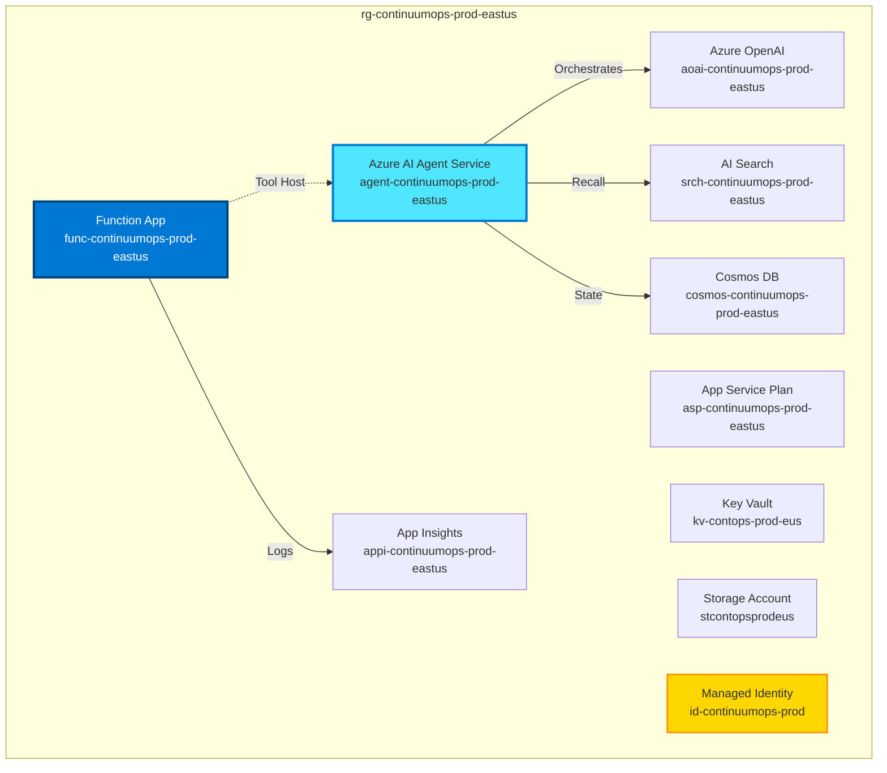
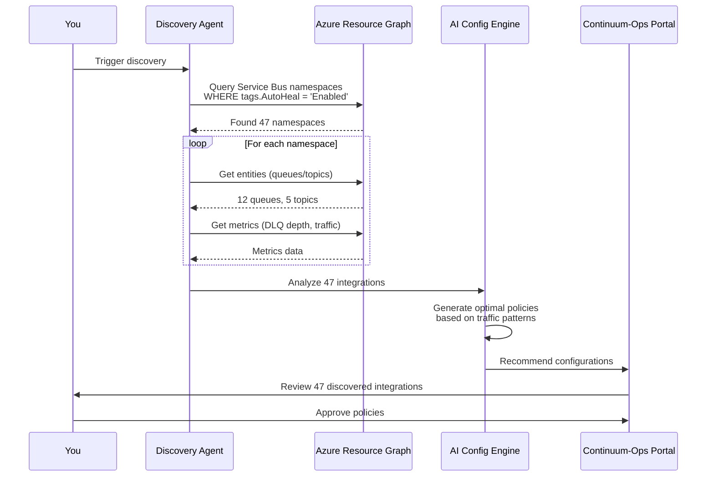

# Continuum-Ops: Deployment Guide
## Zero-Touch Deployment in 30 Minutes

---

## Overview

This guide will take you from **zero to production** in **30 minutes** with Continuum-Ops deployed, configured, and monitoring your internal Azure Service Bus integrations.

**Prerequisites:**
- Azure subscription with Owner or Contributor role
- Azure CLI installed (or use Azure Cloud Shell)
- At least one Azure Service Bus namespace to monitor

**What You'll Deploy:**
- ✅ Azure Functions (Premium EP1 plan)
- ✅ Cosmos DB (Serverless for dev, Autoscale for prod)
- ✅ Azure OpenAI (GPT-4 Turbo)
- ✅ AI Search (Standard tier)
- ✅ Application Insights
- ✅ Managed Identity with cross-subscription RBAC

---

## 🚀 Quick Start: One-Click Deployment

### Step 1: Deploy Infrastructure (5 minutes)

Click the button below to deploy all Azure resources:

[](https://portal.azure.com/#create/Microsoft.Template/uri/https%3A%2F%2Fraw.githubusercontent.com%2Fcontinuum-ops%2Fazure-deploy%2Fmain%2Fazuredeploy.json)

**ARM Template Parameters:**

| Parameter | Description | Default | Notes |
|-----------|-------------|---------|-------|
| `environmentName` | Environment identifier | `prod` | Use `dev`, `staging`, or `prod` |
| `location` | Azure region | `eastus` | Choose region with Azure OpenAI |
| `functionAppSku` | Functions plan SKU | `EP1` | EP1 (1 core) or EP2 (2 cores) |
| `cosmosDbThroughput` | Cosmos DB RU/s | `autoscale` | `autoscale` or `serverless` |
| `openAiDeploymentName` | OpenAI model deployment | `gpt-4-turbo` | Must exist in your subscription |
| `enablePrivateEndpoints` | Use private networking | `false` | Set `true` for enterprise |

**Alternative: Azure CLI Deployment**

```bash
# Login to Azure
az login
az account set --subscription "<your-subscription-id>"

# Create resource group
az group create \
  --name rg-continuumops-prod-eastus \
  --location eastus

# Deploy Bicep template
az deployment group create \
  --resource-group rg-continuumops-prod-eastus \
  --template-file infrastructure/bicep/main.bicep \
  --parameters environmentName=prod \
  --parameters location=eastus \
  --parameters openAiDeploymentName=gpt-4-turbo
```

**What Gets Deployed:**



---

## Step 2: Configure RBAC Permissions (10 minutes)

### 2.1 Get Managed Identity Details

After deployment completes, retrieve the Managed Identity Object ID:

```bash
# Get Function App Managed Identity
FUNCTION_APP_NAME="func-continuumops-prod-eastus"
RESOURCE_GROUP="rg-continuumops-prod-eastus"

MANAGED_IDENTITY_ID=$(az functionapp identity show \
  --name $FUNCTION_APP_NAME \
  --resource-group $RESOURCE_GROUP \
  --query principalId \
  --output tsv)

echo "Managed Identity Object ID: $MANAGED_IDENTITY_ID"
```

### 2.2 Grant Service Bus Permissions

**For Each Service Bus Namespace You Want to Monitor:**

```bash
# Set variables
SERVICE_BUS_NAMESPACE="contoso-sb"
SERVICE_BUS_RESOURCE_GROUP="rg-integrations"
SERVICE_BUS_SUBSCRIPTION_ID="<target-subscription-id>"

# Grant Service Bus Data Receiver (read DLQ messages)
az role assignment create \
  --assignee $MANAGED_IDENTITY_ID \
  --role "Azure Service Bus Data Receiver" \
  --scope /subscriptions/$SERVICE_BUS_SUBSCRIPTION_ID/resourceGroups/$SERVICE_BUS_RESOURCE_GROUP/providers/Microsoft.ServiceBus/namespaces/$SERVICE_BUS_NAMESPACE

# Grant Service Bus Data Sender (replay messages)
az role assignment create \
  --assignee $MANAGED_IDENTITY_ID \
  --role "Azure Service Bus Data Sender" \
  --scope /subscriptions/$SERVICE_BUS_SUBSCRIPTION_ID/resourceGroups/$SERVICE_BUS_RESOURCE_GROUP/providers/Microsoft.ServiceBus/namespaces/$SERVICE_BUS_NAMESPACE
```

**PowerShell Alternative:**

```powershell
$managedIdentityId = "<managed-identity-object-id>"
$serviceBusResourceId = "/subscriptions/{sub-id}/resourceGroups/{rg}/providers/Microsoft.ServiceBus/namespaces/{namespace}"

# Grant permissions
New-AzRoleAssignment -ObjectId $managedIdentityId `
  -RoleDefinitionName "Azure Service Bus Data Receiver" `
  -Scope $serviceBusResourceId

New-AzRoleAssignment -ObjectId $managedIdentityId `
  -RoleDefinitionName "Azure Service Bus Data Sender" `
  -Scope $serviceBusResourceId
```

### 2.3 Grant Application Insights Permissions

```bash
# Get Application Insights workspace ID
APP_INSIGHTS_WORKSPACE_ID=$(az monitor app-insights component show \
  --app appi-continuumops-prod-eastus \
  --resource-group $RESOURCE_GROUP \
  --query workspaceResourceId \
  --output tsv)

# Grant Log Analytics Reader
az role assignment create \
  --assignee $MANAGED_IDENTITY_ID \
  --role "Log Analytics Reader" \
  --scope $APP_INSIGHTS_WORKSPACE_ID
```

### 2.4 Grant Cosmos DB Permissions (Data Plane RBAC)

```bash
# Get Cosmos DB account name
COSMOS_ACCOUNT="cosmos-continuumops-prod-eastus"

# Grant Cosmos DB Built-in Data Contributor
az cosmosdb sql role assignment create \
  --account-name $COSMOS_ACCOUNT \
  --resource-group $RESOURCE_GROUP \
  --role-definition-name "Cosmos DB Built-in Data Contributor" \
  --principal-id $MANAGED_IDENTITY_ID \
  --scope "/"
```

### 2.5 Verify RBAC Assignments

```bash
# List all role assignments for Managed Identity
az role assignment list \
  --assignee $MANAGED_IDENTITY_ID \
  --output table
```

**Expected Output:**
```
PrincipalName                      Role                            Scope
---------------------------------  ------------------------------  ------
id-continuumops-prod               Azure Service Bus Data Receiver /subscriptions/.../namespaces/contoso-sb
id-continuumops-prod               Azure Service Bus Data Sender   /subscriptions/.../namespaces/contoso-sb
id-continuumops-prod               Log Analytics Reader            /subscriptions/.../workspaces/...
id-continuumops-prod               Cosmos DB Data Contributor      /subscriptions/.../databaseAccounts/cosmos-...
```

---

## Step 3: Auto-Discovery & Configuration (15 minutes)

### 3.1 Trigger Auto-Discovery

The auto-discovery agent scans your Azure subscriptions for Service Bus namespaces with the `AutoHeal=Enabled` tag.

**Option A: Tag Your Service Bus Namespaces (Recommended)**

```bash
# Tag Service Bus namespace for auto-discovery
az servicebus namespace update \
  --name contoso-sb \
  --resource-group rg-integrations \
  --tags AutoHeal=Enabled Environment=Production Owner=ops-team
```

**Option B: Manual Registration via API**

```bash
# Call Continuum-Ops Management API
FUNCTION_APP_URL="https://func-continuumops-prod-eastus.azurewebsites.net"

curl -X POST "$FUNCTION_APP_URL/api/discovery/trigger" \
  -H "Content-Type: application/json" \
  -H "x-functions-key: <function-key>" \
  -d '{
    "subscription_ids": ["<subscription-id-1>", "<subscription-id-2>"],
    "tag_filter": "AutoHeal=Enabled"
  }'
```

**Discovery Process:**



### 3.2 Review Discovered Integrations

Navigate to the Continuum-Ops portal:

```bash
# Open portal in browser
$FUNCTION_APP_URL = "https://func-continuumops-prod-eastus.azurewebsites.net"
Start-Process "$FUNCTION_APP_URL/api/portal"
```

**Portal View:**

| Integration ID | Namespace | Entity | DLQ Depth | Traffic (msg/hr) | Recommended Policy |
|----------------|-----------|--------|-----------|------------------|--------------------|
| orders-to-erp | contoso-sb | orders-queue | 47 | 1,200 | Auto-approve (high confidence) |
| invoices-to-accounting | contoso-sb | invoices-topic | 12 | 300 | Require approval (medium risk) |
| shipments-to-wms | contoso-sb | shipments-queue | 0 | 5,000 | Monitor only (healthy) |

### 3.3 Customize Policies (Optional)

For each integration, you can customize:
- **Confidence threshold** (0.70 - 0.95)
- **Allowed actions** (replay, isolate, create_data)
- **Approval requirements** (auto-approve vs. manual)
- **Rate limits** (max repairs per hour)
- **Circuit breaker** (stop after N failures)

**Example: Update Policy via API**

```bash
curl -X PUT "$FUNCTION_APP_URL/api/policies/orders-to-erp" \
  -H "Content-Type: application/json" \
  -d '{
    "confidence_threshold": 0.85,
    "allowed_actions": [
      {"action": "replay_message", "approval_required": false, "max_per_hour": 100},
      {"action": "create_customer", "approval_required": true, "max_per_hour": 10}
    ],
    "circuit_breaker": {
      "failure_threshold": 5,
      "reset_timeout_minutes": 30
    },
    "notifications": {
      "teams_channel": "https://outlook.office.com/webhook/...",
      "approvers": ["ops-team@company.com"]
    }
  }'
```

### 3.4 Configure Microsoft Teams Integration

**Option A: Incoming Webhook (Simple)**

1. In Microsoft Teams, go to your channel → **Connectors** → **Incoming Webhook**
2. Name it "Continuum-Ops Approvals"
3. Copy the webhook URL
4. Configure in Continuum-Ops:

```bash
curl -X POST "$FUNCTION_APP_URL/api/settings/teams" \
  -H "Content-Type: application/json" \
  -d '{
    "webhook_url": "https://outlook.office.com/webhook/...",
    "channel_name": "integration-ops",
    "enable_approvals": true
  }'
```

**Option B: Microsoft Graph API (Advanced)**

1. Register an Azure AD app for Continuum-Ops
2. Grant permissions: `Channel.ReadBasic.All`, `ChannelMessage.Send`
3. Configure in Key Vault:

```bash
az keyvault secret set \
  --vault-name kv-contops-prod-eus \
  --name "TeamsAppClientId" \
  --value "<client-id>"

az keyvault secret set \
  --vault-name kv-contops-prod-eus \
  --name "TeamsAppClientSecret" \
  --value "<client-secret>"
```

---

## Step 4: Validation & Testing (5 minutes)

### 4.1 Health Check

```bash
# Call health endpoint
curl "$FUNCTION_APP_URL/api/health" | jq

# Expected response:
# {
#   "status": "healthy",
#   "services": {
#     "cosmos_db": "healthy",
#     "azure_openai": "healthy",
#     "ai_search": "healthy",
#     "service_bus_connectivity": "healthy"
#   },
#   "discovered_integrations": 47,
#   "active_policies": 47
# }
```

### 4.2 Test with Synthetic Failure

Create a test failure to verify end-to-end flow:

```bash
# Send a test message to a DLQ
az servicebus queue send \
  --namespace-name contoso-sb \
  --queue-name test-queue/$DeadLetterQueue \
  --messages '[{"body":"Test order","properties":{"correlationId":"TEST-12345"}}]'

# Monitor incident creation
curl "$FUNCTION_APP_URL/api/incidents?hours=1" | jq
```

### 4.3 Verify Monitoring Dashboards

Open Application Insights workbook:

```bash
# Get App Insights ID
$APP_INSIGHTS_ID = az monitor app-insights component show \
  --app appi-continuumops-prod-eastus \
  --resource-group $RESOURCE_GROUP \
  --query id --output tsv

# Open in browser
Start-Process "https://portal.azure.com/#blade/AppInsightsExtension/UsageNotebookBlade/ComponentId/$APP_INSIGHTS_ID/ConfigurationId/ContinuumOps"
```

**Key Metrics to Verify:**
- ✅ Azure Monitor Alerts firing correctly (no custom watcher polling)
- ✅ Discovery found expected number of integrations
- ✅ Agent Service successfully invoking Tools
- ✅ Azure OpenAI connectivity working
- ✅ Cosmos DB read/write operations succeeding

---

## 🎉 Congratulations! You're Live

Your Continuum-Ops deployment is now:
- ✅ **Monitoring** all tagged Service Bus integrations
- ✅ **Detecting** anomalies and DLQ spikes
- ✅ **Diagnosing** failures with AI-powered RCA
- ✅ **Remediating** incidents (with your approval)
- ✅ **Learning** from every incident

---

## Next Steps

### Immediate Actions
1. ✅ **Join Teams Channel** - Add team members to approval channel
2. ✅ **Review First Incident** - Wait for real incident, approve/reject
3. ✅ **Tune Policies** - Adjust confidence thresholds based on first week
4. ✅ **Enable Monitoring** - Set up alerts for platform health

### Week 1: Learning Mode
- Keep all actions on **approval required**
- Review AI diagnoses for accuracy
- Validate that proposed actions are correct
- Build trust with the system

### Week 2-4: Gradual Automation
- Lower approval requirements for **low-risk actions** (message replay)
- Monitor auto-resolution rate (target: 40-60%)
- Adjust confidence thresholds
- Enable more integrations

### Month 2+: Full Automation
- Auto-approve most low/medium risk actions
- Target 70-80% auto-resolution rate
- Focus on proactive prevention
- Expand to additional subscriptions

---

## Deployment Checklist

Use this checklist to ensure complete deployment:

### Infrastructure
- [ ] All Azure resources deployed successfully
- [ ] Managed Identity created
- [ ] Function App running (check in Azure Portal)
- [ ] Cosmos DB containers created (Incidents, Patterns, Policies, AuditEvents)
- [ ] Azure OpenAI endpoint accessible
- [ ] AI Search index created

### RBAC & Permissions
- [ ] Managed Identity granted Service Bus Data Receiver on all namespaces
- [ ] Managed Identity granted Service Bus Data Sender on all namespaces
- [ ] Managed Identity granted Log Analytics Reader on workspaces
- [ ] Managed Identity granted Cosmos DB Data Contributor
- [ ] Managed Identity granted Key Vault Secrets User

### Configuration
- [ ] Auto-discovery completed (integrations found)
- [ ] Policies configured for each integration
- [ ] Teams webhook configured
- [ ] Approval channel created in Teams
- [ ] Team members added to approval channel

### Validation
- [ ] Health check returns "healthy" status
- [ ] Test incident triggered and processed
- [ ] Teams approval card received
- [ ] Approval workflow tested
- [ ] Monitoring dashboards accessible

### Documentation
- [ ] Team trained on approval process
- [ ] Escalation procedures documented
- [ ] On-call rotation set up
- [ ] Runbooks documented for manual interventions

---

## Troubleshooting Common Issues

### Issue 1: Deployment Fails with "OpenAI deployment not found"

**Error:**
```
InvalidTemplateDeployment: The template deployment 'main' is not valid according to the validation procedure. 
Error: Azure OpenAI deployment 'gpt-4-turbo' not found.
```

**Solution:**
1. Create Azure OpenAI deployment first:
```bash
az cognitiveservices account deployment create \
  --name aoai-continuumops-prod-eastus \
  --resource-group $RESOURCE_GROUP \
  --deployment-name gpt-4-turbo \
  --model-name gpt-4 \
  --model-version "1106-Preview" \
  --model-format OpenAI \
  --sku-capacity 10 \
  --sku-name "Standard"
```

2. Retry deployment with correct deployment name

---

### Issue 2: RBAC Assignment Fails - "Principal not found"

**Error:**
```
PrincipalNotFound: Principal '<object-id>' does not exist in the directory.
```

**Solution:**
Wait 60 seconds after Function App creation for Managed Identity propagation:

```bash
echo "Waiting for Managed Identity propagation..."
Start-Sleep -Seconds 60
# Retry RBAC assignments
```

---

### Issue 3: Auto-Discovery Finds No Integrations

**Symptoms:**
- Discovery completes but 0 integrations found
- API returns empty list

**Solution:**
1. Check if Service Bus namespaces have tags:
```bash
az servicebus namespace show \
  --name contoso-sb \
  --resource-group rg-integrations \
  --query tags
```

2. Add tags if missing:
```bash
az servicebus namespace update \
  --name contoso-sb \
  --resource-group rg-integrations \
  --tags AutoHeal=Enabled
```

3. Retry discovery

---

### Issue 4: Function App Shows "Unhealthy" Status

**Check Function App Logs:**
```bash
az monitor app-insights query \
  --app appi-continuumops-prod-eastus \
  --analytics-query "traces | where severityLevel >= 3 | top 20 by timestamp desc" \
  --output table
```

**Common Causes:**
- Cosmos DB connection string incorrect
- Azure OpenAI quota exceeded
- Managed Identity permissions missing

---

## Resource Optimization

### Development Environment (Non-Prod)
- Azure Functions: Consumption Plan
- Cosmos DB: Serverless
- Azure OpenAI: Pay-per-use
- AI Search: Basic tier
- Application Insights: Pay-as-you-go

### Production Environment
- Azure Functions: Premium EP1
- Cosmos DB: Autoscale
- Azure OpenAI: Provisioned or Pay-per-use
- AI Search: Standard tier
- Application Insights: Pay-as-you-go

**Optimization Tips:**
- Use Serverless Cosmos DB for low-volume environments
- Monitor Azure OpenAI token usage daily
- Use Consumption Plan for dev/test (if Durable Functions limitations acceptable)

---

## Version History

| Version | Date | Changes |
|---------|------|---------|
| 1.0 | 2026-02-13 | Initial deployment guide with Azure best practices |

---

**© 2026 Continuum-Ops**
