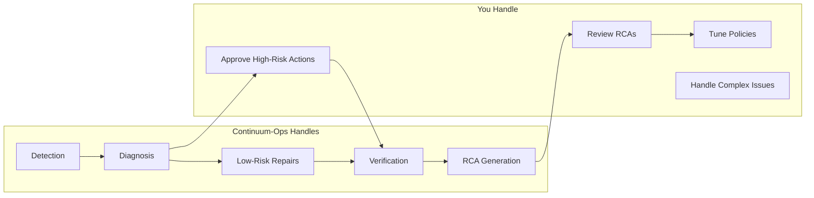
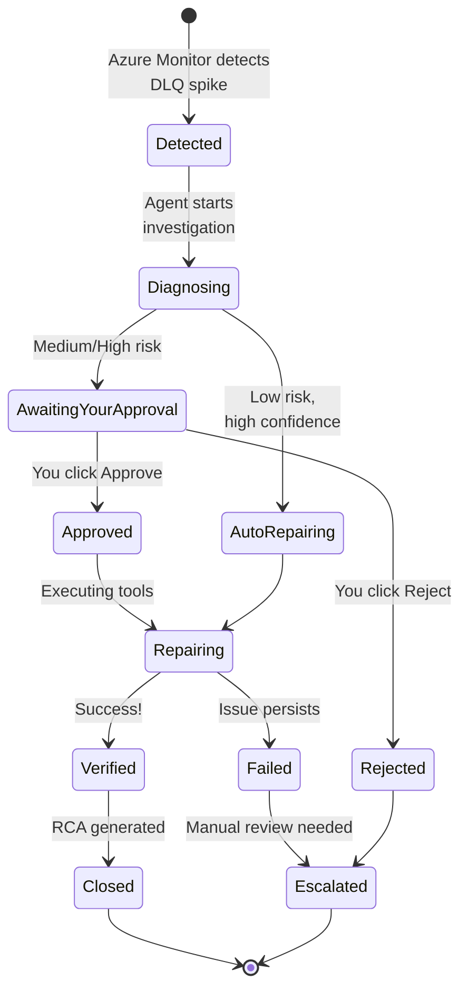
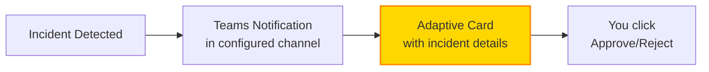
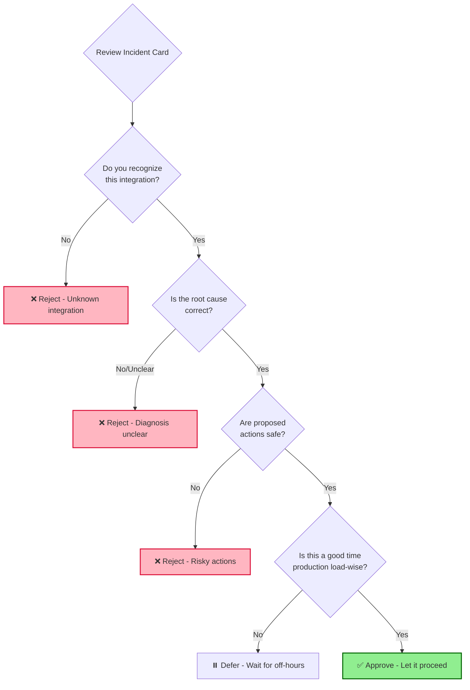
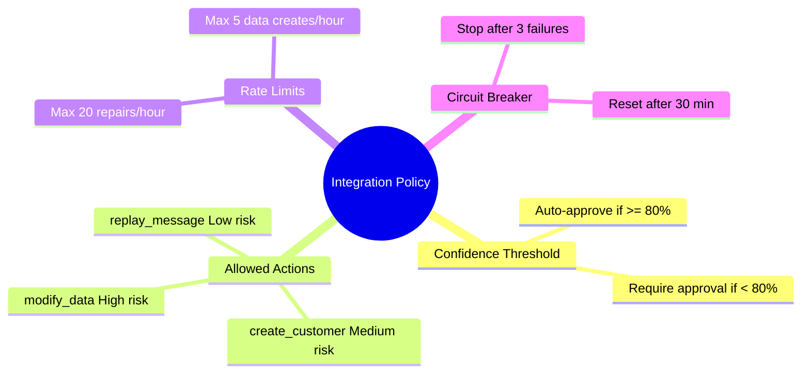
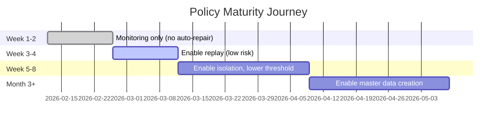
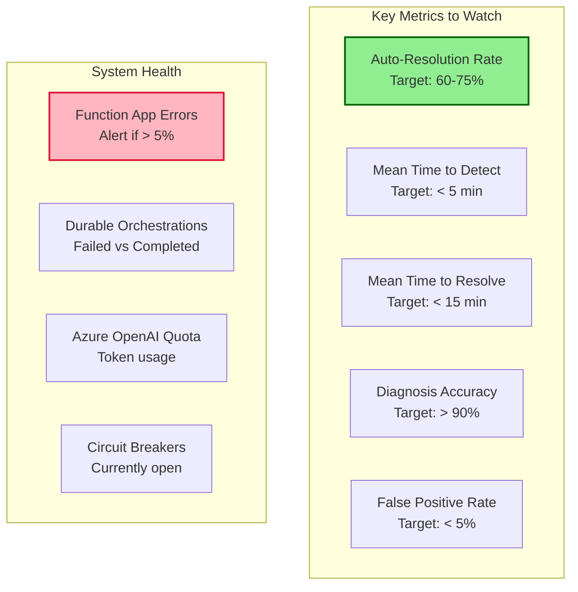
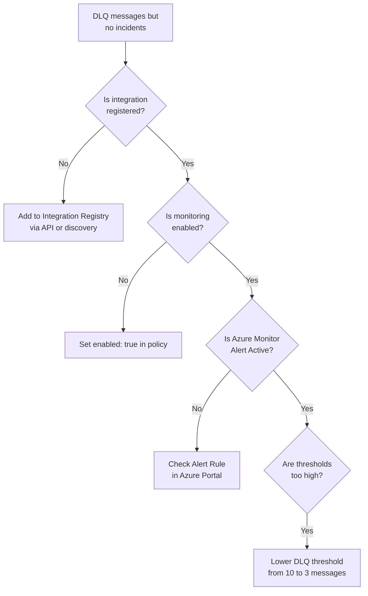
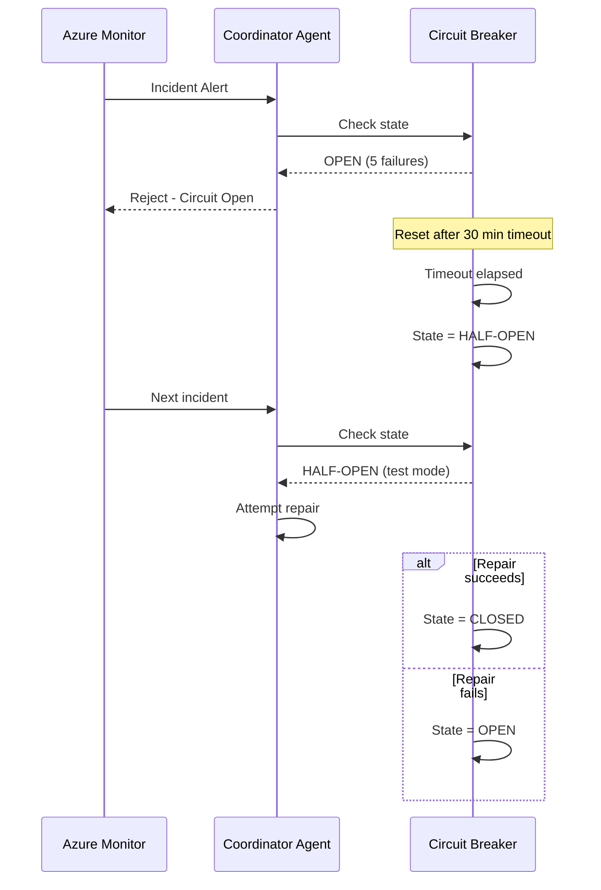
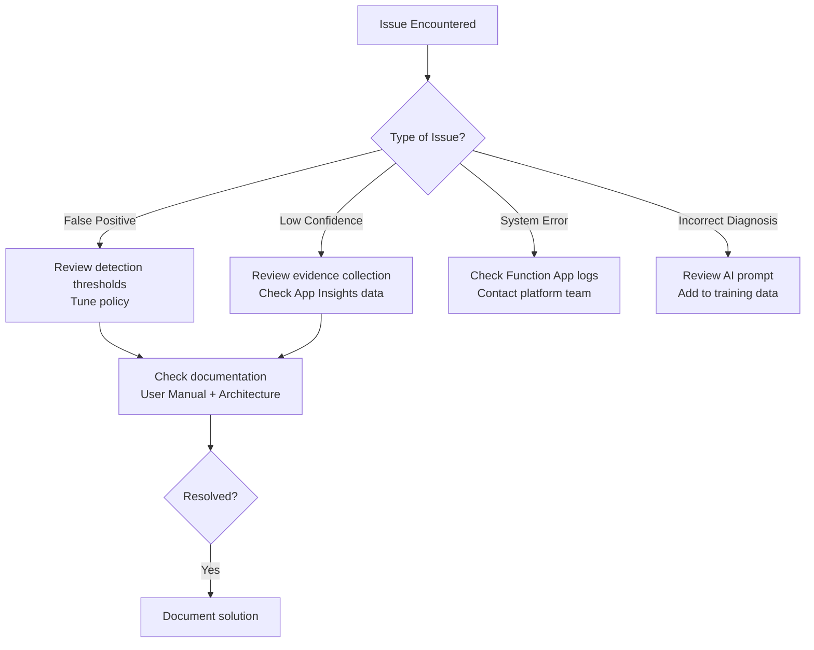

# Continuum-Ops: User Manual

## Document Purpose

This manual is for **operations engineers, platform administrators, and application teams** who will use Continuum-Ops in their day-to-day work. For deployment instructions, see **[02-Deployment-Guide.md](02-Deployment-Guide.md)**.

---

## Table of Contents

1. [Getting Started](#getting-started)
2. [Understanding Incidents](#understanding-incidents)
3. [Reviewing and Approving Actions](#reviewing-and-approving-actions)
4. [Configuring Integration Policies](#configuring-integration-policies)
5. [Monitoring System Health](#monitoring-system-health)
6. [Troubleshooting Common Issues](#troubleshooting-common-issues)
7. [Advanced Operations](#advanced-operations)

---

## Getting Started

### What is Continuum-Ops?

Continuum-Ops is your **autonomous integration reliability assistant** that:
- 🔍 **Detects** when messages fail in Service Bus (dead-letter queues)
- 🧠 **Diagnoses** the root cause using AI analysis
- 🔧 **Repairs** the issue automatically (when safe and approved)
- ✅ **Verifies** that business processes resumed successfully
- 📊 **Learns** from every incident to improve over time

### Your Role



**You are in control**: Continuum-Ops asks for approval before taking any high-risk action. You can always reject and handle manually.

---

## Understanding Incidents

### Incident Lifecycle



### Incident Statuses

| Status | What It Means | What You Should Do |
|--------|---------------|-------------------|
| **Detected** | System noticed a problem | Nothing yet - diagnosis in progress |
| **Diagnosing** | Collecting logs, messages, metrics | Wait for diagnosis (usually <30 sec) |
| **Awaiting Approval** | Action requires your approval | **Review and approve/reject in Teams** |
| **Repairing** | Executing approved actions | Monitor progress (usually <2 min) |
| **Verifying** | Checking if fix worked | Wait for outcome confirmation |
| **Verified** | Successfully resolved! | Review RCA for learning |
| **Escalated** | Needs manual intervention | **Handle manually, update policy** |
| **Closed** | Incident complete | Done - check metrics dashboard |

---

## Reviewing and Approving Actions

### How You'll Be Notified

When an incident requires approval, you'll receive a **Microsoft Teams adaptive card**:



### Sample Approval Card

```
╔══════════════════════════════════════════════╗
║         Incident Approval Required           ║
╠══════════════════════════════════════════════╣
║ Integration: orders-to-erp                   ║
║ Environment: Production                      ║
║                                              ║
║    Root Cause:                               ║
║    Customer CUS-12345 not found in ERP       ║
║                                              ║
║   Proposed Actions:                          ║
║   1. Create customer CUS-12345               ║
║   2. Replay 3 messages from DLQ              ║
║                                              ║
║  Confidence: 86%                             ║
║  Risk Level: Medium                          ║
║                                              ║
║  Detected: 2 minutes ago                     ║
║  DLQ Messages: 3                             ║
║                                              ║
║ [✅ Approve]  [❌ Reject]  [📖 Details]     ║
╚══════════════════════════════════════════════╝
```

### Approval Decision Guide



### When to Approve ✅

- Root cause makes sense (you've seen this before)
- Actions are clearly described and safe
- Confidence score is high (>80%)
- Risk level is acceptable (Low or Medium)
- Similar incidents were auto-resolved successfully before
- Not during peak production hours (if creating data)

### When to Reject ❌

- You don't recognize the integration
- Root cause diagnosis is unclear or wrong
- Actions seem risky or overly complex
- Confidence score is low (<70%)
- High risk level and not urgent
- Recent similar failures (circuit breaker should catch this)
- Prefer manual investigation

### Approval Timeout

If you don't respond within **30 minutes**, the incident is automatically **escalated** to the on-call engineer and posted to the escalation channel. No action is taken automatically.

---

## Configuring Integration Policies

### What are Policies?

Policies control **when and how** Continuum-Ops can take action on each integration. Think of them as "guardrails" for automation.



### Policy Configuration (API)

Policies are stored in Cosmos DB and can be updated via REST API:

**Endpoint**: `POST /api/policies`

**Example Policy**:
```json
{
  "integrationId": "orders-to-erp",
  "environment": "production",
  "enabled": true,
  "confidence_threshold": 0.80,
  "allowed_actions": [
    {
      "action": "replay_message",
      "risk": "low",
      "approval_required": false,
      "max_per_hour": 100
    },
    {
      "action": "isolate_poison_message",
      "risk": "low",
      "approval_required": false,
      "max_per_hour": 20
    },
    {
      "action": "create_master_data",
      "risk": "medium",
      "approval_required": true,
      "allowed_entities": ["customer", "product"],
      "max_per_hour": 10
    }
  ],
  "rate_limits": {
    "max_total_repairs_per_hour": 50,
    "max_concurrent_incidents": 5
  },
  "circuit_breaker": {
    "enabled": true,
    "failure_threshold": 5,
    "reset_timeout_minutes": 30
  },
  "notifications": {
    "teams_channel": "https://outlook.office.com/webhook/...",
    "escalation_channel": "https://outlook.office.com/webhook/...",
    "approvers": ["ops-team@company.com"]
  }
}
```

### Tuning Policies (Best Practices)

#### Start Conservative, Loosen Over Time



**Week 1-2**: Monitoring only
- Set `enabled: false` for all actions
- Review incident detections and diagnoses
- Validate accuracy before enabling auto-repair

**Week 3-4**: Enable low-risk actions
- Enable `replay_message` with `approval_required: true`
- Approve a few manually to verify
- Lower to `approval_required: false` after confidence builds

**Week 5-8**: Broaden automation
- Enable `isolate_poison_message`
- Lower confidence threshold from 0.90 to 0.80
- Increase rate limits gradually

**Month 3+**: Enable advanced actions
- Enable `create_master_data` with approval required
- Monitor for false positives
- Consider auto-approval for specific entity types

---

## Monitoring System Health

### Key Metrics Dashboard

Access the dashboard at: **[Application Insights Workbook URL]**



### Daily Health Check (5 Minutes)

**Morning Routine**:
1. ✅ Check overnight incidents (Cosmos DB query or Teams history)
2. ✅ Review any escalated incidents
3. ✅ Verify auto-resolution rate trending up
4. ✅ Check for circuit breakers stuck open
5. ✅ Review Azure OpenAI quota usage

**Kusto Query (Application Insights)**:
```kusto
customEvents
| where timestamp > ago(24h)
| where name in ("IncidentDetected", "IncidentResolved", "IncidentEscalated")
| summarize 
    Total = count(),
    AutoResolved = countif(name == "IncidentResolved" and customDimensions.resolution == "AutoRepaired"),
    Escalated = countif(name == "IncidentEscalated")
| extend AutoResolutionRate = (AutoResolved * 100.0) / Total
```

---

## Troubleshooting Common Issues

### Issue 1: Incidents Not Being Detected

**Symptoms**: DLQ messages accumulating, but no incidents triggered.



**Action**: Query Integration Registry
```bash
# Check if integration is registered
curl -X GET "https://func-continuumops-prod.azurewebsites.net/api/integrations?integrationId=orders-to-erp"
```

---

### Issue 2: Too Many Approval Requests

**Symptoms**: Getting approval cards for incidents that should be auto-resolved.

**Root Cause**: Confidence threshold too high or AI diagnosis inconsistent.

**Solution**:
1. Review recent incidents with low confidence scores
2. Check if evidence collection is incomplete (missing App Insights data?)
3. Lower confidence threshold from 0.85 to 0.75 gradually
4. Add more historical patterns to Cosmos DB (system learns over time)

---

### Issue 3: Circuit Breaker Stuck Open

**Symptoms**: Incidents are being detected but immediately rejected with "circuit breaker open".



**Action**: Manually reset circuit breaker
```bash
# Reset circuit breaker via API
curl -X POST "https://func-continuumops-prod.azurewebsites.net/api/circuit-breaker/reset?integrationId=orders-to-erp"
```

**Prevention**: Investigate why 5+ repairs failed in a row. Fix the root cause (e.g., ERP API down, incorrect credentials).

---

### Issue 4: Verification Keeps Failing

**Symptoms**: Repairs execute successfully but verification times out or fails.

**Common Causes**:
1. **Business process takes longer than expected**: Increase verification timeout in runbook
2. **ERP API query incorrect**: Update verification query in runbook
3. **Message consumed but downstream process failed**: This is a real failure - needs investigation

**Debugging**:
```kusto
// Application Insights: Find verification failures
customEvents
| where name == "VerificationFailed"
| project timestamp, incidentId = tostring(customDimensions.incidentId), 
    reason = tostring(customDimensions.failureReason)
| order by timestamp desc
| take 20
```

---

## Advanced Operations

### Manual Incident Replay

If you need to manually trigger a repair that was rejected or timed out:

```bash
# Trigger manual repair via API
curl -X POST "https://func-continuumops-prod.azurewebsites.net/api/incidents/{incidentId}/retry" \
  -H "Authorization: Bearer <token>" \
  -d '{
    "reason": "Manual retry after fixing ERP API",
    "approvedBy": "ops-engineer@company.com"
  }'
```

---

### Adding a New Integration

**Automatic Discovery** (Recommended):
1. Tag your Service Bus queue/topic with `AutoHeal=Enabled`
2. Wait for next discovery scan (runs hourly)
3. Review discovered integration in registry
4. Configure policy for the integration

**Manual Registration**:
```bash
curl -X POST "https://func-continuumops-prod.azurewebsites.net/api/integrations" \
  -H "Content-Type: application/json" \
  -d '{
    "integrationId": "invoices-to-accounting",
    "environment": "production",
    "servicebus_namespace": "mycompany-sb.servicebus.windows.net",
    "entity_path": "invoices-topic/subscriptions/accounting-processor",
    "business_context": "Invoice processing to accounting system",
    "owning_team": "accounting-ops@company.com",
    "enabled": true
  }'
```

---

### Viewing Incident History and RCAs

**Access RCAs**: Query Cosmos DB or use API

```bash
# Get RCA for an incident
curl -X GET "https://func-continuumops-prod.azurewebsites.net/api/incidents/{incidentId}/rca"
```

**Sample RCA Output**:
```json
{
  "rca_id": "rca-2026-02-12-001",
  "incident_id": "incident-2026-02-12-001",
  "timestamp": "2026-02-12T10:30:00Z",
  "integration": {
    "id": "orders-to-erp",
    "environment": "production"
  },
  "summary": "Order processing failed due to missing customer master data",
  "root_cause": "Customer ID CUS-12345 did not exist in ERP system",
  "contributing_factors": [
    "Customer sync job from CRM failed 2 hours prior to incident",
    "No pre-flight validation in order intake API to check customer existence"
  ],
  "actions_taken": [
    {
      "action": "create_customer",
      "status": "success",
      "timestamp": "2026-02-12T10:32:15Z",
      "details": "Created customer CUS-12345 with minimal profile"
    },
    {
      "action": "replay_message",
      "status": "success",
      "timestamp": "2026-02-12T10:32:45Z",
      "details": "Replayed 3 messages from DLQ"
    }
  ],
  "business_impact": {
    "orders_affected": 3,
    "revenue_at_risk": "$4,500 USD",
    "sla_breach": false,
    "customer_impact": "Minimal - orders processed within 15 minutes"
  },
  "verification": {
    "status": "verified",
    "outcome": "All 3 orders processed successfully in ERP",
    "timestamp": "2026-02-12T10:35:00Z"
  },
  "learnings": [
    "Pattern: MissingMasterData → CreateEntity has 95% success rate for this integration",
    "Prevention: Implement pre-flight validation in order intake API to check customer existence before accepting order"
  ],
  "recommendations": [
    "Add customer existence check to order intake API (Priority: High)",
    "Monitor customer sync job health proactively (Priority: Medium)",
    "Consider caching frequently accessed customer IDs (Priority: Low)"
  ],
  "ai_confidence": 0.92
}
```

---

### Temporarily Disabling Auto-Remediation

**Scenario**: Maintenance window or high-risk change in progress.

```bash
# Disable auto-remediation for an integration
curl -X PATCH "https://func-continuumops-prod.azurewebsites.net/api/integrations/orders-to-erp" \
  -H "Content-Type: application/json" \
  -d '{"enabled": false, "reason": "Maintenance window - ERP upgrade"}'

# Re-enable after maintenance
curl -X PATCH "https://func-continuumops-prod.azurewebsites.net/api/integrations/orders-to-erp" \
  -H "Content-Type: application/json" \
  -d '{"enabled": true}'
```

**Global Pause** (emergency):
```bash
# Pause all auto-remediation (monitoring continues)
curl -X POST "https://func-continuumops-prod.azurewebsites.net/api/system/pause" \
  -d '{"reason": "Emergency - investigating system-wide issue"}'
```

---

## Quick Reference

### Common API Endpoints

| Operation | Endpoint | Method |
|-----------|----------|--------|
| List integrations | `/api/integrations` | GET |
| Get integration policy | `/api/policies/{integrationId}` | GET |
| Update policy | `/api/policies/{integrationId}` | PUT |
| List recent incidents | `/api/incidents?hours=24` | GET |
| Get incident details | `/api/incidents/{incidentId}` | GET |
| Get incident RCA | `/api/incidents/{incidentId}/rca` | GET |
| Reset circuit breaker | `/api/circuit-breaker/reset?integrationId={id}` | POST |
| Pause system | `/api/system/pause` | POST |
| Resume system | `/api/system/resume` | POST |

### Kusto Queries (Application Insights)

**Auto-resolution rate (last 7 days)**:
```kusto
customEvents
| where timestamp > ago(7d)
| where name in ("IncidentResolved", "IncidentEscalated")
| summarize 
    AutoResolved = countif(name == "IncidentResolved" and customDimensions.resolution == "AutoRepaired"),
    Total = count()
| extend AutoResolutionRate = round((AutoResolved * 100.0) / Total, 2)
```

**Mean time to resolve (auto-resolved incidents)**:
```kusto
customEvents
| where timestamp > ago(7d)
| where name == "IncidentResolved" and customDimensions.resolution == "AutoRepaired"
| extend 
    detected = todatetime(customDimensions.detectedAt),
    resolved = todatetime(customDimensions.resolvedAt),
    duration = (resolved - detected) / 1s
| summarize MTTR_Seconds = avg(duration)
```

---

## Getting Help

### Support Escalation



## Appendix: Teams Adaptive Card Interactions

### Approve Action
1. Click **Approve** button in Teams card
2. Confirmation message appears
3. Repair actions begin immediately
4. Follow-up notification when complete

### Reject Action
1. Click **Reject** button in Teams card
2. (Optional) Add comment explaining why
3. Incident escalated to on-call engineer
4. No automatic actions taken

### View Details
1. Click **View Details** link
2. Opens Azure Portal or Application Insights
3. Shows full incident timeline and evidence
4. Return to Teams to approve/reject

---
