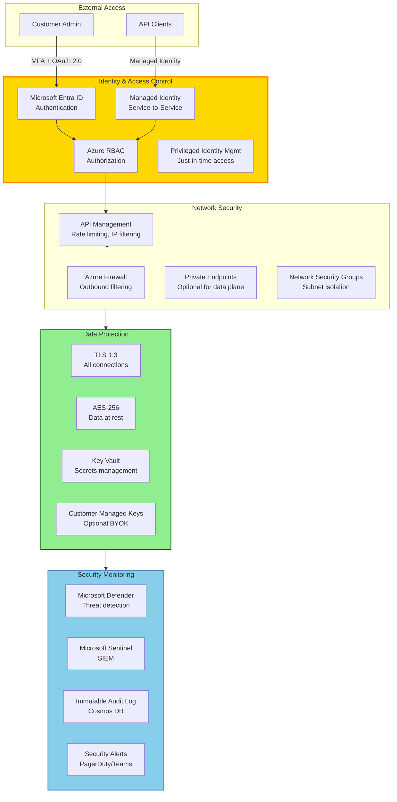
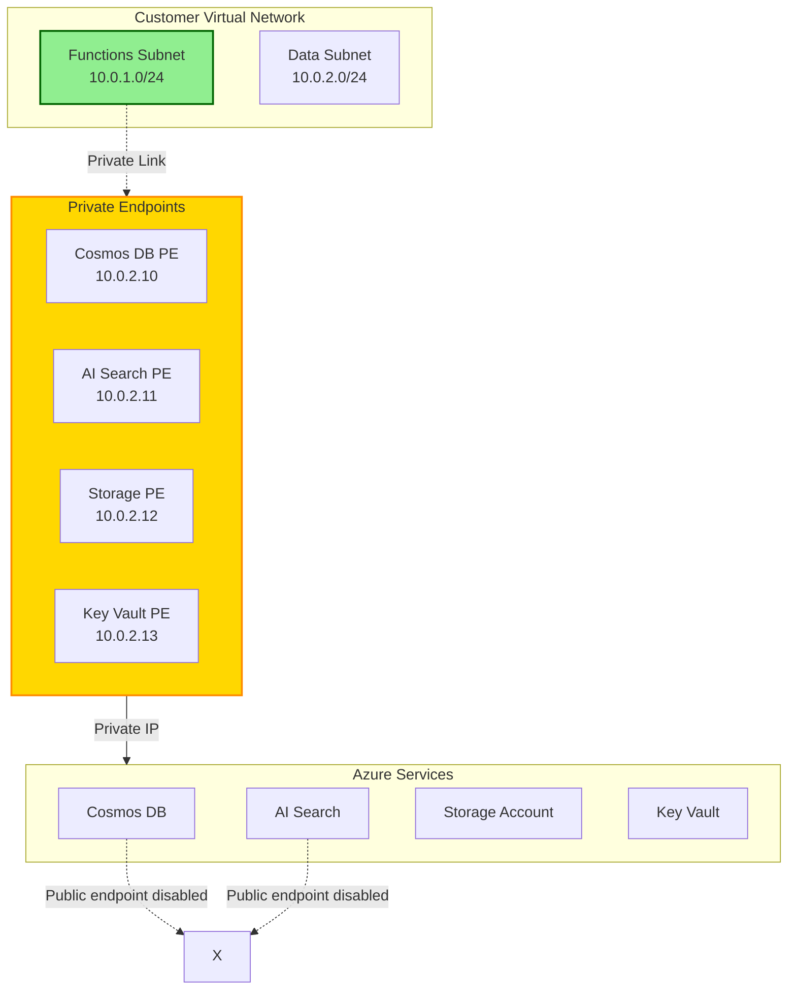
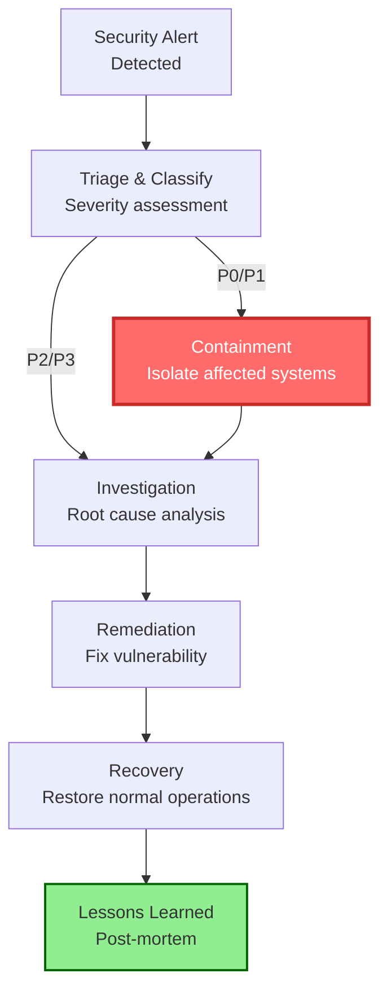

# Continuum-Ops: Security & Compliance
## Enterprise-Grade Zero-Trust Architecture

---

## Overview

Continuum-Ops is built on **zero-trust security principles** with enterprise compliance certifications. This document covers:
- Security architecture and controls
- Compliance certifications (SOC 2, GDPR, HIPAA)
- Data protection and privacy
- Threat detection and response
- Audit and monitoring

---

## Security Architecture

### Zero-Trust Model



---

## Identity & Access Management

### Authentication Methods

| Method | Use Case | Security Level | Recommended For |
|--------|----------|----------------|-----------------|
| **Managed Identity** | Service-to-service | Highest (passwordless) | Production systems |
| **Azure AD Service Principal** | CI/CD pipelines | High (certificate-based) | Automation |
| **Interactive OAuth 2.0** | Admin portal access | High (MFA enforced) | Human users |
| **Function Keys** | Dev/test only | Low (static secrets) | Local development |

### Role-Based Access Control (RBAC)

**Built-in Roles:**

```yaml
# Continuum-Ops Administrator
Role: ContinuumOps.Administrator
Permissions:
  - integrations.* (full control)
  - policies.* (full control)
  - incidents.* (full control)
  - approvals.* (approve/reject)
  - settings.* (full control)
  - analytics.* (read)
  
# Continuum-Ops Operator
Role: ContinuumOps.Operator
Permissions:
  - integrations.read
  - policies.read
  - incidents.* (manage incidents)
  - approvals.* (approve/reject)
  - analytics.read
  
# Continuum-Ops Viewer
Role: ContinuumOps.Viewer
Permissions:
  - integrations.read
  - policies.read
  - incidents.read
  - analytics.read
```

**Custom Role Example:**

```bash
# Create custom role with limited permissions
az role definition create --role-definition '{
  "Name": "ContinuumOps Incident Approver",
  "Description": "Can approve/reject incident remediations only",
  "Actions": [
    "Microsoft.Web/sites/functions/action",
    "Microsoft.Authorization/*/read"
  ],
  "NotActions": [],
  "DataActions": [
    "ContinuumOps/approvals/approve",
    "ContinuumOps/approvals/reject",
    "ContinuumOps/incidents/read"
  ],
  "AssignableScopes": [
    "/subscriptions/{subscription-id}/resourceGroups/rg-continuumops-prod-eastus"
  ]
}'
```

### Privileged Access Management (PAM)

**Just-in-Time (JIT) Access:**

```bash
# Request temporary elevated access (8 hours)
az role assignment create \
  --assignee user@company.com \
  --role "ContinuumOps.Administrator" \
  --scope /subscriptions/{sub-id}/resourceGroups/rg-continuumops-prod \
  --start-time "2026-02-13T09:00:00Z" \
  --end-time "2026-02-13T17:00:00Z" \
  --reason "Emergency incident response"
```

**Approval Workflow:**
1. User requests elevated access via Azure PIM
2. Manager receives approval request in Teams
3. Upon approval, temporary role assignment created
4. Access automatically revoked after time window
5. All actions logged to audit trail

---

## Data Protection

### Encryption

**Data in Transit:**
- ✅ TLS 1.3 for all connections
- ✅ Certificate pinning for critical APIs
- ✅ Perfect Forward Secrecy (PFS) enabled
- ✅ HTTP Strict Transport Security (HSTS)

**Data at Rest:**
```yaml
# Cosmos DB Encryption
Type: Microsoft-managed keys (default)
Algorithm: AES-256
Scope: Database account level
Rotation: Automatic every 90 days

# Optional: Customer-Managed Keys (BYOK)
KeyVault: kv-customer-prod-eastus
KeyName: cosmos-encryption-key
KeyVersion: Auto-rotate enabled
```

**Blob Storage (RCA Documents, Audit Logs):**
```bash
# Enable encryption with customer-managed key
az storage account update \
  --name stcontopsprodeus \
  --resource-group rg-continuumops-prod-eastus \
  --encryption-key-source Microsoft.Keyvault \
  --encryption-key-vault https://kv-customer-prod-eastus.vault.azure.net \
  --encryption-key-name storage-encryption-key
```

### PII Protection

**Automatic PII Detection & Redaction:**

```csharp
// Analyzer Agent - PII Detection using Azure AI Language
public class PiiRedactionService
{
    private readonly TextAnalyticsClient _textAnalytics;
    
    public async Task<RedactedEvidence> RedactPiiAsync(Evidence evidence)
    {
        // Detect PII entities
        var piiEntities = await _textAnalytics.RecognizePiiEntitiesAsync(evidence.RawText);
        
        var redactedText = evidence.RawText;
        var redactions = new List<PiiRedaction>();
        
        foreach (var entity in piiEntities.Value)
        {
            // Categories: Person, Email, Phone, SSN, CreditCard, etc.
            redactedText = redactedText.Replace(entity.Text, $"<{entity.Category}:REDACTED>");
            
            redactions.Add(new PiiRedaction
            {
                Category = entity.Category.ToString(),
                ConfidenceScore = entity.ConfidenceScore,
                OriginalLength = entity.Text.Length
            });
        }
        
        return new RedactedEvidence
        {
            RedactedText = redactedText,
            PiiDetected = true,
            Redactions = redactions
        };
    }
}
```

**PII Categories Detected:**
- 📧 Email addresses
- 📞 Phone numbers
- 🏦 Credit card numbers
- 🆔 Social Security Numbers (SSN)
- 🏠 Physical addresses
- 👤 Person names
- 🌐 IP addresses
- 🔐 API keys/tokens

### Data Retention & Deletion

```yaml
# Data Retention Policies
Incidents:
  Retention: 2 years
  Auto-delete: After 2 years from closure
  Compliance: GDPR Article 17 (Right to be forgotten)

Evidence (Logs, Messages):
  Retention: 90 days (configurable 30-365)
  Auto-delete: TTL in Cosmos DB
  PII-redacted: Always

Audit Logs:
  Retention: 7 years (immutable)
  Storage: Append-only Blob Storage
  Compliance: SOC 2, ISO 27001

RCA Documents:
  Retention: 1 year (customizable)
  Storage: Blob Storage with versioning
  Deletion: Soft-delete enabled (30-day recovery)
```

**GDPR Data Subject Requests:**

```bash
# Delete all data for a specific customer (GDPR erasure)
curl -X DELETE "https://func-continuumops.../api/gdpr/delete" \
  -H "Authorization: Bearer $TOKEN" \
  -d '{
    "subject_id": "user@company.com",
    "reason": "GDPR erasure request",
    "ticket_id": "GDPR-2026-001"
  }'

# Export all data for a customer (GDPR portability)
curl -X POST "https://func-continuumops.../api/gdpr/export" \
  -H "Authorization: Bearer $TOKEN" \
  -d '{
    "subject_id": "user@company.com",
    "format": "json"
  }'
```

---

## Network Security

### Private Networking (Enterprise)



**Enable Private Endpoints (Bicep):**

```bicep
// Private Endpoint for Cosmos DB
resource cosmosPrivateEndpoint 'Microsoft.Network/privateEndpoints@2023-05-01' = {
  name: 'pe-cosmos-continuumops-prod'
  location: location
  properties: {
    subnet: {
      id: dataSubnet.id
    }
    privateLinkServiceConnections: [
      {
        name: 'cosmos-connection'
        properties: {
          privateLinkServiceId: cosmosAccount.id
          groupIds: ['Sql']
        }
      }
    ]
  }
}

// Disable public network access
resource cosmosAccount 'Microsoft.DocumentDB/databaseAccounts@2023-04-15' = {
  name: 'cosmos-continuumops-prod-eastus'
  properties: {
    publicNetworkAccess: 'Disabled'
    networkAclBypass: 'None'
  }
}
```

### Firewall & IP Restrictions

```bash
# Allow only specific IP ranges
az functionapp config access-restriction add \
  --name func-continuumops-prod-eastus \
  --resource-group rg-continuumops-prod-eastus \
  --rule-name "Corporate Network" \
  --priority 100 \
  --ip-address "203.0.113.0/24"

# Allow Azure services
az functionapp config access-restriction add \
  --name func-continuumops-prod-eastus \
  --resource-group rg-continuumops-prod-eastus \
  --rule-name "Azure Services" \
  --priority 200 \
  --service-tag AzureCloud
```

---

## Threat Detection & Response

### Microsoft Defender for Cloud

**Enabled Protections:**
- ✅ Defender for Azure Functions (runtime threat detection)
- ✅ Defender for Cosmos DB (SQL injection, anomalies)
- ✅ Defender for Storage (malware scanning)
- ✅ Defender for Key Vault (unusual access patterns)

**Security Alerts:**

| Severity | Alert Type | Response |
|----------|-----------|----------|
| **Critical** | Crypto-mining malware detected | Auto-isolate function, page on-call |
| **High** | Suspicious PowerShell execution | Auto-isolate, investigate |
| **Medium** | Unusual data access pattern | Alert SOC, monitor |
| **Low** | Failed authentication attempts | Log, monitor trends |

### Microsoft Sentinel Integration

```kusto
// Kusto Query - Detect anomalous incident approval rate
ContinuumOpsAuditLog
| where EventType == "ApprovalRequested" or EventType == "ApprovalGranted"
| summarize 
    TotalRequests = countif(EventType == "ApprovalRequested"),
    TotalApprovals = countif(EventType == "ApprovalGranted")
    by bin(Timestamp, 1h), Approver
| extend ApprovalRate = toreal(TotalApprovals) / TotalRequests
| where ApprovalRate > 0.95 or ApprovalRate < 0.50
| project Timestamp, Approver, ApprovalRate, TotalRequests
```

**Automated Response Playbooks:**

```yaml
# Sentinel Playbook - Suspicious Approval Pattern
Trigger: Approval rate > 95% or < 50% in 1 hour
Actions:
  1. Create high-severity incident in Sentinel
  2. Notify SOC via Teams
  3. Temporarily revoke approver's permissions
  4. Require secondary approval for all incidents
  5. Page security on-call
```

---

## Compliance Standards (Planned)

### Data Privacy

**GDPR Alignment:**

```yaml
Right to Access:
  Mechanism: Audit log export
  Response Time: Target < 30 days
  Format: JSON

Right to Erasure:
  Mechanism: API Trigger
  Response Time: Target < 7 days
```

**Data Processing Agreement:**
- Internal governance applies.
- Data location: Azure region specified at deployment.

### Security Standards

**HIPAA & SOC 2 Alignments:**

We aim to follow industry best practices:

```yaml
Administrative Safeguards:
  - Security Management Process
  - Workforce Security
  - Contingency Plan

Technical Safeguards:
  - Access Control (RBAC, MFA)
  - Audit Controls (Immutable logs)
  - Integrity (Encryption)
  - Transmission Security (TLS 1.3)
```

---

## Audit & Logging

### Immutable Audit Trail

**All actions are logged to append-only storage:**

```csharp
// Audit Event Schema
public class AuditEvent
{
    public string Id { get; set; } // Unique event ID
    public DateTime Timestamp { get; set; } // UTC timestamp
    public string EventType { get; set; } // e.g., "ApprovalGranted"
    public string Actor { get; set; } // User/service principal
    public string ActorType { get; set; } // "User", "ServicePrincipal", "Agent"
    public string ResourceType { get; set; } // "Incident", "Policy", etc.
    public string ResourceId { get; set; } // Resource identifier
    public string Action { get; set; } // "Create", "Update", "Delete"
    public object BeforeState { get; set; } // State before change (JSON)
    public object AfterState { get; set; } // State after change (JSON)
    public string IpAddress { get; set; } // Client IP
    public string UserAgent { get; set; } // Client user agent
    public string CorrelationId { get; set; } // Trace ID
    public bool Immutable { get; set; } = true; // Cannot be modified
    public string Signature { get; set; } // HMAC signature for tamper-detection
}
```

**Sample Audit Query:**

```bash
# Query audit logs for a specific incident
curl "https://func-continuumops.../api/audit" \
  -H "Authorization: Bearer $TOKEN" \
  -d '{
    "resource_type": "Incident",
    "resource_id": "inc-2026-02-13-001",
    "start_date": "2026-02-13T00:00:00Z",
    "end_date": "2026-02-14T00:00:00Z"
  }'
```

### Compliance Reports

**Automated Report Generation:**

```bash
# Generate SOC 2 compliance report (monthly)
az functionapp function keys list \
  --name func-continuumops-prod-eastus \
  --function-name GenerateComplianceReport \
  --query "default" --output tsv

curl -X POST "https://func-continuumops.../api/compliance/reports" \
  -H "x-functions-key: $KEY" \
  -d '{
    "report_type": "soc2",
    "period": "2026-01",
    "format": "pdf"
  }'
```

**Report Contents:**
- ✅ Access control changes (RBAC modifications)
- ✅ Privileged access usage (who, when, why)
- ✅ Failed authentication attempts
- ✅ Data access logs (who accessed what data)
- ✅ Incident response activities
- ✅ Vulnerability scan results
- ✅ Security alert summary

---

## Vulnerability Management

### Security Scanning

**Continuous Scanning:**
```yaml
# Azure DevOps Pipeline - Security Scan
- task: WhiteSource@21
  displayName: 'Dependency Vulnerability Scan'
  inputs:
    cwd: '$(Build.SourcesDirectory)'
    
- task: SonarQubePrepare@5
  displayName: 'Static Code Analysis'
  inputs:
    SonarQube: 'SonarQube-ContinuumOps'
    
- task: CredScan@3
  displayName: 'Credential Scanner'
  inputs:
    toolMajorVersion: 'V2'
    
- task: PostAnalysis@2
  displayName: 'Security Report'
  inputs:
    CredScan: true
    ToolLogsNotFoundAction: 'Error'
```

**Pen Testing Schedule:**
- 📅 Annual external penetration test (Q4)
- 📅 Quarterly internal security review
- 📅 Ad-hoc testing for major releases

---

## Incident Response Plan

### Security Incident Severity

| Severity | Definition | Response Time | Escalation |
|----------|-----------|---------------|------------|
| **P0 - Critical** | Data breach, ransomware | 15 minutes | CIO, CISO |
| **P1 - High** | Unauthorized access, DDoS | 1 hour | Security team |
| **P2 - Medium** | Failed attack attempt | 4 hours | SOC analyst |
| **P3 - Low** | Policy violation | 24 hours | Security team |

### Incident Response Workflow



---

## Shared Responsibility Model

### Continuum-Ops Platform Team Responsibilities
- ✅ Platform security and patching
- ✅ Infrastructure encryption
- ✅ Threat detection and monitoring
- ✅ Compliance certifications
- ✅ Incident response

### Application Team Responsibilities
- ✅ RBAC policy configuration
- ✅ Service Bus security (owned by app team)
- ✅ ERP system security (owned by app team)
- ✅ Approval workflow management
- ✅ User access reviews

---

## Security Best Practices

### For Administrators

1. ✅ **Enable MFA** for all admin accounts
2. ✅ **Use Managed Identity** instead of service principals where possible
3. ✅ **Review RBAC** assignments quarterly
4. ✅ **Enable Private Endpoints** for production
5. ✅ **Rotate secrets** in Key Vault every 90 days
6. ✅ **Monitor audit logs** weekly
7. ✅ **Test incident response** plan annually

### For Developers

1. ✅ **Never commit secrets** to Git (use Key Vault references)
2. ✅ **Use least-privilege** service principals for CI/CD
3. ✅ **Enable dependency scanning** in pipelines
4. ✅ **Sign commits** with GPG keys
5. ✅ **Review security alerts** from Defender
6. ✅ **Validate input** from external systems
7. ✅ **Log sensitive operations** to audit trail

---

## Contact

**Security Issues:**
- **Mayank Gupta** - [mayank.h.gupta@capgemini.com](mailto:mayank.h.gupta@capgemini.com)

---

## Version History

| Version | Date | Changes |
|---------|------|---------|
| 1.0 | 2026-02-13 | Initial security & compliance documentation |

---

**© 2026 Continuum-Ops**
