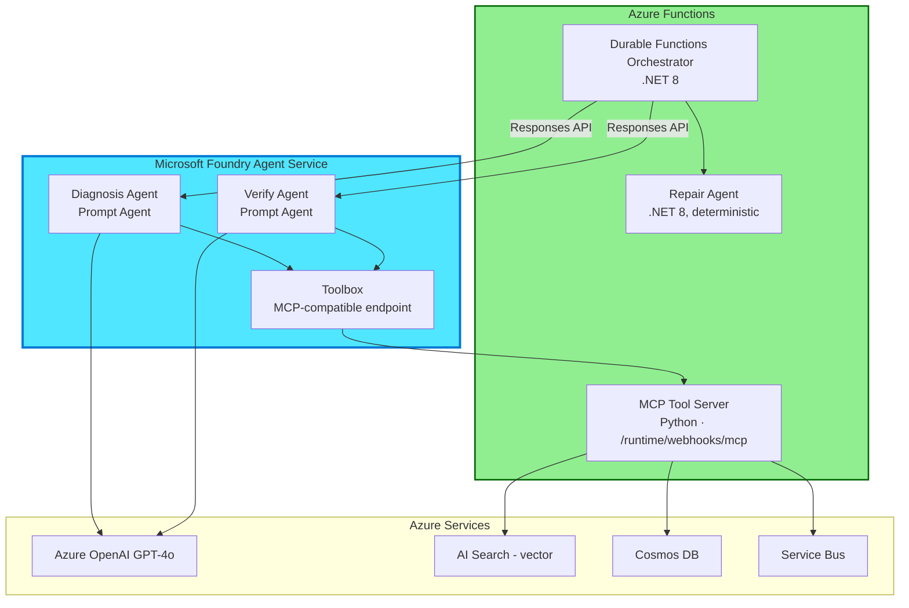

# Continuum-Ops: AI Agent Implementation Guide
## Building Enterprise-Grade AI Agents with Microsoft Foundry Agent Service

---

## Overview

This guide provides **end-to-end implementation instructions** for building the **3 specialized AI agents** in Continuum-Ops using **Microsoft Foundry Agent Service**. It reflects the current (2026) recommended architecture: **Prompt Agents** for AI reasoning, a **custom MCP tool server** for evidence/action tools, and **Durable Functions** for deterministic orchestration.

> **Looking for the older Assistants API implementation?** It's kept for reference in [docs/legacy/06-AI-Agent-Implementation-AssistantsAPI-Legacy.md](legacy/06-AI-Agent-Implementation-AssistantsAPI-Legacy.md). It is **not** the recommended starting point — see [08-AIOps-Solution-Architecture-Review.md](08-AIOps-Solution-Architecture-Review.md) for why.

**Agent Architecture Reference:**
- **Diagnosis Agent**: Foundry **Prompt Agent** — evidence collection + root cause analysis + repair planning (1 GPT-4o call, ~2,600 tokens)
- **Repair Agent**: Deterministic .NET Azure Function (0 LLM calls) — executes policy-driven repair actions
- **Verify Agent**: Foundry **Prompt Agent** — outcome validation + pattern learning (1 GPT-4o call, ~700 tokens)

**What You'll Learn:**
- ✅ Setting up a Microsoft Foundry project and Azure OpenAI GPT-4o deployment
- ✅ Building a custom **MCP tool server** on Azure Functions and registering it in Foundry's **Toolbox**
- ✅ Authoring Diagnosis Agent and Verify Agent as **Prompt Agents** (portal + code-first)
- ✅ Orchestrating multi-agent workflows with Durable Functions calling the Foundry **Responses API**
- ✅ Tracing, evaluating, and optimizing agents with Foundry's built-in lifecycle tools
- ✅ Cost optimization strategies (target: <$0.01 per incident)

---

## Table of Contents

1. [Implementation Approach](#implementation-approach)
2. [Prerequisites & Setup](#prerequisites)
3. [Step-by-Step Implementation](#step-by-step-implementation-guide)
4. [Building the MCP Tool Server](#building-the-mcp-tool-server)
5. [Diagnosis Agent (Prompt Agent)](#diagnosis-agent-prompt-agent)
6. [Verify Agent (Prompt Agent)](#verify-agent-prompt-agent)
7. [Repair Agent (Deterministic Function)](#repair-agent-deterministic-function)
8. [Orchestration Layer](#orchestration-layer-durable-functions)
9. [Deployment & Testing](#deployment--testing)
10. [Tracing, Evaluation & Optimization](#tracing-evaluation--optimization)
11. [Best Practices](#best-practices)
12. [Cost Optimization Strategies](#cost-optimization-strategies)
13. [References](#references)

---

## Implementation Approach

| Component | Technology | Why |
|---|---|---|
| **Diagnosis Agent** | Microsoft Foundry Agent Service — **Prompt Agent** | Reasons over evidence and calls tools; no custom orchestration logic needed. Foundry manages the tool-calling loop, session state, and identity. Language-agnostic — configured via Foundry portal/SDK/REST. |
| **Verify Agent** | Microsoft Foundry Agent Service — **Prompt Agent** | Same rationale — a narrow, tool-calling reasoning task. Language-agnostic. |
| **Repair Agent** | **.NET 8** Azure Function, deterministic | Never an LLM decision — auditable, policy-driven, dry-run capable. .NET chosen for Durable Functions maturity and typed enterprise/ERP integration. |
| **Tools** (`peek_dlq_messages`, `query_application_logs`, `search_similar_patterns`, `replay_messages`, `check_dlq_depth`, `query_erp`, `upsert_pattern`) | **Python** MCP server on Azure Functions, registered in Foundry **Toolbox** | Python has first-class support for the `mcp_tool_trigger` binding, is faster to iterate on than the .NET MCP attribute model, and matches the broader Python-first MCP tooling ecosystem. Centrally governed, versioned tool set shared by both Prompt Agents instead of duplicated OpenAPI definitions per agent. |
| **Orchestration** | **.NET 8** Durable Functions | Owns retries, branching, and compensation outside the agents — agents stay narrow and stateless per call. |

> **Why polyglot?** The MCP tool server and the orchestrator/Repair Agent are independently deployed Function Apps with no shared code, so there's no interop cost to using different languages for each — pick the best fit per component. See [08-AIOps-Solution-Architecture-Review.md](08-AIOps-Solution-Architecture-Review.md) for the full comparison.



---

## Prerequisites

### Azure Resources Required
- **Microsoft Foundry project** (hosts Prompt Agents, Toolbox, tracing/evaluation)
- **Azure OpenAI** with a GPT-4o deployment (used by the Foundry model catalog)
- **Azure Functions Premium plan** (EP1/EP2) — hosts the MCP tool server, Repair Agent, and Durable Functions orchestrator
- **Azure AI Search** (Standard tier, vector support) — pattern memory
- **Azure Cosmos DB** (Core SQL API) — incidents, patterns, audit
- **Azure Service Bus namespace** — the system being monitored/healed
- **Application Insights** — observability (in addition to Foundry's native agent tracing)

### Development Environment

```powershell
# .NET 8 SDK (orchestrator + Repair Agent)
dotnet --version   # 8.0.x or later

# Python 3.11+ (MCP tool server)
python --version

# Azure CLI
az --version
az extension add --name ml     # Foundry project management (hub/project resources)

# Azure Functions Core Tools (4.0.7030+ required for MCP extension)
func --version

# Python packages for the MCP tool server (Azure Function, Python v2 model)
pip install azure-functions>=1.24.0
pip install azure-cosmos azure-search-documents azure-servicebus azure-identity

# NuGet packages for the orchestrator / Repair Agent (.NET Azure Function)
dotnet add package Microsoft.Azure.Functions.Worker.Extensions.DurableTask
dotnet add package Azure.Identity
```

---

## Step-by-Step Implementation Guide

### Phase 1: Foundry Project Setup

```powershell
az login
az account set --subscription "<your-subscription-id>"

az group create --name rg-continuumops-prod --location eastus

# Foundry hub + project (agent hosting, tracing, evaluation, Toolbox)
az ml workspace create `
  --kind hub `
  --name foundry-hub-continuumops `
  --resource-group rg-continuumops-prod `
  --location eastus

az ml workspace create `
  --kind project `
  --name foundry-continuumops `
  --hub-id foundry-hub-continuumops `
  --resource-group rg-continuumops-prod `
  --location eastus
```

### Phase 2: Deploy Azure OpenAI GPT-4o

```powershell
az cognitiveservices account create `
  --name openai-continuumops `
  --resource-group rg-continuumops-prod `
  --kind OpenAI --sku S0 --location eastus

az cognitiveservices account deployment create `
  --name openai-continuumops `
  --resource-group rg-continuumops-prod `
  --deployment-name gpt-4o `
  --model-name gpt-4o --model-version "2024-08-06" `
  --model-format OpenAI --sku-capacity 50 --sku-name "Standard"
```

### Phase 3: Azure AI Search + Cosmos DB

```powershell
az search service create `
  --name search-continuumops --resource-group rg-continuumops-prod `
  --sku Standard --partition-count 1 --replica-count 2

az cosmosdb create `
  --name cosmos-continuumops --resource-group rg-continuumops-prod `
  --locations regionName=eastus failoverPriority=0 `
  --capabilities EnableServerless EnableNoSQLVectorSearch

az cosmosdb sql database create `
  --account-name cosmos-continuumops --resource-group rg-continuumops-prod --name ContinuumOps

az cosmosdb sql container create `
  --account-name cosmos-continuumops --database-name ContinuumOps `
  --name Incidents --partition-key-path "/tenantId" --throughput 4000

az cosmosdb sql container create `
  --account-name cosmos-continuumops --database-name ContinuumOps `
  --name Patterns --partition-key-path "/tenantId" --throughput 1000
```

> Use `/tenantId` as the partition key from day one, even for a single-client POC — see [08-AIOps-Solution-Architecture-Review.md §5.1](08-AIOps-Solution-Architecture-Review.md#51-multi-tenant-control-plane--data-plane-split).

---

## Building the MCP Tool Server

Instead of defining tools as OpenAPI functions per agent, expose them once as a **remote MCP server**. We build this in **Python** (Azure Functions Python v2 programming model) — the official `mcp_tool_trigger` decorator is lighter-weight to scaffold in Python than the equivalent .NET attributes, and it keeps the tool surface fast to iterate on during the POC. The orchestrator and Repair Agent remain .NET (see [08-AIOps-Solution-Architecture-Review.md](08-AIOps-Solution-Architecture-Review.md) for the full language-choice rationale). Both Diagnosis Agent and Verify Agent connect to this one server through Foundry's **Toolbox**.

**File: `src/mcp-server/function_app.py`**

```python
import json
import logging
import azure.functions as func

from services.service_bus_evidence import peek_dead_letter
from services.pattern_search import find_similar_patterns

app = func.FunctionApp()

_PEEK_DLQ_PROPERTIES = json.dumps([
    {"propertyName": "namespace", "propertyType": "string", "description": "Service Bus namespace name", "isRequired": True},
    {"propertyName": "queue", "propertyType": "string", "description": "Queue or subscription name", "isRequired": True},
    {"propertyName": "count", "propertyType": "integer", "description": "Number of messages to peek (max 20)", "isRequired": False},
])


@app.mcp_tool_trigger(
    arg_name="context",
    tool_name="peek_dlq_messages",
    description="Peek up to N messages from a Service Bus dead-letter queue without removing them.",
    tool_properties=_PEEK_DLQ_PROPERTIES,
)
def peek_dlq_messages(context: str) -> str:
    args = json.loads(context)["arguments"]
    namespace = args["namespace"]
    queue = args["queue"]
    count = min(int(args.get("count", 5)), 20)

    logging.info("MCP tool peek_dlq_messages invoked for %s/%s", namespace, queue)
    messages = peek_dead_letter(namespace, queue, count)
    return json.dumps(messages)


_SEARCH_PATTERNS_PROPERTIES = json.dumps([
    {"propertyName": "errorSignature", "propertyType": "string", "description": "Normalized error signature or message text", "isRequired": True},
    {"propertyName": "tenantId", "propertyType": "string", "description": "Tenant identifier to scope the search", "isRequired": True},
])


@app.mcp_tool_trigger(
    arg_name="context",
    tool_name="search_similar_patterns",
    description="Vector search Azure AI Search for previously learned incident patterns similar to the given error signature.",
    tool_properties=_SEARCH_PATTERNS_PROPERTIES,
)
def search_similar_patterns(context: str) -> str:
    args = json.loads(context)["arguments"]
    matches = find_similar_patterns(args["errorSignature"], args["tenantId"], top_k=5)
    return json.dumps(matches)
```

**File: `src/mcp-server/requirements.txt`**

```text
azure-functions>=1.24.0
azure-cosmos
azure-search-documents
azure-servicebus
azure-identity
```

**`host.json` — MCP server configuration:**

```json
{
  "version": "2.0",
  "extensions": {
    "mcp": {
      "instructions": "Continuum-Ops evidence and repair tools for AI agents diagnosing Service Bus incidents.",
      "serverName": "ContinuumOpsTools",
      "serverVersion": "1.0.0",
      "system": {
        "webhookAuthorizationLevel": "System"
      }
    }
  }
}
```

Deploy this Function app, then register its endpoint (`https://<app>.azurewebsites.net/runtime/webhooks/mcp`) as a **custom MCP server** in the Foundry portal's Add Tools catalog, using the function's system key (`mcp_extension`) for authentication. Once added, publish it as a versioned entry in the project's **Toolbox** so both agents reference the same governed tool set. See [src/mcp-server/](../src/mcp-server/) for the full runnable scaffold, including additional tools (`query_application_logs`, `replay_messages`, `check_dlq_depth`, `query_erp`, `upsert_pattern`).

---

## Diagnosis Agent (Prompt Agent)

### Portal-first (recommended for the POC)
1. In the Foundry portal, create a new **Prompt Agent** named `diagnosis-agent`.
2. Select the `gpt-4o` model deployment.
3. Attach the `ContinuumOpsTools` Toolbox entry and enable only the tools this agent needs: `peek_dlq_messages`, `query_application_logs`, `search_similar_patterns`.
4. Set the agent instructions:

```text
You are an expert Azure Service Bus diagnostician specializing in dead-letter queue analysis.

Given the evidence available through your tools:
1. Identify the root cause with precision.
2. Generate a repair plan with specific, executable actions.
3. Provide a confidence score (0.0-1.0).

Output strict JSON:
{
  "rootCause": "string",
  "category": "MessageFormat|DependencyFailure|ConfigurationError|DataIssue",
  "confidence": 0.0,
  "riskLevel": "Low|Medium|High",
  "evidenceCitations": ["string"],
  "repairPlan": [{"action": "string", "parameters": {}, "reasoning": "string"}],
  "preventionRecommendations": ["string"]
}

Rules:
- Only suggest actions that are safe and reversible.
- If confidence < 0.7, set riskLevel to "High" and flag requiresApproval.
- Cite specific tool output for every claim.
```

5. Test in the playground with a sample incident, then **Publish** to get a stable endpoint.

### Code-first (CI/CD)

Define the same agent as code so it can be version-controlled and deployed through a pipeline, using the Foundry SDK/REST API against your project endpoint (see the [Responses API quickstart](https://learn.microsoft.com/en-us/azure/foundry/agents/quickstarts/responses-api) for exact SDK syntax for your chosen language/version).

### Invoking the Diagnosis Agent from the Orchestrator

```csharp
public class DiagnosisAgentClient
{
    private readonly HttpClient _httpClient; // configured with Foundry project endpoint + Entra auth
    private readonly ILogger<DiagnosisAgentClient> _logger;

    public DiagnosisAgentClient(HttpClient httpClient, ILogger<DiagnosisAgentClient> logger)
    {
        _httpClient = httpClient;
        _logger = logger;
    }

    public async Task<DiagnosisResult> DiagnoseAsync(string incidentId, Dictionary<string, object> evidence, CancellationToken ct)
    {
        // Calls the published Diagnosis Agent through the Responses API —
        // Foundry handles the tool-calling loop, session state, and tracing internally.
        var request = new
        {
            agent = "diagnosis-agent",
            input = System.Text.Json.JsonSerializer.Serialize(evidence),
            metadata = new { incidentId }
        };

        var response = await _httpClient.PostAsJsonAsync("responses", request, ct);
        response.EnsureSuccessStatusCode();

        var payload = await response.Content.ReadFromJsonAsync<ResponsesApiResult>(cancellationToken: ct);
        return System.Text.Json.JsonSerializer.Deserialize<DiagnosisResult>(payload!.OutputText)!;
    }
}

public class DiagnosisResult
{
    public string RootCause { get; set; } = string.Empty;
    public string Category { get; set; } = string.Empty;
    public double Confidence { get; set; }
    public string RiskLevel { get; set; } = string.Empty;
    public List<string> EvidenceCitations { get; set; } = new();
    public List<RepairAction> RepairPlan { get; set; } = new();
    public List<string> PreventionRecommendations { get; set; } = new();
    public bool RequiresApproval { get; set; }
}

public class RepairAction
{
    public string Action { get; set; } = string.Empty;
    public Dictionary<string, object> Parameters { get; set; } = new();
    public string Reasoning { get; set; } = string.Empty;
}

public class ResponsesApiResult
{
    public string OutputText { get; set; } = string.Empty;
}
```

> **Key metrics**: ~2,600 tokens/call, ~$0.0078/diagnosis, target latency <3s (P95).

---

## Verify Agent (Prompt Agent)

Same authoring pattern as Diagnosis Agent:
- **Tools attached**: `check_dlq_depth`, `query_erp`, `upsert_pattern`.
- **Instructions**: validate the repair achieved the desired business outcome, then extract a learning pattern; output `{verified: bool, evidence, failure_reason?, pattern_summary}`.
- **Runs**: only if the Repair Agent succeeded.
- **Key metrics**: ~700 tokens/call, ~$0.0021/verification.

Invocation follows the identical `DiagnosisAgentClient` pattern above, targeting `agent = "verify-agent"`.

---

## Repair Agent (Deterministic Function)

Unchanged from a deterministic-execution standpoint — this agent makes **no LLM calls**. Recommended evolution: externalize each repair action as a declarative policy document (YAML/JSON) rather than hardcoded per-scenario C#, so new repair actions can be added without a code deployment.

```csharp
[Function(nameof(ExecuteRepairPlan))]
public async Task<RepairResult> ExecuteRepairPlan(
    [ActivityTrigger] RepairPlanRequest request)
{
    var policy = await _policyStore.LoadAsync(request.Action, request.TenantId);
    if (policy is null)
        return RepairResult.Failed($"No policy registered for action '{request.Action}'");

    if (policy.RequiresDryRun && !request.DryRunApproved)
        return RepairResult.PendingApproval(policy);

    return await policy.ExecuteAsync(request.Parameters);
}
```

---

## Orchestration Layer (Durable Functions)

The orchestrator owns branching, retries, and compensation — it calls the Diagnosis Agent, then the Repair Agent, then the Verify Agent, using the `alertId` as the orchestration instance ID for idempotency (see [01-Technical-Architecture.md](01-Technical-Architecture.md#alert-ingestion-async-buffer-event-grid)).

```csharp
[Function(nameof(IncidentOrchestrator))]
public async Task<IncidentResult> IncidentOrchestrator(
    [OrchestrationTrigger] TaskOrchestrationContext context)
{
    var evidence = context.GetInput<IncidentEvidence>();

    var diagnosis = await context.CallActivityAsync<DiagnosisResult>(nameof(CallDiagnosisAgent), evidence);

    if (diagnosis.RequiresApproval)
        await context.WaitForExternalEvent<bool>("ApprovalGranted");

    var repair = await context.CallActivityAsync<RepairResult>(nameof(ExecuteRepairPlan), diagnosis.RepairPlan);

    if (repair.Success)
    {
        var verification = await context.CallActivityAsync<VerificationResult>(nameof(CallVerifyAgent), repair);
        return IncidentResult.From(diagnosis, repair, verification);
    }

    return IncidentResult.Failed(diagnosis, repair);
}
```

---

## Deployment & Testing

```powershell
az deployment group create `
  --resource-group rg-continuumops-prod `
  --template-file Infrastructure/bicep/main.bicep `
  --parameters environment=prod

cd src/Continuum.Ops.Functions
func azure functionapp publish func-continuumops-prod
```

Test each Prompt Agent independently in the **Foundry playground** before wiring it into the orchestrator — this exercises the MCP tool connectivity, permissions, and instructions in isolation.

---

## Tracing, Evaluation & Optimization

Use Foundry's native development lifecycle instead of building custom tooling:

| Step | Foundry capability |
|---|---|
| **Trace** | Agent tracing shows every model call, tool invocation, and decision per incident. |
| **Evaluate** | Run built-in evaluations against a labeled set of past incidents to catch diagnosis-quality regressions before publishing a new agent version. |
| **Optimize** | The **Agent Optimizer** can automatically improve an agent's instructions based on evaluation feedback — use this instead of manual prompt tuning as the pattern library grows. |
| **Publish/Rollback** | Every iteration is auto-snapshotted; roll back to a prior version if a new instruction set regresses diagnosis quality. |

---

## Best Practices

1. **One narrow job per Prompt Agent.** Diagnosis and Verify each do one thing — resist the urge to merge them into a single "do everything" agent (see the token-budget rationale in [01-Technical-Architecture.md](01-Technical-Architecture.md)).
2. **Govern tools centrally.** Add/version tools once in the Toolbox; don't duplicate tool definitions per agent.
3. **Idempotent tools.** Every MCP tool function must be safe to call multiple times with the same input.
4. **Structured JSON outputs only.** Never let an agent return free text for anything the orchestrator has to parse.
5. **Confidence-gated approval.** Route low-confidence diagnoses to human approval (Teams Adaptive Card) instead of auto-executing.
6. **Trace everything.** Use Foundry's native tracing rather than custom Application Insights events for agent-level decisions.
7. **Version agents like code.** Treat each published agent version as an immutable artifact; roll forward/back explicitly.

---

## Cost Optimization Strategies

| Strategy | Impact | Implementation |
|----------|--------|----------------|
| **Cache similar patterns** | 30–40% token reduction | `search_similar_patterns` MCP tool against AI Search |
| **Minimize attached tools per agent** | 15–20% reduction | Only enable the tools each Prompt Agent actually needs |
| **Use a smaller model for simple tasks** | 60–80% cost reduction | Consider a lighter model for basic validation/formatting steps |
| **Batch verifications** | 25% reduction | Verify multiple related incidents together where safe |
| **Prompt compression** | 10–15% reduction | Trim redundant context before sending to the agent |

**Target cost per incident: <$0.01** (Diagnosis ~$0.0078 + Verify ~$0.0021).

---

## References

### Microsoft Foundry Agent Service
- **[Microsoft Foundry Agent Service — Overview](https://learn.microsoft.com/en-us/azure/foundry/agents/overview)** ⭐ PRIMARY REFERENCE
- [Agent development lifecycle](https://learn.microsoft.com/en-us/azure/foundry/agents/concepts/development-lifecycle)
- [Responses API quickstart](https://learn.microsoft.com/en-us/azure/foundry/agents/quickstarts/responses-api)
- [Toolbox](https://learn.microsoft.com/en-us/azure/foundry/agents/how-to/tools/toolbox)
- [Agent Optimizer overview](https://learn.microsoft.com/en-us/azure/foundry/agents/concepts/agent-optimizer-overview)

### Azure Functions MCP Extension
- [Model Context Protocol bindings for Azure Functions](https://learn.microsoft.com/en-us/azure/azure-functions/functions-bindings-mcp)
- [Create a tool endpoint in your remote MCP server](https://learn.microsoft.com/en-us/azure/azure-functions/functions-bindings-mcp-tool-trigger)

### Azure Services
- [Azure OpenAI Service](https://learn.microsoft.com/en-us/azure/ai-services/openai/)
- [Durable Functions](https://learn.microsoft.com/en-us/azure/azure-functions/durable/)
- [Azure AI Search Vector Search](https://learn.microsoft.com/en-us/azure/search/vector-search-overview)

### Related Continuum-Ops Docs
- [08-AIOps-Solution-Architecture-Review.md](08-AIOps-Solution-Architecture-Review.md) — full rationale for the Foundry Agents vs. custom-build decision
- [01-Technical-Architecture.md](01-Technical-Architecture.md) — system-wide architecture
- [Legacy Assistants API implementation](legacy/06-AI-Agent-Implementation-AssistantsAPI-Legacy.md) — superseded reference
