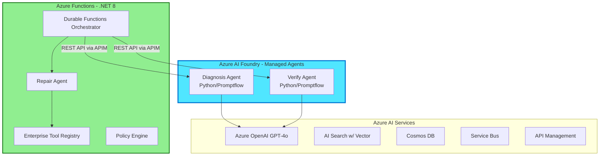

# Continuum-Ops: AI Agent Implementation Guide
## Building Enterprise-Grade AI Agents with Azure AI Foundry & Semantic Kernel

---

## Overview

This comprehensive guide provides **end-to-end implementation instructions** for building the **3 specialized AI agents** in Continuum-Ops using the latest Azure AI technologies (2026). You'll learn how to leverage **Azure AI Foundry**, **Semantic Kernel 1.x**, **Azure OpenAI GPT-4o**, and **.NET 8** to create production-ready AI agents.

**Agent Architecture Reference:**
- **Diagnosis Agent**: Evidence collection + Root Cause Analysis + repair planning (1 GPT-4o call, ~2,600 tokens)
- **Repair Agent**: Deterministic tool execution with OpenAPI-based plugins (0 LLM calls, pure .NET logic)
- **Verify Agent**: Outcome validation + pattern learning (1 GPT-4o call, ~700 tokens)

**What You'll Learn:**
- ✅ Setting up Azure AI Foundry workspace and managed agents
- ✅ Implementing agents using Semantic Kernel with best practices
- ✅ Building OpenAPI-based tool plugins for Azure Functions
- ✅ Orchestrating multi-agent workflows with Durable Functions
- ✅ Deploying, monitoring, and optimizing agent performance
- ✅ Cost optimization strategies (target: <$0.01 per incident)

---

## Table of Contents

1. [Implementation Approaches](#implementation-approaches-2026-best-practices)
2. [Prerequisites & Setup](#prerequisites)
3. [Step-by-Step Implementation](#step-by-step-implementation-guide)
4. [Agent 1: Diagnosis Agent](#agent-1-diagnosis-agent-implementation)
5. [Agent 2: Repair Agent](#agent-2-repair-agent-implementation)
6. [Agent 3: Verify Agent](#agent-3-verify-agent-implementation)
7. [Orchestration Layer](#orchestration-layer-durable-functions)
8. [Deployment & Testing](#deployment--testing)
9. [Monitoring & Optimization](#monitoring--optimization)
10. [Best Practices & Patterns](#best-practices--agent-design-patterns)

---

## Implementation Approaches (2026 Best Practices)

### Option 1: Azure AI Foundry Managed Agents (Recommended for AI-Heavy Workloads)
- **Language**: Python or .NET
- **Hosting**: Fully managed by Azure AI Foundry
- **Best for**: Diagnosis and Verify agents (AI reasoning)
- **Benefits**: Managed hosting, built-in conversation memory, automatic scaling

### Option 2: Custom Azure Functions Implementation (Recommended for Enterprise Integration)
- **Language**: .NET 8 with Semantic Kernel
- **Hosting**: Azure Functions Premium
- **Best for**: Repair agent and orchestration (business logic)
- **Benefits**: Full control, enterprise libraries, deterministic execution

### Hybrid Approach (Recommended for Continuum-Ops)


---

## Prerequisites

### Azure Resources Required
- **Azure AI Foundry workspace** (for managed agents)
- **Azure OpenAI service** with GPT-4o deployment
- **Azure Functions Premium plan** (EP1/EP2)
- **Azure AI Search service** (Standard tier with vector support)
- **Azure Cosmos DB account** (with vector extensions)
- **Azure API Management** (for agent communication)
- **Azure Service Bus namespace** (for testing)
- **Azure Application Insights** (for monitoring)

### Development Environment
```bash
# .NET 8 SDK
dotnet --version  # Should be 8.0.x or later

# Azure CLI with AI extensions
az version
az extension add --name ml
az extension add --name ai

# Python (for AI Foundry agents)
python --version  # Should be 3.11+ for best AI Foundry support

# Required NuGet packages (.NET)
dotnet add package Microsoft.SemanticKernel --version 1.5.0
dotnet add package Microsoft.SemanticKernel.Plugins.OpenApi --version 1.5.0
dotnet add package Azure.AI.OpenAI --version 1.0.0
dotnet add package Azure.Search.Documents --version 11.6.0
dotnet add package Microsoft.Azure.Cosmos --version 3.39.0
dotnet add package Azure.Messaging.ServiceBus --version 7.18.0
dotnet add package Microsoft.Azure.Functions.Worker --version 1.21.0
dotnet add package Microsoft.Azure.Functions.Worker.Extensions.DurableTask --version 1.1.0
dotnet add package Microsoft.Extensions.Azure --version 1.7.0

# Required Python packages (for AI Foundry)
pip install azure-ai-ml>=1.13.0
pip install azure-ai-inference>=1.0.0
pip install promptflow[azure]>=1.9.0
pip install semantic-kernel>=1.0.0
```

---

## Step-by-Step Implementation Guide

### Phase 1: Azure AI Foundry Setup (30 minutes)

#### 1.1 Create Azure AI Foundry Workspace

```bash
# Login to Azure
az login

# Set your subscription
az account set --subscription "<your-subscription-id>"

# Create resource group
az group create --name rg-continuumops-prod --location eastus

# Create Azure AI Foundry workspace (formerly Azure AI Studio)
az ml workspace create \
  --name aifoundry-continuumops \
  --resource-group rg-continuumops-prod \
  --location eastus \
  --display-name "Continuum-Ops AI Foundry" \
  --description "AI agent workspace for enterprise AutoHeal"
```

#### 1.2 Deploy Azure OpenAI GPT-4o

```bash
# Create Azure OpenAI resource
az cognitiveservices account create \
  --name openai-continuumops \
  --resource-group rg-continuumops-prod \
  --kind OpenAI \
  --sku S0 \
  --location eastus

# Deploy GPT-4o model
az cognitiveservices account deployment create \
  --name openai-continuumops \
  --resource-group rg-continuumops-prod \
  --deployment-name gpt-4o \
  --model-name gpt-4o \
  --model-version "2024-08-06" \
  --model-format OpenAI \
  --sku-capacity 50 \
  --sku-name "Standard"
```

#### 1.3 Configure Azure AI Search for Vector Memory

```bash
# Create Azure AI Search service
az search service create \
  --name search-continuumops \
  --resource-group rg-continuumops-prod \
  --sku Standard \
  --partition-count 1 \
  --replica-count 2

# Enable semantic ranker (for better retrieval)
az search service update \
  --name search-continuumops \
  --resource-group rg-continuumops-prod \
  --semantic-search free
```

#### 1.4 Create Cosmos DB for State & Audit

```bash
# Create Cosmos DB account with vector extensions
az cosmosdb create \
  --name cosmos-continuumops \
  --resource-group rg-continuumops-prod \
  --locations regionName=eastus failoverPriority=0 \
  --capabilities EnableServerless EnableNoSQLVectorSearch

# Create databases and containers
az cosmosdb sql database create \
  --account-name cosmos-continuumops \
  --resource-group rg-continuumops-prod \
  --name ContinuumOps

# Incidents container
az cosmosdb sql container create \
  --account-name cosmos-continuumops \
  --database-name ContinuumOps \
  --name Incidents \
  --partition-key-path "/incidentId" \
  --throughput 4000

# Patterns container with vector indexing
az cosmosdb sql container create \
  --account-name cosmos-continuumops \
  --database-name ContinuumOps \
  --name Patterns \
  --partition-key-path "/signatureHash" \
  --throughput 1000

# Audit container
az cosmosdb sql container create \
  --account-name cosmos-continuumops \
  --database-name ContinuumOps \
  --name AuditEvents \
  --partition-key-path "/incidentId" \
  --throughput 1000
```

### Phase 2: Development Environment Setup (15 minutes)

#### 2.1 Initialize .NET 8 Solution

```bash
# Create solution structure
mkdir src
cd src

# Create main projects
dotnet new sln -n ContinuumOps

# Create Azure Functions project for agents and orchestration
dotnet new func -n Continuum.Ops.Functions --worker-runtime dotnet-isolated --target-framework net8.0
dotnet sln add Continuum.Ops.Functions

# Create shared library
dotnet new classlib -n Continuum.Ops.Shared --framework net8.0
dotnet sln add Continuum.Ops.Shared

# Add project references
cd Continuum.Ops.Functions
dotnet add reference ../Continuum.Ops.Shared
```

#### 2.2 Install Core NuGet Packages

```bash
# Navigate to Functions project
cd Continuum.Ops.Functions

# Azure Functions & Durable Functions
dotnet add package Microsoft.Azure.Functions.Worker --version 1.21.0
dotnet add package Microsoft.Azure.Functions.Worker.Extensions.DurableTask --version 1.1.0
dotnet add package Microsoft.Azure.Functions.Worker.Extensions.Http --version 3.1.0

# Semantic Kernel for AI orchestration
dotnet add package Microsoft.SemanticKernel --version 1.5.0
dotnet add package Microsoft.SemanticKernel.Plugins.OpenApi --version 1.5.0
dotnet add package Microsoft.SemanticKernel.Connectors.AzureOpenAI --version 1.5.0

# Azure SDKs
dotnet add package Azure.AI.OpenAI --version 1.0.0
dotnet add package Azure.Search.Documents --version 11.6.0
dotnet add package Microsoft.Azure.Cosmos --version 3.39.0
dotnet add package Azure.Messaging.ServiceBus --version 7.18.0
dotnet add package Azure.Identity --version 1.11.0

# Monitoring & Logging
dotnet add package Microsoft.ApplicationInsights.WorkerService --version 2.22.0
dotnet add package Microsoft.Extensions.Logging.ApplicationInsights --version 2.22.0
```

---

## Project Structure (Updated 2026)

```
src/
├── Continuum.Ops.AIFoundry/              # AI Foundry managed agents
│   ├── diagnosis-agent/
│   │   ├── flow.dag.yaml                 # Promptflow definition
│   │   ├── evidence_collector.py
│   │   ├── pattern_matcher.py
│   │   └── diagnosis_flow.py
│   ├── verify-agent/
│   │   ├── flow.dag.yaml
│   │   ├── outcome_validator.py
│   │   └── verify_flow.py
│   └── deployment/
│       ├── diagnosis-deployment.yaml
│       └── verify-deployment.yaml
├── Continuum.Ops.Functions/              # Azure Functions (.NET 8)
│   ├── Orchestrators/
│   │   └── IncidentOrchestrator.cs
│   ├── Agents/
│   │   └── RepairAgent.cs
│   ├── Services/
│   │   ├── PolicyEngine.cs
│   │   ├── ToolRegistry.cs
│   │   └── AuditService.cs
│   ├── Tools/
│   │   ├── ServiceBusTools.cs
│   │   ├── ErpTools.cs
│   │   └── ITool.cs
│   ├── Models/
│   ├── Extensions/
│   └── Program.cs
├── Continuum.Ops.Shared/                 # Shared models and utilities
│   ├── Models/
│   ├── Constants/
│   └── Extensions/
└── Infrastructure/                        # Infrastructure as Code
    ├── bicep/
    │   ├── main.bicep
    │   ├── ai-foundry.bicep
    │   └── functions.bicep
    └── terraform/                         # Alternative IaC
```

---

## Agent 1: Diagnosis Agent Implementation

### Overview
The Diagnosis Agent is the **core AI reasoning component** that performs:
1. **Evidence Collection** - Gathers data from Service Bus, App Insights, and historical patterns
2. **Root Cause Analysis** - Uses GPT-4o to analyze failure patterns
3. **Repair Planning** - Generates actionable repair steps with confidence scores

**Key Metrics:**
- 1 GPT-4o call per incident (~2,600 tokens average)
- Cost: ~$0.0078 per diagnosis
- Target latency: <3 seconds

### 3.1 Create Diagnosis Agent Service

**File: `Continuum.Ops.Functions/Agents/DiagnosisAgent.cs`**

```csharp
using Microsoft.SemanticKernel;
using Microsoft.SemanticKernel.Connectors.AzureOpenAI;
using Microsoft.SemanticKernel.ChatCompletion;
using Azure.AI.OpenAI;
using System.Text.Json;
using Microsoft.Extensions.Logging;

namespace Continuum.Ops.Functions.Agents;

public class DiagnosisAgent
{
    private readonly Kernel _kernel;
    private readonly ILogger<DiagnosisAgent> _logger;
    private readonly IChatCompletionService _chatService;

    public DiagnosisAgent(Kernel kernel, ILogger<DiagnosisAgent> logger)
    {
        _kernel = kernel;
        _logger = logger;
        _chatService = kernel.GetRequiredService<IChatCompletionService>();
    }

    public async Task<DiagnosisResult> DiagnoseAsync(
        string incidentId,
        Dictionary<string, object> evidence,
        CancellationToken cancellationToken = default)
    {
        var startTime = DateTime.UtcNow;
        _logger.LogInformation("Starting diagnosis for incident {IncidentId}", incidentId);

        try
        {
            // Step 1: Build comprehensive context from evidence
            var context = await BuildDiagnosisContextAsync(evidence, cancellationToken);

            // Step 2: Execute single GPT-4o call with structured output
            var diagnosis = await ExecuteDiagnosisAsync(context, cancellationToken);

            // Step 3: Validate and enrich diagnosis
            var result = await ValidateDiagnosisAsync(diagnosis, cancellationToken);

            var duration = (DateTime.UtcNow - startTime).TotalSeconds;
            _logger.LogInformation(
                "Diagnosis completed for {IncidentId} in {Duration}s with confidence {Confidence}",
                incidentId, duration, result.Confidence);

            return result;
        }
        catch (Exception ex)
        {
            _logger.LogError(ex, "Diagnosis failed for incident {IncidentId}", incidentId);
            throw;
        }
    }

    private async Task<DiagnosisContext> BuildDiagnosisContextAsync(
        Dictionary<string, object> evidence,
        CancellationToken cancellationToken)
    {
        var context = new DiagnosisContext
        {
            Evidence = evidence,
            Timestamp = DateTime.UtcNow
        };

        // Collect DLQ message sample
        if (evidence.ContainsKey("dlqMessages"))
        {
            context.DlqSample = JsonSerializer.Serialize(evidence["dlqMessages"]);
        }

        // Retrieve similar historical patterns using vector search
        if (evidence.ContainsKey("errorSignature"))
        {
            context.HistoricalPatterns = await SearchSimilarPatternsAsync(
                evidence["errorSignature"].ToString()!,
                cancellationToken);
        }

        // Get application logs from App Insights
        if (evidence.ContainsKey("namespace"))
        {
            context.ApplicationLogs = await QueryAppInsightsAsync(
                evidence["namespace"].ToString()!,
                cancellationToken);
        }

        return context;
    }

    private async Task<DiagnosisResult> ExecuteDiagnosisAsync(
        DiagnosisContext context,
        CancellationToken cancellationToken)
    {
        // Build system prompt with best practices from 2026
        var systemPrompt = """
            You are an expert Azure Service Bus diagnostician specializing in dead-letter queue analysis.
            
            Your task:
            1. Analyze the provided evidence (DLQ messages, logs, historical patterns)
            2. Identify the root cause with precision
            3. Generate a repair plan with specific, executable actions
            4. Provide a confidence score (0.0-1.0) for your diagnosis
            
            Output Format (JSON):
            {
                "rootCause": "Brief description of the core issue",
                "category": "MessageFormat|DependencyFailure|ConfigurationError|DataIssue",
                "confidence": 0.95,
                "riskLevel": "Low|Medium|High",
                "evidenceCitations": ["Quote from logs", "Quote from message"],
                "repairPlan": [
                    {
                        "action": "CreateCustomer",
                        "parameters": {"customerId": "12345", "name": "ACME Corp"},
                        "reasoning": "Message references non-existent customer"
                    }
                ],
                "preventionRecommendations": ["Add customer validation before publishing"]
            }
            
            Rules:
            - Only suggest actions that are safe and reversible
            - If confidence < 0.7, set riskLevel to "High" and recommend human approval
            - Cite specific evidence for every claim
            - Keep repair plans minimal - only essential actions
            """;

        var userPrompt = $"""
            Incident Evidence:
            
            DLQ Message Sample:
            {context.DlqSample}
            
            Application Logs (last 15 minutes):
            {context.ApplicationLogs}
            
            Similar Historical Patterns:
            {JsonSerializer.Serialize(context.HistoricalPatterns, new JsonSerializerOptions { WriteIndented = true })}
            
            Please diagnose this incident and provide a structured repair plan.
            """;

        var chatHistory = new ChatHistory();
        chatHistory.AddSystemMessage(systemPrompt);
        chatHistory.AddUserMessage(userPrompt);

        // Use GPT-4o with JSON mode for structured output
        var executionSettings = new AzureOpenAIPromptExecutionSettings
        {
            Temperature = 0.2,  // Low temperature for deterministic outputs
            MaxTokens = 1500,
            ResponseFormat = "json_object",  // Force JSON output
            ToolCallBehavior = ToolCallBehavior.EnableKernelFunctions  // Enable function calling
        };

        var response = await _chatService.GetChatMessageContentAsync(
            chatHistory,
            executionSettings,
            _kernel,
            cancellationToken);

        var diagnosisJson = response.Content ?? "{}";
        var diagnosis = JsonSerializer.Deserialize<DiagnosisResult>(diagnosisJson)
            ?? throw new InvalidOperationException("Failed to parse diagnosis result");

        return diagnosis;
    }

    private async Task<List<PatternMatch>> SearchSimilarPatternsAsync(
        string errorSignature,
        CancellationToken cancellationToken)
    {
        // TODO: Implement vector search against Azure AI Search
        // For now, return empty list
        await Task.CompletedTask;
        return new List<PatternMatch>();
    }

    private async Task<string> QueryAppInsightsAsync(
        string namespaceName,
        CancellationToken cancellationToken)
    {
        // TODO: Implement KQL query against Application Insights
        await Task.CompletedTask;
        return "[No logs available]";
    }

    private async Task<DiagnosisResult> ValidateDiagnosisAsync(
        DiagnosisResult diagnosis,
        CancellationToken cancellationToken)
    {
        // Validation rules
        if (diagnosis.Confidence < 0.5)
        {
            diagnosis.RiskLevel = "High";
            diagnosis.RequiresApproval = true;
        }

        if (diagnosis.RepairPlan.Count > 5)
        {
            _logger.LogWarning("Diagnosis contains {Count} repair actions - may be too complex",
                diagnosis.RepairPlan.Count);
        }

        await Task.CompletedTask;
        return diagnosis;
    }
}

// Supporting models
public class DiagnosisContext
{
    public Dictionary<string, object> Evidence { get; set; } = new();
    public DateTime Timestamp { get; set; }
    public string DlqSample { get; set; } = string.Empty;
    public string ApplicationLogs { get; set; } = string.Empty;
    public List<PatternMatch> HistoricalPatterns { get; set; } = new();
}

public class DiagnosisResult
{
    public string RootCause { get; set; } = string.Empty;
    public string Category { get; set; } = string.Empty;
    public double Confidence { get; set; }
    public string RiskLevel { get; set; } = string.Empty;
    public List<string> EvidenceCitations { get; set; } = new();
    public List<RepairAction> RepairPlan { get; set; } = new();
    public List<string> PreventionRecommendations { get; set; } = new();
    public bool RequiresApproval { get; set; }
}

public class RepairAction
{
    public string Action { get; set; } = string.Empty;
    public Dictionary<string, object> Parameters { get; set; } = new();
    public string Reasoning { get; set; } = string.Empty;
}

public class PatternMatch
{
    public string PatternId { get; set; } = string.Empty;
    public double Similarity { get; set; }
    public string Category { get; set; } = string.Empty;
    public double SuccessRate { get; set; }
}
```

### 3.2 Create Diagnosis Function Endpoint

**File: `Continuum.Ops.Functions/Functions/DiagnosisFunction.cs`**

```csharp
using Microsoft.Azure.Functions.Worker;
using Microsoft.Azure.Functions.Worker.Http;
using Microsoft.Extensions.Logging;
using System.Net;
using System.Text.Json;

namespace Continuum.Ops.Functions.Functions;

public class DiagnosisFunction
{
    private readonly DiagnosisAgent _diagnosisAgent;
    private readonly ILogger<DiagnosisFunction> _logger;

    public DiagnosisFunction(
        DiagnosisAgent diagnosisAgent,
        ILogger<DiagnosisFunction> logger)
    {
        _diagnosisAgent = diagnosisAgent;
        _logger = logger;
    }

    [Function("Diagnose")]
    public async Task<HttpResponseData> Run(
        [HttpTrigger(AuthorizationLevel.Function, "post", Route = "incidents/{incidentId}/diagnose")]
        HttpRequestData req,
        string incidentId,
        FunctionContext executionContext)
    {
        _logger.LogInformation("Diagnosis request received for incident {IncidentId}", incidentId);

        try
        {
            // Parse request body
            var requestBody = await new StreamReader(req.Body).ReadToEndAsync();
            var evidence = JsonSerializer.Deserialize<Dictionary<string, object>>(requestBody)
                ?? new Dictionary<string, object>();

            // Execute diagnosis
            var result = await _diagnosisAgent.DiagnoseAsync(incidentId, evidence);

            // Return structured response
            var response = req.CreateResponse(HttpStatusCode.OK);
            response.Headers.Add("Content-Type", "application/json");
            await response.WriteAsJsonAsync(result);

            return response;
        }
        catch (Exception ex)
        {
            _logger.LogError(ex, "Diagnosis failed for incident {IncidentId}", incidentId);

            var errorResponse = req.CreateResponse(HttpStatusCode.InternalServerError);
            await errorResponse.WriteAsJsonAsync(new { error = ex.Message });
            return errorResponse;
        }
    }
}
```

---

## Agent 2: Repair Agent Implementation

1. **Set up development environment** with all required Azure services
2. **Implement Diagnosis Agent first** - it's the core AI component
3. **Build basic tools** for Service Bus message replay
4. **Test with synthetic incidents** before connecting to real systems
5. **Add monitoring and alerting** for cost and performance tracking
6. **Gradually expand tool registry** based on actual failure patterns

This implementation guide provides a solid foundation for building your AI agents. The key is to start simple, test thoroughly, and iterate based on real-world usage patterns.

---

## Deployment & Testing

### Deploy to Azure

**Deploy using Azure CLI:**

```bash
# Create Azure resources
az deployment group create \
  --resource-group rg-continuumops-prod \
  --template-file Infrastructure/bicep/main.bicep \
  --parameters environment=prod

# Publish Functions app
cd src/Continuum.Ops.Functions
func azure functionapp publish func-continuumops-prod
```

### Monitor Agent Performance

```bash
# View agent metrics in Application Insights
az monitor app-insights metrics show \
  --app func-continuumops-prod \
  --resource-group rg-continuumops-prod \
  --metric "requests/duration" \
  --aggregation avg
```

---

## Best Practices & Agent Design Patterns

### 1. **Use Threads for Conversation Context**
Azure AI Foundry Agents use threads to maintain conversation state. Each incident gets its own thread.

### 2. **Implement Idempotent Tools**
All tool functions should be idempotent - safe to call multiple times with the same parameters.

### 3. **Keep Instructions Focused**
Agent instructions should be specific and task-oriented. Avoid generic "helpful assistant" prompts.

### 4. **Monitor Token Usage**
Track GPT-4o token consumption per incident:
- Diagnosis: ~2,600 tokens (~$0.0078)
- Verify: ~700 tokens (~$0.0021)
- Total per incident: ~$0.01

### 5. **Use Structured Outputs**
Always request JSON responses using `ResponseFormat = AssistantResponseFormat.JsonObject`

### 6. **Implement Circuit Breakers**
Add failure thresholds to prevent runaway costs if agents malfunction.

### 7. **Version Your Assistants**
Create new assistant versions instead of modifying existing ones for safe rollbacks.

---

## Cost Optimization Strategies

| Strategy | Impact | Implementation |
|----------|--------|----------------|
| **Cache similar patterns** | 30-40% token reduction | Use AI Search for semantic recall |
| **Minimize tool definitions** | 15-20% reduction | Only attach needed tools per agent |
| **Use GPT-4o-mini for simple tasks** | 60-80% cost reduction | Use for simple validation/formatting |
| **Batch verifications** | 25% reduction | Verify multiple incidents together |
| **Smart prompt compression** | 10-15% reduction | Remove redundant context |

**Target Cost per Incident:** <$0.01

---

## References

### Azure AI Foundry Agents
- **[Azure AI Foundry Agents Overview](https://learn.microsoft.com/en-us/azure/ai-foundry/agents/overview)** ⭐ PRIMARY REFERENCE
- [Assistants API Documentation](https://learn.microsoft.com/en-us/azure/ai-services/openai/how-to/assistant)
- [Azure AI Projects SDK](https://learn.microsoft.com/en-us/dotnet/api/overview/azure/ai.projects-readme)
- [Function Calling with Assistants](https://learn.microsoft.com/en-us/azure/ai-services/openai/how-to/assistant-functions)

### Azure Services
- [Azure OpenAI Service](https://learn.microsoft.com/en-us/azure/ai-services/openai/)
- [Azure Functions .NET Worker](https://learn.microsoft.com/en-us/azure/azure-functions/dotnet-worker-guide)
- [Durable Functions](https://learn.microsoft.com/en-us/azure/azure-functions/durable/)
- [Azure AI Search Vector Search](https://learn.microsoft.com/en-us/azure/search/vector-search-overview)
- [Service Bus .NET SDK](https://learn.microsoft.com/en-us/azure/service-bus-messaging/service-bus-dotnet-get-started-with-queues)

### Best Practices
- [Azure AI Foundry Best Practices](https://learn.microsoft.com/en-us/azure/ai-foundry/concepts/best-practices)
- [Prompt Engineering Guide](https://learn.microsoft.com/en-us/azure/ai-services/openai/concepts/prompt-engineering)
- [Cost Management for Azure OpenAI](https://learn.microsoft.com/en-us/azure/ai-services/openai/how-to/manage-costs)