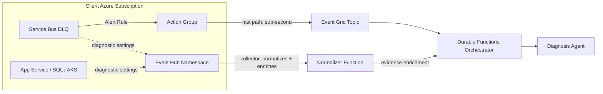

# 08 — AIOps Solution Architecture Review (Solution Architect Assessment)

> **Purpose of this document**: A candid, evidence-based architecture review of Continuum-Ops written from the perspective of a solution architect preparing this platform to be **pitched and sold to external clients**, not just run as an internal tool. It answers three questions directly:
>
> 1. What can we learn from the **open-source AIOps landscape**?
> 2. What can we borrow from **Datadog's Azure collector architecture** (and other observability vendors)?
> 3. **Should we build agents on Microsoft Foundry Agent Service, or hand-roll custom agents?**
>
> It also lists every place the existing docs are **out of date or incorrect** and what to change.

**Status**: Recommended direction — supersedes conflicting statements in [01-Technical-Architecture.md](01-Technical-Architecture.md) and [06-AI-Agent-Implementation.md](06-AI-Agent-Implementation.md) (see [§6 Doc Corrections](#6-doc-corrections-required)).

---

## Table of Contents
1. [Executive Recommendation](#1-executive-recommendation)
2. [Open-Source AIOps Landscape Scan](#2-open-source-aiops-landscape-scan)
3. [Reference Architecture: The Datadog Collector Pattern](#3-reference-architecture-the-datadog-collector-pattern)
4. [Build vs. Foundry Agents vs. Open Source — The Decision](#4-build-vs-foundry-agents-vs-open-source--the-decision)
5. [Revised Target Architecture](#5-revised-target-architecture)
6. [Doc Corrections Required](#6-doc-corrections-required)
7. [What Changes in the Roadmap](#7-what-changes-in-the-roadmap)

---

## 1. Executive Recommendation

| Question | Answer |
|---|---|
| **Foundry Agents or custom-built agents?** | **Microsoft Foundry Agent Service — Prompt Agents** as the default for Diagnosis Agent and Verify Agent. Do **not** hand-roll orchestration, threading, tool-calling loops, tracing, or eval harnesses — Foundry now provides all of this natively and it was previously under-used in our own docs (which used the older, lower-level Assistants API pattern). |
| **When would we need Hosted Agents / custom code?** | Only if we outgrow tool-calling (e.g., an agent needs to run our own multi-step planning code, call a non-HTTP protocol, or embed a framework like **Microsoft Agent Framework** / LangGraph for genuinely dynamic multi-agent reasoning). For a 3-agent, deterministic-repair design, we don't need this yet — Durable Functions already owns the orchestration. Keep Hosted Agents as **Phase 2 upgrade path**, not a Phase 1 requirement. |
| **What do we borrow from Datadog?** | Their **Diagnostic Settings → Event Hub → stateless normalizer function** collector pattern (the same mechanism Splunk, Sumo Logic, ArcSight, and LogRhythm all use to ingest Azure telemetry). This is a strict scalability upgrade over an Event-Grid-only ingestion path and is the key to a **multi-client, multi-tenant** product instead of a single-subscription tool. |
| **What do we borrow from open source?** | Not code — **patterns**: Keep's alert-correlation/dedup model, StackStorm's rule-driven action packs, Robusta's playbook-with-guardrails model, and OpenTelemetry as the vendor-neutral collection standard so the product isn't Azure-only forever. |
| **Biggest architectural gap today** | The docs describe a **single-tenant, single-subscription** deployment. If this is going to be pitched to multiple clients, we need a **control-plane / data-plane split** (shared orchestration + AI layer, isolated data per tenant) — this is how every commercial AIOps vendor (Datadog, PagerDuty, Dynatrace) actually scales. |

---

## 2. Open-Source AIOps Landscape Scan

A market-leading product has to be positioned *against* what's freely available. Here's what exists today, what each project is good at, and what Continuum-Ops should take from it (not copy — Continuum-Ops' differentiator is **LLM-driven diagnosis + closed-loop repair**, which none of these do natively).

| Project | Category | What it does well | What Continuum-Ops should borrow |
|---|---|---|---|
| **[Keep](https://github.com/keephq/keep)** | Open-source AIOps / alert correlation | Unifies alerts from many providers, dedups/correlates them, has an AI-assisted "why did this fire" view and workflow automation (YAML-based playbooks). Closest open-source analog to Continuum-Ops. | Its **alert correlation & noise-reduction model** — we should correlate DLQ alerts with related Azure Monitor signals (App Service restarts, SQL DTU spikes) *before* invoking the Diagnosis Agent, to avoid burning LLM tokens on duplicate/related alerts. |
| **[StackStorm](https://stackstorm.com/)** | Event-driven automation ("IFTTT for ops") | Sensors → rules → actions, with an extensive integration pack ecosystem and a full audit trail of every automated action. | Its **action-pack/audit-trail discipline** for the Repair Agent — every deterministic action (replay, config change) should be a versioned, reviewable "pack" the same way, with dry-run mode. |
| **[Robusta](https://home.robusta.dev/)** | Kubernetes-native auto-remediation | Playbooks that react to Prometheus alerts, auto-attach diagnostic evidence (logs, pod state) to Slack/Teams, guardrails on destructive actions. | Its **"attach evidence before asking for approval"** UX pattern — exactly what our Teams Adaptive Card approval flow should mirror, and its safe-guardrail concept for auto-vs-approval thresholds. |
| **[Grafana OnCall](https://github.com/grafana/oncall)** | Incident/on-call management | Open-source escalation policies, schedules, and incident timelines. | Escalation-policy model as an alternative/complement to Teams-only human-in-loop, useful if a client already runs PagerDuty/Grafana OnCall — we should support it as a **notification channel**, not rebuild it. |
| **[Cloud Custodian](https://cloudcustodian.io/)** | Policy-as-code cloud governance/remediation | Declarative YAML policies that detect and auto-remediate cloud misconfigurations at scale, multi-cloud (AWS/Azure/GCP). | Its **declarative remediation policy** format is a good model for how we externalize the Repair Agent's deterministic playbooks (YAML/JSON policy documents instead of hardcoded C# per scenario), making it easier for clients to author their own repair policies without code changes. |
| **[OpenTelemetry](https://opentelemetry.io/)** (CNCF) | Vendor-neutral telemetry collection standard | Now the de facto standard collection layer — Datadog, Dynatrace, New Relic, and Grafana all ingest OTel natively. | **Adopt OTel as the ingestion contract**, not just Azure Monitor. This is the single highest-leverage change: it turns Continuum-Ops from "an Azure Service Bus tool" into a platform that can ingest from any OTel-instrumented source (AWS, GCP, on-prem, K8s) — critical for external client pitches where prospects aren't all-Azure. |
| **[Netdata](https://www.netdata.cloud/) / Prometheus + Thanos/Mimir** | High-cardinality metrics at scale | Proven patterns for long-retention, high-cardinality metric storage that outgrows a single region. | Reference only — not needed at POC scale, but informs the multi-tenant metrics store design in [§5](#5-revised-target-architecture) if the product scales past a handful of clients. |
| **Microsoft Agent Framework** ([github.com/microsoft/agent-framework](https://github.com/microsoft/agent-framework)) | Agent orchestration SDK (Microsoft's unification of Semantic Kernel + AutoGen) | Open-source, supports multi-agent graphs, tool calling, human-in-loop, and is a first-class **Hosted Agent** authoring option in Foundry. | This — not standalone Semantic Kernel — is the framework to use **if/when** we move Diagnosis/Verify to Hosted Agents. Semantic Kernel alone is now legacy relative to Agent Framework. |

**Verdict**: There is no open-source project that combines (a) LLM-based root-cause diagnosis, (b) deterministic closed-loop repair, and (c) enterprise-grade agent hosting/governance the way Continuum-Ops does. That is the pitch. The gap is **scale and vendor-neutral ingestion**, addressed in §3 and §5.

---

## 3. Reference Architecture: The Datadog Collector Pattern

Datadog's own Azure integration doesn't poll the Azure Resource Manager API per-resource — it uses the exact mechanism Microsoft documents as the standard way to stream Azure telemetry to *any* external partner:

```
Azure Resources (Service Bus, App Service, SQL, AKS, VMs, ...)
        │  (Diagnostic Settings — configured once per resource/policy)
        ▼
Azure Event Hub  (namespace: high-throughput, partitioned, 7-day retention)
        │  (pulled by, not pushed to — consumer-group isolation per subscriber)
        ▼
Collector / Normalizer  (Datadog: Azure Function "Log Forwarder"; Splunk/SumoLogic: same pattern)
        │  (parses, tags, normalizes into a common event schema)
        ▼
Downstream platform (correlation, storage, alerting, ML)
```

This is documented by Microsoft as the standard **"stream monitoring data to Event Hubs and external partner"** pattern, and it's how IBM QRadar, Splunk, SumoLogic, ArcSight, LogRhythm, and Logz.io all consume Azure data — not something Datadog invented, but something Datadog (and everyone else) standardized on because it scales.

### Why this matters for Continuum-Ops

Today's docs describe **Event Grid** as the alert ingestion buffer (Azure Monitor Alert → Action Group → Event Grid → Function). That's fine for **one subscription's Service Bus alerts** but it doesn't scale to a **multi-tenant product**:

| Concern | Event Grid only (current) | Event Hub collector (Datadog-style) |
|---|---|---|
| Throughput | Good for discrete alert events (~thousands/day) | Built for firehose telemetry (millions/day), partitioned for parallel consumption |
| Multi-tenant isolation | One subscription per client, hard to pool | One Event Hub namespace can safely multiplex many clients' diagnostic settings via separate consumer groups/partitions |
| Replay / backfill | No built-in replay | 7-day+ retention — a stalled collector can catch up, essential for SLA-bound client deployments |
| Multi-source (not just Service Bus alerts) | Requires a new Action Group + Event Grid topic per signal type | Diagnostic Settings can stream **any** Azure resource's logs/metrics (App Service, SQL, AKS, Key Vault) into the **same** hub |
| Non-Azure sources (future) | Not supported | OpenTelemetry Collector can also write into the same normalized event schema, giving a path to AWS/GCP/on-prem clients |

### Recommended change

Keep Event Grid for what it's good at — **fast, low-latency routing of the specific Service Bus DLQ alert that triggers the Durable Functions orchestration** (sub-second, webhook-style). **Add** an Event Hub-based collector as a **parallel, second ingestion path** for:
- broader diagnostic evidence collection (App Service logs, SQL metrics, AKS events) that enriches the Diagnosis Agent's context beyond just the DLQ alert, and
- future multi-tenant, multi-client scale where a single collector tier serves many clients' diagnostic settings.



---

## 4. Build vs. Foundry Agents vs. Open Source — The Decision

This is the question the user asked most directly: **"shall we use azure foundry agents not custom agents? what do you think is best?"**

### 4.1 What "custom agents" would actually mean

Building custom means: your own orchestration loop calling Azure OpenAI chat completions directly, your own tool-calling dispatcher, your own conversation/state persistence (probably Cosmos DB), your own tracing (App Insights custom events), your own evaluation harness, your own versioning/rollback, and your own identity/RBAC model for the agent's access to tools. Every one of those is a solved problem in Foundry Agent Service today.

### 4.2 Why Foundry Agent Service wins for Diagnosis Agent and Verify Agent

| Capability needed | Custom-built | Microsoft Foundry Agent Service (Prompt Agents) |
|---|---|---|
| Tool-calling loop (DLQ peek, log query, pattern search) | Write & maintain it | Built in — define tools, Foundry runs the loop |
| Conversation/session state | Build on Cosmos DB yourself | Built in (session-level state persistence) |
| Per-agent identity & RBAC | Build custom auth | Dedicated Microsoft Entra identity per agent, OBO support |
| Tracing / "why did the agent do that" | Custom App Insights events | Native agent tracing, step-by-step |
| Evaluation & regression testing | Build your own harness | Built-in evaluation pipeline |
| Prompt/instruction tuning | Manual trial and error | **Agent Optimizer** auto-improves instructions |
| Versioning & rollback | Build a version table | Automatic snapshotting, rollback, stable published endpoints |
| Tool governance (MCP) | Custom REST clients per tool | **Toolbox**: centrally managed, versioned, MCP-compatible tool sets — works with Azure DevOps MCP Server, custom MCP on Azure Functions, etc. |
| Compute to run/scale/patch | You own it (Function/VM) | None — fully managed |
| Cost | Compute + dev time + maintenance | Per-call inference + tool usage only |

**Conclusion**: For Diagnosis Agent and Verify Agent — both of which are "reason over evidence, call a few tools, produce structured output" workloads — a **Prompt Agent** is a strictly better fit than anything we'd build ourselves. This also directly fixes a real gap in the existing implementation guide, which was written against the older Assistants API (`AssistantsClient`, manual thread/run polling) — that pattern predates Prompt Agents and requires us to hand-roll exactly the polling/tool-dispatch loop that Prompt Agents now do for us.

### 4.3 When Hosted Agents (custom code) would be justified

Hosted Agents matter once an agent needs to run **our own code as the "brain,"** not just call tools — e.g., a genuinely dynamic multi-agent negotiation, a non-HTTP protocol, or embedding **Microsoft Agent Framework**/LangGraph for graph-based reasoning across many tool calls with branching logic that a single system prompt can't express. **Continuum-Ops does not need this today** — the Durable Functions orchestrator already owns branching/retry/compensation logic outside the agent, and each agent's job is narrow (diagnose, or verify). Revisit Hosted Agents if we add a 4th "planner" agent that must dynamically decide which of many playbooks to run across heterogeneous client environments.

### 4.4 The Repair Agent stays deterministic, non-AI

No change here — this is already correct in the existing docs and matches how Cloud Custodian and StackStorm both treat remediation: **deterministic, auditable, dry-run-capable code**, not an LLM decision. Recommendation: externalize its playbooks as declarative policy documents (Cloud Custodian-style YAML) so clients can add remediation actions without a code deployment — this also makes the product easier to customize per-client without forking code.

### 4.5 MCP vs. OpenAPI for tools — reverse the existing decision

[01-Technical-Architecture.md](01-Technical-Architecture.md) currently states MCP was rejected as "still experimental and lacks native Azure integration." **This is now out of date.** Microsoft Foundry Agent Service has:
- native remote MCP server support (addable from the tool catalog, e.g. Azure DevOps MCP Server),
- native support for **custom MCP servers hosted on Azure Functions** via the Functions MCP webhook endpoint (`/runtime/webhooks/mcp`),
- a **Toolbox** feature specifically for centrally managing and versioning MCP-compatible tool sets across agents.

**Revised recommendation**: Expose the Repair Agent's and Diagnosis Agent's tools (`peek_dlq_messages`, `query_application_logs`, `search_similar_patterns`, `replay_messages`, etc.) as a **custom MCP server hosted on Azure Functions**, registered once in Foundry's Toolbox, and consumed by both agents. This replaces the OpenAPI-function-definition approach with something versioned, centrally governed, and reusable — and it's also the same integration surface a client's own tools (Azure DevOps MCP Server, ServiceNow, JIRA) can plug into, which matters for the ticketing integration in [07-Ticketing-Integration-Strategy.md](07-Ticketing-Integration-Strategy.md).

---

## 5. Revised Target Architecture

### 5.1 Multi-tenant control-plane / data-plane split

To go from "internal tool" to "product we pitch to clients," adopt the same split every commercial AIOps vendor uses:

- **Control plane** (Continuum-Ops-owned, shared): Foundry project + Prompt Agents, Agent Optimizer, evaluation pipelines, the MCP Toolbox definitions, the pattern-learning corpus schema (per-tenant partitioned), product telemetry.
- **Data plane** (per client, isolated): the client's own Azure subscription holding Service Bus, Cosmos DB (evidence store), Azure AI Search (pattern memory), and Event Hub/Event Grid — using Foundry's **"bring your own resources"** capability (Storage, AI Search, Cosmos DB for conversation state) so each client's operational data never leaves their tenant, while the agent logic/prompts/optimization stay centrally managed and improved once for all clients.

This directly answers the "single-tenant only" limitation called out in [01-Technical-Architecture.md](01-Technical-Architecture.md) and gives a genuine SaaS/multi-client story instead of "deploy one full copy per customer."

### 5.2 Updated component list

| Layer | Component | Change from current docs |
|---|---|---|
| Ingestion (fast path) | Service Bus DLQ Alert → Action Group → Event Grid | Unchanged |
| Ingestion (broad collector) | Diagnostic Settings → Event Hub → Normalizer Function | **New** (§3) |
| Orchestration | Durable Functions | Unchanged |
| Diagnosis Agent | Foundry **Prompt Agent**, GPT-4o | Was: Assistants API pattern — update SDK usage (§6) |
| Verify Agent | Foundry **Prompt Agent**, GPT-4o | Same correction |
| Repair Agent | Deterministic .NET Function, policy-driven (Cloud Custodian-style YAML playbooks) | Add externalized policy documents |
| Tooling | **MCP server on Azure Functions**, registered in Foundry **Toolbox** | Was: OpenAPI-only — reverse decision (§4.5) |
| Memory | Azure AI Search (per-tenant index/partition) | Unchanged, now explicitly multi-tenant partitioned |
| Evidence store | Cosmos DB (per-tenant, client-owned via BYO resources) | Clarify BYO-resources model |
| Human-in-loop | Teams Adaptive Cards **+ optional Grafana OnCall / PagerDuty webhook** | Add pluggable notification channel |
| Ticketing | ADO/JIRA/ServiceNow via `ITicketingService` | Unchanged (07 doc) |
| Observability | Foundry native agent tracing + Application Insights | Unchanged, now explicitly using native tracing instead of custom |

---

## 6. Doc Corrections Required

Concrete edits to make across the existing documentation set:

1. **Branding**: "Azure AI Agent Service" / "Azure AI Foundry" → **"Microsoft Foundry Agent Service"** everywhere (product was renamed). Affects [README.md](../README.md), [00-Product-Overview.md](00-Product-Overview.md), [01-Technical-Architecture.md](01-Technical-Architecture.md), [06-AI-Agent-Implementation.md](06-AI-Agent-Implementation.md).
2. **01-Technical-Architecture.md — "OpenAPI vs MCP Decision"**: reverse this decision per [§4.5](#45-mcp-vs-openapi-for-tools--reverse-the-existing-decision).
3. **01-Technical-Architecture.md — Technology Stack Summary table**: change "AI Orchestration: Azure AI Agent Service — Preview" to "Microsoft Foundry Agent Service — GA, Prompt Agents"; change "AI Framework: Semantic Kernel 1.x" to "Microsoft Agent Framework (only if/when Hosted Agents are adopted; not required for Prompt Agents)".
4. **01-Technical-Architecture.md — Deployment Models**: currently states single-tenant only. Add the control-plane/data-plane multi-tenant model from [§5.1](#51-multi-tenant-control-plane--data-plane-split) as the path to a sellable product.
5. **01-Technical-Architecture.md — Alert Ingestion**: add the Event Hub collector as a parallel path per [§3](#3-reference-architecture-the-datadog-collector-pattern).
6. **06-AI-Agent-Implementation.md**: ✅ Done — rewritten to build Diagnosis/Verify Agents as Foundry **Prompt Agents** with tools exposed via a custom **MCP server** on Azure Functions. The original Assistants API version (`AssistantsClient`, thread/run polling, `RunStatus.RequiresAction`) has been moved to [docs/legacy/06-AI-Agent-Implementation-AssistantsAPI-Legacy.md](legacy/06-AI-Agent-Implementation-AssistantsAPI-Legacy.md) and is kept only as a reference for manual thread/run semantics, relevant if a **Hosted Agent** (custom code) path is ever adopted.
7. **00-Product-Overview.md — Documentation structure list**: outdated, only lists 00-05. Update to include 06, 07, and this 08 doc.
8. **README.md**: update Documentation section links and confirm the 4 `POC-*.md` files referenced under "For Management" actually exist — **they currently do not** (confirmed via directory listing: only 00-08, Management-Presentation.md, and 07-Ticketing exist). Recreate them if still needed, or remove the links.

---

## 7. What Changes in the Roadmap

- **Phase 1 (POC/Prototype)**: No change to timeline. Build Diagnosis/Verify as Foundry **Prompt Agents** from day one (it's less work than the Assistants API pattern, not more) with tools exposed via a small custom MCP server on Azure Functions. Keep single-tenant, single-client deployment — but build the Cosmos DB/AI Search schema with a `tenantId` partition key from the start so the multi-tenant path in §5.1 isn't a rewrite later.
- **Phase 2 (MVP → Product)**: Introduce the Event Hub collector for broader evidence + the control-plane/data-plane split so a second client can onboard without a forked codebase. Evaluate Hosted Agents only if a genuine multi-step planning requirement emerges.
- **Ongoing**: Use Foundry's **Agent Optimizer** and evaluation pipeline to continuously improve Diagnosis/Verify Agent instructions per-pattern, instead of manual prompt tuning — this becomes a differentiator to show clients ("the system gets better at diagnosing your specific incidents over time," which is also the flywheel already described in [00-Product-Overview.md](00-Product-Overview.md)).

---

## References

- [Microsoft Foundry Agent Service — Overview](https://learn.microsoft.com/en-us/azure/foundry/agents/overview)
- [Microsoft Agent Framework (GitHub)](https://github.com/microsoft/agent-framework)
- [Stream Azure monitoring data to an Event Hub and external partner](https://learn.microsoft.com/en-us/azure/azure-monitor/essentials/stream-monitoring-data-event-hubs)
- [Keep — open-source AIOps](https://github.com/keephq/keep)
- [StackStorm](https://stackstorm.com/)
- [Robusta](https://home.robusta.dev/)
- [Grafana OnCall](https://github.com/grafana/oncall)
- [Cloud Custodian](https://cloudcustodian.io/)
- [OpenTelemetry](https://opentelemetry.io/)
