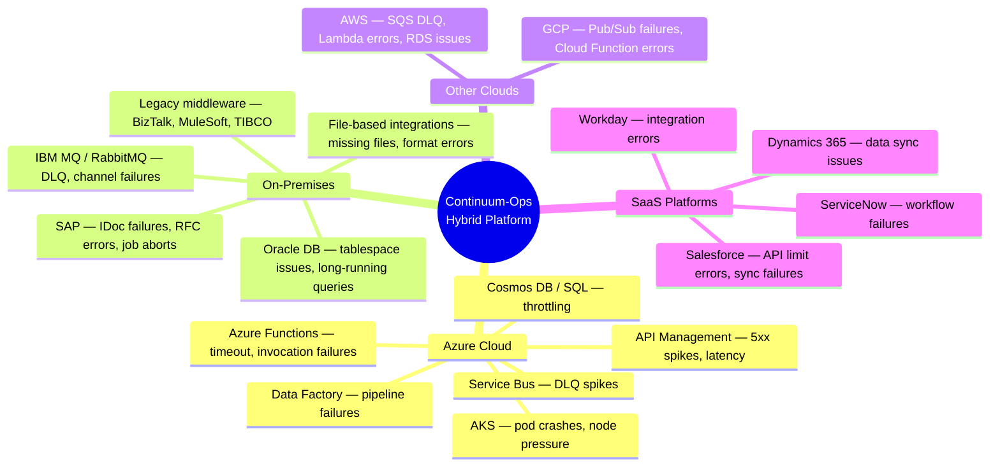
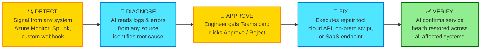
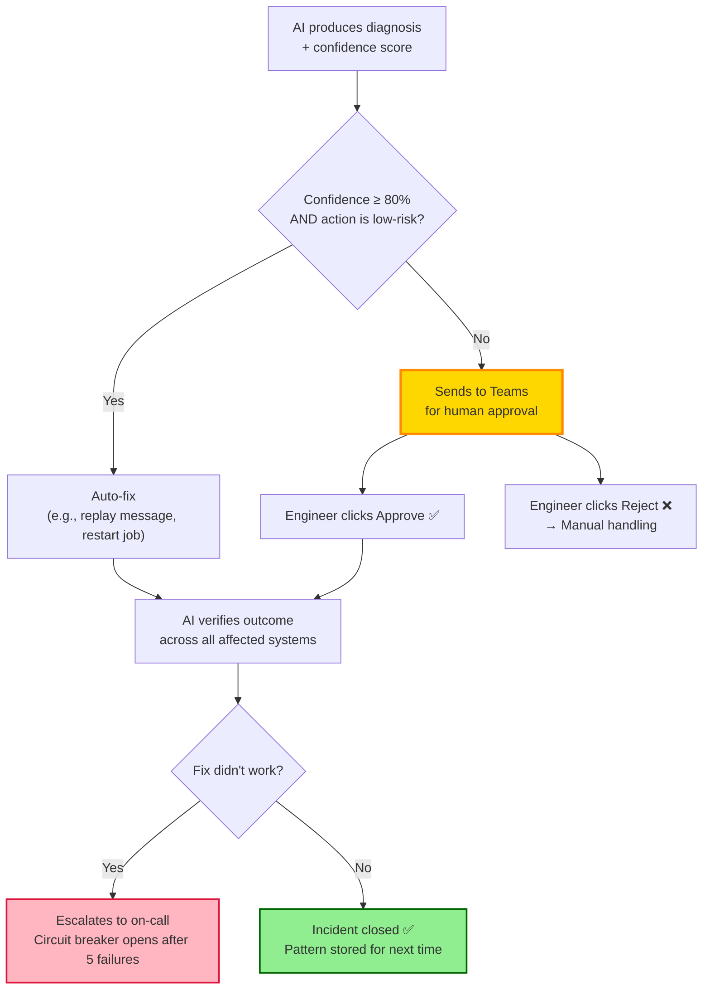
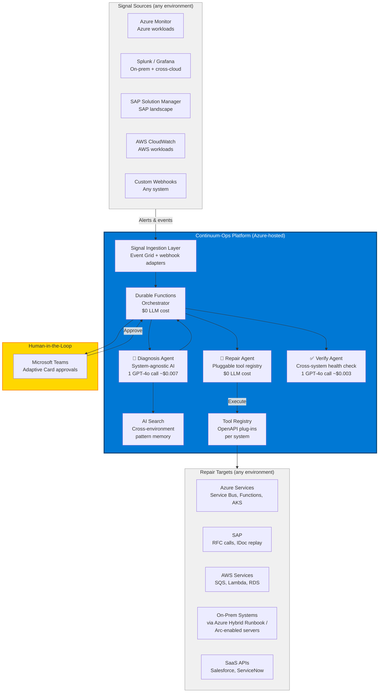

# Continuum-Ops
## AI-Powered Operational Self-Healing for Hybrid Environments

---

<!-- SLIDE 1: THE PROBLEM -->

## 😤 The Problem We Live With Today

Every week, our operations teams deal with this — across cloud services, on-premises systems, SaaS platforms, and everything in between:

```
  ┌──────────────────────────────────────────────────────────────────┐
  │                    A TYPICAL NIGHT ON-CALL                       │
  │                                                                  │
  │  10:45 PM   Production failures start                            │
  │             (Service Bus, SAP IDocs, API gateway, data pipeline) │
  │  11:30 PM   Alert pages on-call engineer (45 min delay)          │
  │  12:00 AM   Engineer logs in, starts reading logs across systems │
  │  12:45 AM   Root cause found: missing data / timeout / bad config│
  │   1:15 AM   Manually applies fix (cloud portal + on-prem console)│
  │   1:30 AM   Manually retries / replays / restarts                │
  │   2:00 AM   Verifies systems recovered                           │
  │   2:15 AM   Writes incident report, goes back to sleep           │
  │                                                                  │
  │  ⏱️  Total: 3.5 hours  |  👤 100% manual  |  Engineer burnt out │
  └──────────────────────────────────────────────────────────────────┘
```

**This pattern repeats across our entire technology landscape — cloud and on-prem.**

The root causes are often the **same handful of issues** — missing master data, transient timeouts, configuration drift, resource throttling, poison messages — yet every incident requires a human to manually investigate across multiple systems, fix, and verify.

---

<!-- SLIDE 2: THE COST OF DOING NOTHING -->

## 💸 What This Costs Us

| Cost Driver | Impact |
|-------------|--------|
| **MTTR** | 2–8 hours per operational incident |
| **Cross-system complexity** | Engineers must context-switch between Azure Portal, SAP GUI, AWS Console, Splunk, ServiceNow |
| **Off-hours fatigue** | On-call burnout, attrition risk |
| **Business impact** | Delayed orders, stuck invoices, failed data syncs, SLA pressure |
| **Inconsistency** | Different engineer = different fix = different quality |
| **Scale** | Problem multiplies as hybrid footprint grows |

> **The irony**: 60-80% of these incidents follow predictable, recurring patterns — regardless of whether the failure is in Azure, SAP, AWS, or a SaaS connector.
> We're paying senior engineers to do work a well-designed system could handle.

---

<!-- SLIDE 3: THE PROPOSAL — ONE SENTENCE -->

## 💡 What We're Proposing

> **Build an AI-powered platform that watches our hybrid environment — cloud, on-prem,
> and SaaS — diagnoses operational failures automatically, and fixes the common ones
> with human approval, in minutes instead of hours.**

**Name**: Continuum-Ops  
**Approach**: Azure-hosted AI brain that connects to **any** system via adapters  
**Vision**: One platform for operational self-healing across the entire technology landscape  
**Safety**: Human-in-the-loop — the AI proposes, an engineer approves with one click in Teams  

---

<!-- SLIDE 4: HYBRID SCOPE -->

## 🌐 Hybrid Platform — Not Just Azure

The same Detect → Diagnose → Approve → Fix → Verify loop works across **any system** that produces observable failure signals:



> **The AI diagnosis engine is system-agnostic.** It reads logs, error messages, and metrics regardless of source.
> Only the **detection adapters** and **repair tools** are system-specific — and those are pluggable.

---

<!-- SLIDE 5: HOW IT WORKS — SIMPLE VIEW -->

## ⚙️ How It Works



| Step | Who Does It | Time |
|------|------------|------|
| **Detect** anomaly | Any monitoring system (Azure Monitor, Splunk, Grafana, custom webhook) | ~2 min |
| **Diagnose** root cause | AI Agent (GPT-4o) — reads logs from any source | ~30 sec |
| **Approve** fix | Engineer (one click in Teams) | ~1-3 min |
| **Fix** the issue | Pluggable repair tool (cloud API, on-prem script, SaaS call) | ~1 min |
| **Verify** outcome | AI Agent — checks health across affected systems | ~1 min |
| | **Total** | **~5-10 min** |

**The key insight**: GPT-4o doesn't care whether the error log comes from Azure Service Bus, SAP, or AWS SQS. It reads the evidence, matches patterns, and proposes a fix. The platform just needs **adapters** to collect signals and **tools** to execute repairs.

---

<!-- SLIDE 6: THE BEFORE/AFTER -->

## 📊 Before vs. After

```
  TODAY                                       WITH CONTINUUM-OPS
  ───────────────────────────────────         ───────────────────────────────────
  ⏱️  2-8 hours MTTR                         ⏱️  5-15 minutes (target)
  👤  Full manual investigation              🤖  AI diagnoses in 30 sec
  🔀  Context-switch across 4+ consoles      📱  One Teams card, one click
  📝  Inconsistent fixes                     📋  Standardized, audited actions
  🔁  Same issue, same toil, every time      🧠  System learns the pattern
  📄  RCA written manually next day          📄  Auto-generated with evidence
  🏢  Separate tools per environment         🌐  One platform, all environments
```

---

<!-- SLIDE 7: WHY THIS IS SAFE -->

## 🛡️ "But What If the AI Gets It Wrong?"

We designed for this concern from day one:



**Safety guardrails built in:**

| Guardrail | What It Does |
|-----------|-------------|
| **Confidence threshold** | AI must be ≥80% confident or it asks a human |
| **Action allowlist** | Only pre-approved repair tools per system can run |
| **Rate limits** | Max repairs per hour per workload (prevents runaway) |
| **Circuit breaker** | 5 consecutive failures → all auto-repair stops, human takes over |
| **Immutable audit trail** | Every action logged — who, what, when, why, which system |
| **Cross-system verification** | Checks health across all affected systems, not just the one that was fixed |
| **PII redaction** | Sensitive data automatically redacted before AI processing |

> **Week 1-2**: Everything requires approval (learning mode).
> We gradually loosen the guardrails only after we build trust in the system.

---

<!-- SLIDE 8: HYBRID ARCHITECTURE -->

## 🏗️ Architecture — Hybrid by Design

**Azure-hosted AI brain. Pluggable adapters for any system.**



**Key design decisions:**

| Decision | Why |
|----------|-----|
| **Azure-hosted brain, not Azure-only** | Platform runs on Azure but connects to anything via adapters |
| **Signal ingestion layer** | Normalizes alerts from Azure Monitor, Splunk, CloudWatch, SAP, or custom webhooks into a common format |
| **Pluggable tool registry (OpenAPI)** | Teams register repair tools for any system — Azure Functions for cloud, Hybrid Runbook Workers for on-prem, REST APIs for SaaS |
| **AI diagnosis is system-agnostic** | GPT-4o reads error logs, metrics, and traces regardless of source |
| **On-prem connectivity via Azure Arc / Hybrid Workers** | No VPN tunnels to manage — use Azure's built-in hybrid connectivity |
| **Only 3 AI agents** | Same cost efficiency — $0.01/incident whether it's Azure, SAP, or AWS |

---

<!-- SLIDE 9: HOW HYBRID CONNECTIVITY WORKS -->

## 🔌 How We Reach Non-Azure Systems

| System Type | Signal Collection (Detect) | Repair Execution (Fix) | Azure Technology |
|-------------|--------------------------|----------------------|-----------------|
| **Azure services** | Azure Monitor → Event Grid | Azure Functions (direct API) | Native |
| **On-prem (SAP, Oracle, MQ)** | Forward logs to Log Analytics via agent, or webhook from on-prem monitoring | Azure Automation Hybrid Runbook Worker runs scripts on-prem | Azure Arc + Hybrid Worker |
| **AWS** | CloudWatch alarm → SNS → webhook to Continuum-Ops | Azure Function calls AWS API via stored credentials | Cross-cloud REST |
| **GCP** | Cloud Monitoring alert → Pub/Sub → webhook | Azure Function calls GCP API | Cross-cloud REST |
| **SaaS (Salesforce, ServiceNow)** | Platform webhook / event subscription | REST API call with OAuth tokens | Standard REST |
| **Custom / Legacy** | Custom agent or script pushes events via webhook | Custom Azure Function or Hybrid Runbook | Webhook + Hybrid Worker |

> **No custom agents installed on-prem.** For on-prem systems, we use Azure Arc-enabled servers
> and Hybrid Runbook Workers — Microsoft's built-in hybrid management layer. For everything
> else, standard webhooks and REST APIs.

---

<!-- SLIDE 10: TECHNOLOGY STACK -->

## 🛠️ Technology Stack — Built on Azure AI

**Lean, cost-optimized, enterprise-grade.**

| Layer | Technology | Why Chosen |
|-------|-----------|------------|
| **AI Orchestration** | Microsoft Foundry Agent Service (Prompt Agents) | Managed agent hosting with native Azure integration |
| **Detection** | Azure Monitor (Dynamic Thresholds) | ML-based anomaly detection, zero LLM tokens, zero code |
| **LLM** | Azure OpenAI GPT-4o | Fast structured output, cost-effective (~$0.01/incident) |
| **Orchestration** | Azure Durable Functions (.NET 8) | Stateful workflows, deterministic routing, $0 LLM cost |
| **Tooling** | OpenAPI + Azure Functions | Standardized, interchangeable, pluggable tool definitions |
| **Memory** | Azure AI Search (vectors) + Cosmos DB (metadata) | Semantic pattern recall + structured incident storage |
| **Identity** | Microsoft Entra ID + Managed Identity | Zero-trust, passwordless, no secrets to manage |
| **Approval UI** | Microsoft Teams Adaptive Cards | Where engineers already work — one-click approve/reject |
| **Infrastructure** | Bicep (IaC) | One-click deployment, repeatable, auditable |

### Why Only 3 AI Agents?

Every LLM call has fixed token overhead. Our lean 3-agent design cuts token cost by **~70%** vs. a typical multi-agent approach:

| Component | Role | LLM Cost |
|-----------|------|----------|
| **Azure Monitor** | Detection — ML-based anomaly detection | **$0** (no LLM) |
| **Durable Functions** | Routing, state, policy gates, approvals | **$0** (deterministic code) |
| **Diagnosis Agent** | Evidence + Root Cause Analysis + repair plan | **~$0.007** (1 GPT-4o call) |
| **Repair Agent** | Execute OpenAPI tools | **$0** (deterministic code) |
| **Verify Agent** | Validate outcome + update patterns | **~$0.003** (1 GPT-4o call) |

> **Total cost per incident: ~$0.01** — whether it's Azure, SAP, or AWS.

---

<!-- SLIDE 11: MVP SCOPE — START SMALL, THINK BIG -->

## 🎯 MVP Scope — Start Azure, Extend Hybrid

### ✅ In Scope (Phase 1 MVP — Azure First)

| Capability | Details |
|-----------|---------|
| **Platform core** | Signal ingestion → diagnosis → approval → repair → verify loop |
| **Signal ingestion layer** | Azure Monitor + Event Grid + generic webhook endpoint (ready for non-Azure signals) |
| **First workload** | Azure Service Bus DLQ (detect, diagnose, replay, verify) |
| **AI Agents** | Diagnosis Agent (GPT-4o) + Repair Agent (deterministic) + Verify Agent (GPT-4o) |
| **Tool registry** | OpenAPI-based plug-in system (same interface for any system) |
| **Pattern memory** | AI Search (vector similarity) + Cosmos DB (metadata) — system learns from every incident |
| **Approve** via Teams | Adaptive Card with Approve / Reject buttons |
| **Auto-discovery** | Scans Azure subscriptions for Service Bus namespaces tagged `AutoHeal=Enabled` |
| **Policy engine** | Per-integration confidence thresholds, allowed actions, rate limits, circuit breakers |
| **Audit** everything | Immutable log in Cosmos DB with tamper-detection signatures |
| **PII redaction** | Automatic PII detection and redaction before AI processing |
| **Deployment** | One-click Bicep deployment (~30 min from zero to live) |

### 🔮 Phase 2 — Extend to Hybrid

| Capability | Details |
|-----------|---------|
| **On-prem adapter** | SAP IDoc failure detection via Log Analytics agent + Hybrid Runbook repair |
| **Cross-cloud adapter** | AWS SQS DLQ via CloudWatch webhook |
| **SaaS adapter** | Salesforce sync failure via platform events |
| **Pattern sharing** | Patterns learned from Azure incidents help diagnose similar on-prem failures |
| **Additional Azure workloads** | API Management, Data Factory, AKS |

### ❌ Not In MVP

| Capability | Why Deferred |
|-----------|-------------|
| Full SAP / Oracle repair tools | Need domain expertise + safety validation for on-prem write operations |
| AWS / GCP native monitoring integration | Webhooks are sufficient; native integration is optimization |
| Self-service portal for teams | API registration is fine initially |
| Auto-discovery across environments | Manual registration for pilot |
| SDKs (.NET, TypeScript, Python) | REST API is sufficient; SDKs are a post-MVP polish |

> **Philosophy**: Build the platform engine once on Azure, prove it with one Azure workload,
> then extend to on-prem and other clouds. The **webhook ingestion + OpenAPI tool registry**
> design means hybrid is an extension, not a rebuild.

---

<!-- SLIDE 12: WHY HYBRID MATTERS -->

## 💡 Why Hybrid Matters

Most enterprise incidents don't live in one system:

```
  ┌─────────────────────────────────────────────────────────────┐
  │  REAL-WORLD INCIDENT: Order-to-Cash Failure                 │
  │                                                             │
  │  1. Order received via Azure API Management          (Azure)│
  │  2. Message placed on Service Bus queue              (Azure)│
  │  3. Consumer tries to create Sales Order in SAP    (On-Prem)│
  │  4. SAP rejects: Customer master not synced from CRM  (SaaS)│
  │  5. Message lands in DLQ                             (Azure)│
  │  6. Alert fires                                             │
  │                                                             │
  │  Root cause is in Salesforce (SaaS).                        │
  │  Symptom shows in Azure (Service Bus DLQ).                  │
  │  Fix requires action in SAP (On-Prem).                      │
  │                                                             │
  │  A single-cloud tool can detect but not diagnose or fix.    │
  │  Continuum-Ops can see across all three.                    │
  └─────────────────────────────────────────────────────────────┘
```

> **This is why "Azure-only" is a limitation, not a feature.**
> Real enterprise incidents span multiple systems. The diagnosis engine
> needs to see evidence from everywhere, and repair tools need to reach everywhere.

---

<!-- SLIDE 13: SUCCESS METRICS & LEARNING CURVE -->

## 📈 Success Metrics & Expected Progression

### Platform SLA Targets

| Metric | Design Target | Stretch Goal |
|--------|--------------|--------------|
| **Platform Uptime** | 99.9% | 99.95% |
| **Detection Latency** | <5 min | <2 min |
| **Diagnosis Latency** | <30 sec | <15 sec |
| **Auto-Resolution Rate** | 50-65% | 75% |
| **False Positive Rate** | <10% | <5% |
| **Diagnosis Accuracy** | >85% | >90% |

### The System Gets Smarter Over Time

```
  📈 Auto-Resolution Rate Progression
  
  Week 1-2     ████████░░░░░░░░░░░░  30-40%  (learning mode, most need approval)
  Month 1-2    █████████████░░░░░░░  50-65%  (common patterns recognized)
  Month 3-6    ███████████████░░░░░  60-75%  (mature pattern library)
```

Every resolved incident writes a **compact evidence summary** to the pattern memory (AI Search vectors). When a similar incident occurs, the system matches it in milliseconds — no LLM call needed for known patterns (~$0.001 vs $0.01).

> **Reality check**: These projections assume the majority of failures fall into a small
> number of recurring patterns. Environments with highly diverse failure modes will see
> lower auto-resolution rates. The system always falls back to human escalation for novel failures.

---

<!-- SLIDE 14: RISKS & MITIGATIONS -->

## ⚠️ Risks & Mitigations

| Risk | Likelihood | Impact | Mitigation |
|------|-----------|--------|-----------|
| **AI gives wrong diagnosis** | Medium | Medium | Confidence threshold + mandatory approval + circuit breaker |
| **Azure OpenAI outage** | Low | Medium | Graceful degradation: detection + escalation continues without AI; pattern-match-only mode |
| **Low auto-resolution rate** | Medium | Low | Diagnosis alone saves 30-60 min even without auto-fix |
| **On-prem connectivity issues** | Medium | Medium | Azure Arc + Hybrid Workers are proven tech; start with Azure-only, add on-prem after trust is built |
| **Cross-system repair complexity** | Medium | High | Start with single-system repairs (replay message). Cross-system orchestration is Phase 3+ |
| **Team resistance** | Medium | Medium | Learning mode first. Show evidence. Build trust over 2-4 weeks |
| **Scope creep** (too many systems too fast) | High | High | Strict phasing: Azure first → validate → on-prem → validate → expand |
| **LLM cost runaway** | Low | Medium | Daily token budget cap (200K tokens), auto-switches to pattern-match-only mode when exhausted |
| **PII/data leakage to LLM** | Low | High | Automatic PII redaction BEFORE AI processing; Azure OpenAI data stays in your tenant |

---

<!-- SLIDE 15: CLOSING -->

## 🚀 One Last Thing

This is what the engineer sees at 2 AM — **regardless of which system failed** — instead of spending 3.5 hours switching between consoles:

```
╔══════════════════════════════════════════════════╗
║          Continuum-Ops — Action Required         ║
╠══════════════════════════════════════════════════╣
║                                                  ║
║  Workload: order-to-cash (Production)            ║
║  Systems: Service Bus → SAP ECC                  ║
║                                                  ║
║  Root Cause:                                     ║
║  Customer CUS-12345 not found in SAP.            ║
║  3 order messages stuck in Azure DLQ.            ║
║  Customer sync from Salesforce failed 2hrs ago.  ║
║                                                  ║
║  Proposed Fix:                                   ║
║  1. Create customer CUS-12345 in SAP (RFC call)  ║
║  2. Replay 3 messages from Azure DLQ             ║
║                                                  ║
║  Confidence: 86%  |  Risk: Medium                ║
║  Similar incidents resolved 5 times before.      ║
║                                                  ║
║  ┌────────────┐  ┌────────────┐  ┌───────────┐   ║
║  │   Approve  │  │    Reject  │  │   Detail  │   ║
║  └────────────┘  └────────────┘  └───────────┘   ║
╚══════════════════════════════════════════════════╝
```

**One click. Back to sleep. Cloud, on-prem, SaaS — one platform handles it all.**

---

## 📎 Appendix: Links

| Document | Description |
|----------|------------|
| [Product Overview](00-Product-Overview.md) | Full vision and value proposition |
| [Technical Architecture](01-Technical-Architecture.md) | System design, data model, failure handling |
| [Deployment Guide](02-Deployment-Guide.md) | Infrastructure setup and onboarding |
| [User Manual](03-User-Manual.md) | Day-to-day operations guide |
| [API Reference](04-API-Reference.md) | REST API endpoints |
| [Security & Compliance](05-Security-Compliance.md) | Zero-trust architecture, audit trail |

---
